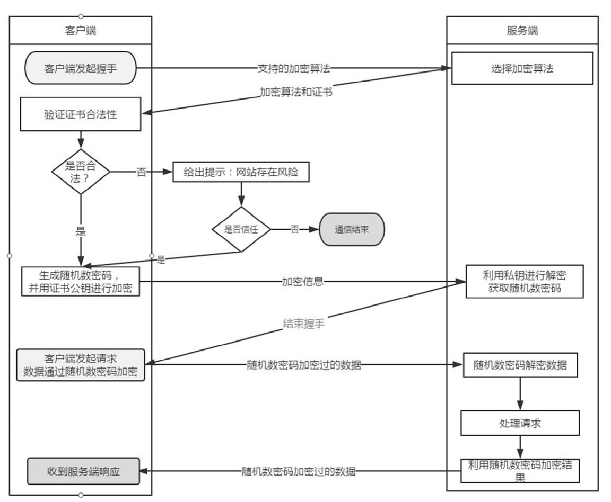

# https 基础知识

 HTTPS基础知识：`HTTPS (Secure Hypertext Transfer Protocol)安全超文本传输协议`，是一个安全通信通道，它基于HTTP开发用于在客户计算机和服务器之间交换信息。它使用安全套接字层(SSL)进行信息交换，简单来说它是HTTP的安全版,是使用TLS/SSL加密的HTTP协议。    HTTP协议采用明文传输信息，存在信息窃听、信息篡改和信息劫持的风险，而协议TLS/SSL具有身份验证、信息加密和完整性校验的功能，可以避免此类问题发生。

` TLS/SSL`全称安全传输层协议Transport Layer Security, 是介于TCP和HTTP之间的一层安全协议，不影响原有的TCP协议和HTTP协议，所以使用HTTPS基本上不需要对HTTP页面进行改造

端口、安全原理、中间人攻击

将HTTP协议的通信接口部分用 `SSL` （Secure Socket Layer，安全套接字层，保障数据传输过程中不被截取和窃听的一种协议）或 `TLS` （Transport Layer Security，安全传输层协议，用来确保通信双方传递数据的保密性和完整性）

> HTTP+加密+认证+完整性保护=HTTPS

### 一、什么是HTTPS
HTTPS是在HTTP上建立SSL加密层，并对传输数据进行加密，是HTTP协议的安全版。HTTPS主要作用是：
（1）对数据进行加密，并建立一个信息安全通道，来保证传输过程中的数据安全;
（2）对网站服务器进行真实身份认证。

### 二、HTTPS和HTTP的区别是什么

1. HTTPS是加密传输协议，HTTP是名文传输协议;
2. HTTPS需要用到SSL证书，而HTTP不用;
3. HTTPS比HTTP更加安全，对搜索引擎更友好，利于SEO 1）为保护用户隐私安全,谷歌优先索引HTTPS网页、（2）百度开放收录https站点，https全网化势不可挡;
4. HTTPS标准端口`443`，HTTP标准端口`80`;
5. HTTPS基于传输层，HTTP基于应用层;
6. HTTPS在浏览器显示绿色安全锁，HTTP没有显示;
总的来说HTTPS比HTTP更加安全，能够有效的保护网站用户的隐私信息安全，这也是为什么现在的HTTPS网站越来越多。如果不想你的网站因为数据泄露上头条的话，就赶快去申请一张SSL证书为自己的网站实现HTTPS加密吧!

### 三、HTTPS通信流程

1. 浏览器需要先与服务端进行握手，将自己支持的加密算法发送给服务端。
2. 服务端从中选出一组加密算法，并将自己的SSL证书和公钥发回给浏览器。
3. 浏览器获得证书之后开始验证证书的合法性（颁发证书的机构是否合法、证书中包含的网站地址是否与正在访问的地址一致等），如果证书受信任，则浏览器栏里面会显示一个小锁头，否则会给出证书不受信任的提示。
4. 如果证书受信任，或者用户接受了不受信任的证书，浏览器会生成一串随机数的密码，并用证书中提供的公钥加密。
5. 浏览器生成随机数密码，并使用证书公钥加密发送给服务端。
6. 网站接收浏览器发来的数据之后使用自己的私钥将信息解密取出密码，使用密码解密浏览器发来的握手消息，使用密码加密一段握手消息，发送给浏览器，告诉浏览器握手过程结束。
7. 之后所有的通信数据将用之前浏览器生成的随机密码并利用对称加密算法进行加解密

### HTTPS是对称加密还是非对称加密
参考资料： https://www.cnblogs.com/imstudy/p/12015889.html