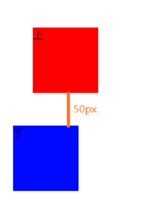
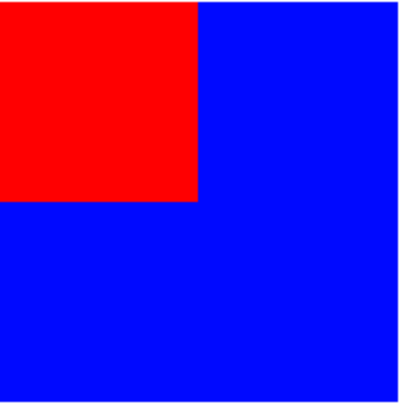
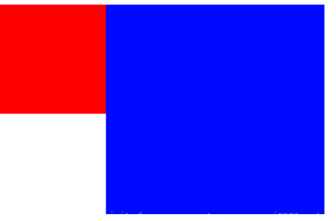
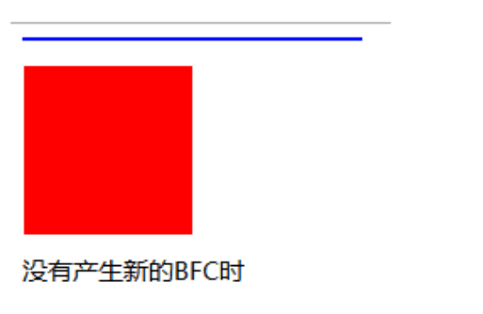
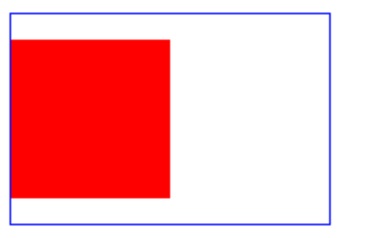
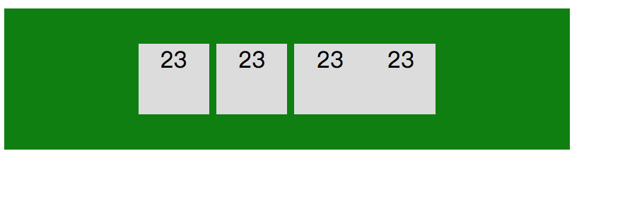

# css 篇

## css选择器有哪些，

## 选择器的权重

1. 第一等级：代表 内联样式，如 `style=""` ，权值为 1000；
2. 第二等级：代表 ID选择器，如 `#id=""` , 权值为 100；
3. 第三等级：代表 `class` | 伪类 | 属性 选择器，如 `.class | :hover,:link,:target | [type]` , 权值 10；
4. 第四等级：代表 标签 | 伪元素 选择器，如 p | ::after, ::before, ::fist-inline, ::selection, 权值 1；

> 此外，通用选择器（*），子选择器（>）， 相邻同胞选择器（+）等选择器不在4等级之内，所以它们的权值都为 0；

> 3点比较规则

1. 先从高等级进行比较，高等级相同时，再比较低等级的，以此类推；
2. 完全相同的话，就采用 后者优先原则（也就是样式覆盖）；
3. css属性后面加 !important 时，无条件绝对优先（比内联样式还要优先）；

## 盒子模型

## 如何实现水平居中和垂直居中

## css清除浮动的几种方法

### 一、常用css定位流描述

#### 1、文档流定位 `position: static` （默认方式）

页面元素的默认定位方式

* **块级元素**：按照从上到下的方式逐个排列
* **行内元素**：按照从左到右的方式逐个排列

> 但是如何让多个块级元素在一行内显示? 方法之一：浮动定位

#### 2、浮动定位 float

`floa: left/right`
这个属性原本是用来做文字环绕的，但是后来大家发现做布局也不错，就一直这么用了

#### 3、相对定位 `position: relative`

元素会相对于它原来的位置偏移某个距离，改变元素位置后，元素原本的空间依然会被保留（不会脱离文档流）

#### 4、绝对定位 `position: absolute`

特征:

* 1、脱离文档流-不占据页面空间
* 2、通过偏移属性固定元素位置
* 3、相对于最近的已定位的祖先元素实现位置固定
* 4、如果没有已定位祖先元素，那么就相对于最初的包含块(body, html)去实现位置的固定

### 二、浮动的效果

* 1、浮动定位元素会被排除在文档流之外-脱离文档流(不占据页面空间), 其余的元素要上前补位
* 2、浮动元素会停靠在父元素的左边或右边，或停靠在其他已浮动元素的边缘上(元素只能在当前所在行浮动)
* 3、浮动元素依然位于父元素之内
* 4、浮动元素处理的问题-解决多个块级元素在一行内显示的问题

#### 注意

* 1、一行内，显示不下所有的已浮动元素时，最后一个将换行
* 2、元素一旦浮动起来之后，那么宽度将变成自适应(宽度由内容决定)
* 3、元素一旦浮动起来之后，那么就将变成 **类似行内块级元素**
* 4、文本，行内元素，行内块元素时采用环绕的方式来排列的，是不会被浮动元素压在底下的，会巧妙的避开浮动元素

#### 浮动的影响？

由于浮动元素会脱离文档流，所以导致不占据页面空间，所以会对父元素高度带来一定影响。如果一个元素中包含的元素全部是浮动元素，那么该元素高度将变成0（**高度塌陷**）

### 三、清除浮动

#### 方案1

* 直接设置父元素的高度
* 优势：极其简单
* 弊端：必须要知道父元素高度是多少

#### 方案2

* 在父元素中，追加空子元素，并设置其clear属性为both
* clear是css中专用于清除浮动的属性
* 作用：清除当前元素前面的元素浮动所带来的影响

**取值：**

    - 1、 `none` :默认值，不做任何清除浮动的操作
    - 2、 `left` : 清除前面元素左浮动带来的影响
    - 3、 `right` :清除前面元素右浮动带来的影响
    - 4、 `both` : 清除前面元素所有浮动带来的影响
* 优势：代码量少 容易掌握 简单易懂
* 弊端：会添加许多无意义的空标签，有违结构与表现的分离，不便于后期的维护

#### 方案3

* 设置父元素浮动
* 优势：简单，代码量少，没有结构和语义化问题
* 弊端：对后续元素会有影响

#### 方案4

* 为父元素设置overflow属性
* 取值：hidden 或 auto
* 优势：简单，代码量少
* 弊端：如果有内容要溢出显示(弹出菜单)，也会被一同隐藏

#### 方案5

* 父元素设置display:table
* 优势：不影响结构与表现的分离，语义化正确，代码量少
* 弊端：盒模型属性已经改变，会造成其他问题

#### 方案6

使用内容生成的方式清除浮动

```
.clearfix:after {
   content:"";
   display: block;
   clear:both;
}
```

* `:after` 选择器向选定的元素之后插入内容
* `content:""` ; 生成内容为空
* `display: block` ; 生成的元素以块级元素显示,
* `clear:both` ; 清除前面元素浮动带来的影响
* 相对于空标签闭合浮动的方法
* 优势：不破坏文档结构，没有副作用
* 弊端：代码量多

#### 方案7

```
.cf:before,.cf:after {
   content:"";
   display:table;
}
.cf:after { clear:both; }
```

* 优势：不破坏文档结构，没有副作用
* 弊端： 代码量多

> 注意：display:table本身无法触发BFC，但是它会产生匿名框(anonymous boxes)，而匿名框中的display:table-cell可以触发BFC，简单说就是，触发块级格式化上下文的是匿名框，而不是display:table。所以通过display:table和display:table-cell创建的BFC效果是不一样的（后面会说到BFC）。

> CSS2.1 表格模型中的元素，可能不会全部包含在除HTML之外的文档语言中。这时，那些“丢失”的元素会被模拟出来，从而使得表格模型能够正常工作。所有的表格元素将会自动在自身周围生成所需的匿名table对象，使其符合table/inline-table、table-row、table- cell的三层嵌套关系。

### 疑问

* 为什么会margin边距重叠？
* overflow:hidden, 语义应该是溢出: 隐藏，按道理说，子元素浮动了，但依然是在父元素里的，而父元素高度塌陷，高度为0了，子元素应该算是溢出了，为什么没有隐藏，反而撑开了父元素的高度？
* 为什么display:table也能清除浮动，原理是什么？

## BFC

**BFC(Block formatting context)直译为”块级格式化上下文”**:。它是一个独立的渲染区域，只有Block-level box参与， 它规定了内部的Block-level Box如何布局，并且与这个区域外部毫不相干。

* `block-level box` ，display属性为block, list-item, table的元素，会生成block-level box。并且参与block fomatting context。
* `inline-level box` ， display属性为inline, inline-block, inline-table的元素，会生成inline-level box。并且参与inline formatting context。

### BFC布局规则：

* 1、内部的Box会在垂直方向，按照从上到下的方式逐个排列。
* 2、Box垂直方向的距离由margin决定。属于同一个BFC的两个相邻Box的margin会发生重叠
* 3、每个元素的margin box的左边， 与包含块border box的左边相接触(对于从左往右的格式化，否则相反)。即使存在浮动也是如此。
* 4、BFC的区域不会与float box重叠。
* 5、BFC就是页面上的一个隔离的独立容器，容器里面的子元素不会影响到外面的元素。反之也如此。
* 6、计算BFC的高度时，浮动元素的高度也参与计算

### 触发BFC的条件

* 1、根元素
* 2、float （left，right）
* 3、overflow 除了visible 以外的值（hidden，auto，scroll ）
* 4、display (table-cell，table-caption，inline-block)
* 5、position（absolute，fixed）

### BFC example

* 1、依据BFC布局规则第二条：

Box垂直方向的距离由margin决定。属于同一个BFC的两个相邻Box的margin会发生重叠
注意：发生重叠后，外边距的高度等于两个发生重叠的外边距的高度中的较大者

```
<style>
   .top{
    width:100px;
    height:100px;
    background:red;
    margin:50px;
   }
   .bottom{
    width:100px;
    height:100px;
    background:blue;
    margin:20px;
   }
</style>
<body>
    <div class="top">上</div>
    <div class="bottom">下</div>
</body>
```



* 2、依据BFC布局规则第三条：

每个元素的margin box的左边， 与包含块border box的左边相接触(对于从左往右的格式化，否则相反)。即使存在浮动也是如此。
我们可以看到，虽然有浮动的元素top，但是bottom的左边依然与包含块的左边相接触。

```
<style>
   .top{
    width:100px;
    height:100px;
    background:red;
    float:left;
   }
   .bottom{
    width:200px;
    height:200px;
    background:blue;
   }
</style>
<body>
    <div class="top"></div>
    <div class="bottom"></div>
</body>
```



* 3、依据BFC布局规则第四条：

BFC的区域不会与float box重叠。
看代码和效果图，可以看出，这次的代码比上面的代码多了一行overflow:hidden; 用这行代码触发新的BFC后，由于这个新的BFC不会与浮动的top重叠，所以bottom的位置改变了

```
<style>
   .top{
    width:100px;
    height:100px;
    background:red;
    float:left;
   }
   .bottom{
    width:200px;
    height:200px;
    background:blue;
    overflow:hidden;
   }
</style>
<body>
    <div class="top"></div>
    <div class="bottom"></div>
</body>
```



* 4、依据BFC布局规则第六条：

计算BFC的高度时，浮动元素的高度也参与计算。
到此我们应该是解决了上面的所有疑问了。

```
<style>
   p{
    width:100px;
    height:100px;
    background:red;
    float:left;
   }
   div{
    width:200px;
    border:1px solid blue;
   }
</style>
<body>
    <div>
       <p></p>
    </div>
</body>
```



当div增加 overflow:hidden; 时 效果如下



> 清除浮动的方式有很多种，但是实现的原理主要是靠clear属性和触发新的BFC，通过详细的解释与比较，最后两种内容生成的方式是比较推荐使用的，如果需要考虑margin重叠的问题，就用方案7，不考虑就用方案6

* 5、自适应两栏布局

```
<style>
	body {
		width: 300px;
		position: relative;
	}
	.aside {
		width: 100px;
		height: 150px;
		float: left;
		background: #f66;
	}
	.main {
		height: 200px;
		background: #fcc;
               overflow: hidden;
	}
</style>
<body>
	<div class="aside"></div>
	<div class="main"></div>
</body>
```

每个元素的margin box的左边, 与包含块border box的左边相接触(对于从左往右的格式化, 否则相反)。即使存在浮动也是如此。
因此, 虽然存在浮动的元素aslide, 但main的左边依然会与包含块的左边相接触。
根据BFC布局规则第四条:
BFC的区域不会与float box重叠。
我们可以通过通过触发main生成BFC, 来实现自适应两栏布局。
`.main { overflow: hidden/auto;}`
当触发main生成BFC后, 这个新的BFC不会与浮动的aside重叠。因此会根据包含块的宽度, 和aside的宽度, 自动变窄。效果如下:

> 参考文献：https://blog.csdn.net/FE_dev/article/details/68954481

## 相邻的两个inline-block节点为什么会出现间隔，该如何解决？

### 产生间隔的原因：
元素被当成行内元素排版的时候，原来HTML代码中的回车换行被转成一个空白符，在字体不为0的情况下，空白符占据一定宽度，所以 `inline-bloc` 的元素之间就出现了空隙。这些元素之间的间距会随着字体的大小而变化，当行内元素font-size:16px时，间距为8px。

``` html
<style>
    .baba {
        display: inline-block;
        width: 400px;
        height: 100px;
        background: green;
        display: table-cell;
        vertical-align: middle;
        text-align: center;
    }

    .son {
        display: inline-block;
        width: 50px;
        height: 50px;
        background: #dcdcdc;
    }
</style>
</head>

<body>
    <span class="baba">
        <span class="son">23</span>
        <span class="son">23</span>
        <span class="son">23</span><span class="son">23</span>
    </span>
</body>
```



### 解决方案：

* 方法1: 给父级元素设置font-size： 0；子元素设置相应的font-size

* 方法2：改变书写方式, 去掉标签直接的空格

* 方法3：使用margin负值

* 方法4：使用word-spacing或letter-spacing（设置父元素，display:table和word-spacing）

## css sprite 是什么, 有什么优缺点

> 概念：将多个小图片拼接到一个图片中。通过 background-position 和元素尺寸调节需要显示的背景图案。

### 优点：

1. 减少 HTTP 请求数，极大地提高页面加载速度
2. 增加图片信息重复度，提高压缩比，减少图片大小
3. 更换风格方便，只需在一张或几张图片上修改颜色或样式即可实现

### 缺点：

1. 图片合并麻烦
2. 维护麻烦，修改一个图片可能需要重新布局整个图片，样式

## display: none; 与visibility: hidden; 的区别

### 联系：它们都能让元素不可见

### 区别：

1. display:none;会让元素完全从渲染树中消失，渲染的时候不占据任何空间；visibility: hidden;不会让元素从渲染树消失，渲染时元素继续占据空间，只是内容不可见。
2. display: none;是非继承属性，子孙节点消失由于元素从渲染树消失造成，通过修改子孙节点属性无法显示；visibility: hidden;是继承属性，子孙节点由于继承了 hidden 而消失，通过设置 visibility: visible，可以让子孙节点显示。
3. 修改常规流中元素的 display 通常会造成文档重排。修改 visibility 属性只会造成本元素的重绘。
4. 读屏器不会读取 display: none;元素内容；会读取 visibility: hidden;元素内容。

## 块级元素和行内元素

默认情况下，其宽度自动填满其父元素宽度，行内元素不会独占一行，相邻的行内元素会排列在同一行里，直到一行排不下，才会换行，其宽度随元素的内容而变化

* 块级元素可以设置width、height属性。行内元素设置width、height属性无效。
* 块级元素可以设置margin和padding属性。行内元素的margin和padding属性很奇怪，水平方向的padding-left、padding-right、margin-left、margin-right都产生边距效果，但竖直方向的padding-top、padding-bottom、margin-top、margin-bottom却不会产生边距效果。

## 水平居中

##### 一、行内元素

* 1. 给父元素设置 `text-align：center` ， 此方法对 `inline` 、 `inline-block` 、 `inline-table` 和 `inline-flex` 元素水平居中都有效。

* 2.table+margin 先将子元素设置为块级表格来显示（类似），再将其设置水平居中

``` html
<div class="parent">
    <div class="child">Demo</div>
</div>
<style>
    .parent {
        text-align: center;
    }

    .child {
        display: inline-block;
    }
</style>
```

##### 二、块级元素的水平居中

* 1. 固定宽度的块级元素

``` css
.child {
    width: 100px;
    margin: 0 auto;
}
```

* 2. 不确定宽度的块级元素的水平居中

> 方法一，使用 `absolute+transform` 先将父元素设置为相对定位，再将子元素设置为绝对定位，向右移动子元素，移动距离为父容器的一半，最后通过向左移动子元素的一半宽度以达到水平居中。

``` html
<div class="parent">
    <div class="child">Demo</div>
</div>
<style>
    .child {
        position: absolute;
        left: 50%;
        transform: translateX(-50%);
    }

    .parent {
        position: relative;
    }
</style>
```

> 方法二，flex+justify-content (不管是定宽还是不定宽都适用)

**通过CSS3中的布局利器flex中的justify-content属性来达到水平居中。**

```
<div class="parent">
  <div class="child">Demo</div>
</div>
<style>
  .parent {
    display: flex;
    justify-content:center;
  }
</style>
```

* 3. 绝对定位元素水平居中

这种方式非常独特，**通过子元素绝对定位，外加 `margin: 0 auto` 来实现**。

``` html
<div class="parent">
    <div class="child">让绝对定位的元素水平居中对齐。</div>
</div>
<style>
    .parent {
        position: relative;
    }

    .child {
        position: absolute;
        /*绝对定位*/
        width: 200px;
        height: 100px;
        background: yellow;
        margin: 0 auto;
        /*水平居中*/
        left: 0;
        /*此处不能省略，且为0*/
        right: 0;
        /*此处不能省略，且为0*/
    }
</style>
```

## 竖直居中

##### 一、行内元素

* 1. 单行内联元素垂直居中

父元素高度和行高设置为相同

``` html
<div id="box">
    <span>单行内联元素垂直居中。</span>。
</div>
<style>
    #box {
        height: 120px;
        line-height: 120px;
        border: 2px dashed #f69c55;
    }
</style>
```

* 2. 多行内联元素垂直居中

> 方法一、利用flex布局（flex）

**利用flex布局实现垂直居中，其中flex-direction: column定义主轴方向为纵向**。。

``` html
<div class="parent">
    <p>Dance like nobody is watching, code like everybody is.
        Dance like nobody is watching, code like everybody is.
        Dance like nobody is watching, code like everybody is.</p>
</div>
<style>
    .parent {
        height: 140px;
        display: flex;
        flex-direction: column;
        justify-content: center;
        border: 2px dashed #f69c55;
    }
</style>
```


> 方法二、利用表布局（table）

**利用表布局的vertical-align: middle可以实现子元素的垂直居中**

``` html
<div class="parent">
    <p class="child">The more technology you learn, the more you realize how little you know.
        The more technology you learn, the more you realize how little you know.
        The more technology you learn, the more you realize how little you know.</p>
</div>
<style>
    .parent {
        display: table;
        height: 140px;
        border: 2px dashed #f69c55;
    }

    .child {
        display: table-cell;
        vertical-align: middle;
    }
</style>
```

###### 块级元素垂直居中

* 1. 使用absolute+负margin(已知高度宽度)

**通过绝对定位元素距离顶部50%，并设置margin-top向上偏移元素高度的一半，就可以实现了**。

``` html
<div class="parent">
    <div class="child">固定高度的块级元素垂直居中。</div>
</div>
.parent {
position: relative;
}
.child {
position: absolute;
top: 50%;
height: 100px;
margin-top: -50px;
}
```

* 2. 使用absolute+transform

**当垂直居中的元素的高度和宽度未知时，可以借助CSS3中的transform属性向Y轴反向偏移50%的方法实现垂直居中**。但是部分浏览器存在兼容性的问题。

```
<div class="parent">
    <div class="child">未知高度的块级元素垂直居中。</div>
</div>
.parent {
position: relative;
}
.child {
position: absolute;
top: 50%;
transform: translateY(-50%);
}
```

* 3. 使用flex+align-items

**通过设置flex布局中的属性align-items，使子元素垂直居中**。

```
<div class="parent">
    <div class="child">未知高度的块级元素垂直居中。</div>
</div>
.parent {
    display:flex;
    align-items:center;
}
```

4. 使用table-cell+vertical-align

**通过将父元素转化为一个表格单元格显示（类似 `<td>` 和 `<th>` ），再通过设置 `vertical-align` 属性，使表格单元格内容垂直居中。**

```
<div class="parent">
  <div class="child">Demo</div>
</div>
<style>
  .parent {
    display: table-cell;
    vertical-align: middle;
  }
</style>
```

##### 1、父元素高度不确定的文本、图片、块级元素的竖直居中

父元素高度不确定的文本、图片、块级元素的竖直居中是通过给父容器设置相同上下边距实现的

##### 2、父元素高度确定的单行文本的竖直居中

父元素高度确定的单行文本的竖直居中，是通过给父元素设置line-height来实现的，line-height值和父元素的高度值相同

##### 3、父元素高度确定的多行文本、图片、块级元素的竖直居中

* 方法一：说到竖直居中，CSS中有一个用于竖直居中的属性vertical-align。 设置display: table-cell
* 不知道自己高度和父容器高度的情况下, 利用绝对定位只需要以下三行：

```
parentElement{
        position:relative;
    }

 childElement{
        position: absolute;
        top: 50%;
        transform: translateY(-50%);

 }
```

* 若父容器下只有一个元素，且父元素设置了高度，则只需要使用相对定位即可

```
parentElement{
        height:xxx;
    }

    .childElement {
      position: relative;
      top: 50%;
      transform: translateY(-50%);
    }
```

```
parentElement{
    display:flex;/*Flex布局*/    align-items:center;/*指定垂直居中*/
}
```

```
vw、vh、vmin和vmax是CSS3中的新单位，是一种视窗单位，也是相对单位。它们的大小都是由视窗大小来决定的，单位1，代表类似于1%。具体描述如下：

vw：视窗宽度的百分比
vh：视窗高度的百分比
vmin：当前较小的vw和vh
vmax：当前较大的vw和vh

视窗，指的是浏览器可视区域的宽高，也就是window.innerWidth/window.innerHeight。1vw就是1%的浏览器的宽度。100vw就是整个视窗的宽度。
```

### 清除浮动

#### 方案1

* 直接设置父元素的高度
* 优势：极其简单
* 弊端：必须要知道父元素高度是多少

#### 方案2

* 在父元素中，追加空子元素，并设置其clear属性为both
* clear是css中专用于清除浮动的属性
* 作用：清除当前元素前面的元素浮动所带来的影响

**取值：**

    - 1、 `none` :默认值，不做任何清除浮动的操作
    - 2、 `left` : 清除前面元素左浮动带来的影响
    - 3、 `right` :清除前面元素右浮动带来的影响
    - 4、 `both` : 清除前面元素所有浮动带来的影响
* 优势：代码量少 容易掌握 简单易懂
* 弊端：会添加许多无意义的空标签，有违结构与表现的分离，不便于后期的维护

#### 方案3

* 设置父元素浮动
* 优势：简单，代码量少，没有结构和语义化问题
* 弊端：对后续元素会有影响

#### 方案4

* 为父元素设置overflow属性
* 取值：hidden 或 auto
* 优势：简单，代码量少
* 弊端：如果有内容要溢出显示(弹出菜单)，也会被一同隐藏

#### 方案5

* 父元素设置display:table
* 优势：不影响结构与表现的分离，语义化正确，代码量少
* 弊端：盒模型属性已经改变，会造成其他问题

#### 方案6

使用内容生成的方式清除浮动

```
.clearfix:after {
   content:"";
   display: block;
   clear:both;
}
```

* `:after` 选择器向选定的元素之后插入内容
* `content:""` ; 生成内容为空
* `display: block` ; 生成的元素以块级元素显示,
* `clear:both` ; 清除前面元素浮动带来的影响
* 相对于空标签闭合浮动的方法
* 优势：不破坏文档结构，没有副作用
* 弊端：代码量多

#### 方案7

```
.cf:before,.cf:after {
   content:"";
   display:table;
}
.cf:after { clear:both; }
```

* 优势：不破坏文档结构，没有副作用
* 弊端： 代码量多


## DPR
css的逻辑像素没变，可物理像素却变多了，一个逻辑像素要对于多个物理像素，这两者的比例就是 DPR
`DPR = 物理像素/css逻辑像素`

可通过`window.devicePixelRatio` 获取设备的 DPR

## link 和 @import 的区别
### 从属关系区别
`link`:是 html 提供的标签，不仅可以加载css样式表，还可以定义 `RSS、rel` 连接属性等。
`@import`:是 css 提供的语法规则，用于导入样式表。


### 加载顺序区别
link：文件是同时加载。
@import 引入的 CSS 将在页面加载完毕后被加载(导致闪烁问题)
