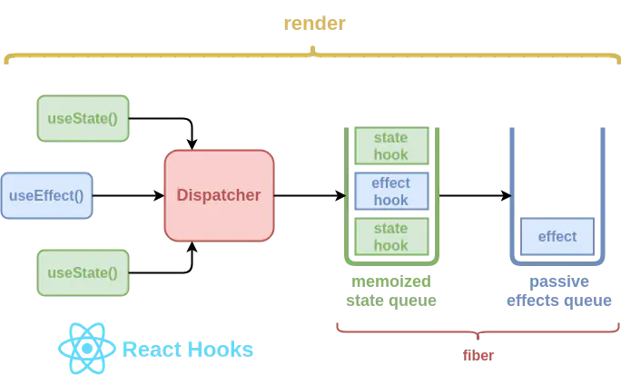
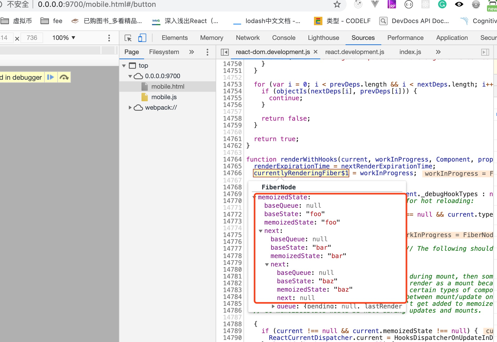

<div class="title">hook</div>
Hook 是什么？ Hook 是一个特殊的函数，它可以让你“钩入” React 的特性。

## 1. hook 解决的问题
1. **在组件之间复用状态逻辑很难：** 之前的一些解决方案，比如 **render props** 和 **高阶组件**。但是这类方案需要重新组织你的组件结构，这可能会很麻烦，使代码难以理解。 Hook 从组件中提取状态逻辑，使得这些逻辑可以单独测试并复用
2. **复杂组件变得难以理解：** 每个生命周期常常包含一些不相关的逻辑。
3. **难以理解的 class：**class的`this`问题,class压缩的问题

## 2. Hook 使用规则
Hook 就是 JavaScript 函数，但是使用它们会有两个额外的规则：
1. 只能在函数最外层调用 Hook。不要在循环、条件判断或者子函数中调用。
2. 只能在 React 的函数组件中调用 Hook或者自定义Hook。

## 3. hook原理
React hook 系统概要示意图


### 3.1. Dispatcher
`dispatcher` 是一个包含了 `hook` 函数的共享对象。基于 `ReactDOM` 的渲染状态，它将会被动态的分配或者清理，并且它能够确保用户不可在 `React` 组件之外获取 `hook`
`dispatcher` 在每次 `hook` 的调用中都会被函数 `resolveDispatcher()` 解析。正如我之前所说，在 React 的渲染周期之外，这些都无意义了，React 将会打印出警告信息：“hook 只能在函数组件内部调用”

```js
let currentDispatcher
const dispatcherWithoutHooks = { /* ... */ }
const dispatcherWithHooks = { /* ... */ }

function resolveDispatcher() {
  if (currentDispatcher) return currentDispatcher
  throw Error("Hooks can't be called")
}

function useXXX(...args) {
  const dispatcher = resolveDispatcher()
  return dispatcher.useXXX(...args)
}

function renderRoot() {
  currentDispatcher = enableHooks ? dispatcherWithHooks : dispatcherWithoutHooks
  performWork()
  currentDispatcher = null
}
```

### 3.2. hook 队列
在 React 后台，hook 被表示为以调用顺序连接起来的节点。这样做原因是 hook 并不能简单的被创建然后丢弃。它们有一套特有的机制，也正是这些机制让它们成为 hook。一个 hook 会有数个属性，在继续学习之前，我希望你能牢记于心：

1. 它的初始状态会在初次渲染的时候被创建。
2. 它的状态可以在运行时更新。
3. React 可以在后续渲染中记住 hook 的状态。
4. React 能根据调用顺序提供给你正确的状态。
5. React 知道当前 hook 属于哪个 fiber。

另外，也需要重新思考看待组件状态的方式。目前，我们只把它看作一个简单的对象：
旧视角理解 React 的状态
```js
{
  foo: 'foo',
  bar: 'bar',
  baz: 'baz',
}
```
但是当处理 hook 的时候，状态需要被看作是一个队列，每个节点都表示一个状态模型：

hoook React的状态的结构
```js
{
  memoizedState: 'foo',
  next: {
    memoizedState: 'bar',
    next: {
      memoizedState: 'bar',
      next: null
    }
  }
}
```

单个 `hook` 节点的结构可以在源码中查看。你将会发现，`hook` 还有一些附加的属性，但是弄明白 `hook` 是如何运行的关键在于它的 `memoizedState` 和 `next` 属性。其他的属性会被 `useReducer() hook` 使用，可以缓存发送过的 `action` `和一些基本的状态，这样在某些情况下，reduction` 过程还可以作为后备被重复一次：

* **`baseState`** —— 传递给 `reducer` 的状态对象。
* **`baseUpdate`** —— 最近一次创建 `baseState` 的已发送的 `action。`
* **`queue`** —— 已发送 `action` 组成的队列，等待传入 `reducer。`

```js
function mountWorkInProgressHook(): Hook {
  const hook: Hook = {
    memoizedState: null,
    baseState: null,
    baseQueue: null,
    queue: null,
    next: null,
  };

  if (workInProgressHook === null) {
    // This is the first hook in the list
    // 将第一个 hook 队列中第一个节点的引用将会被保存在已渲染 当前fiber节点 的 memoizedState 属性中
    currentlyRenderingFiber.memoizedState = workInProgressHook = hook;
  } else {
    // Append to the end of the list
    workInProgressHook = workInProgressHook.next = hook;
  }
  return workInProgressHook;
}
```
在每个函数组件调用时，`mountWorkInProgressHook`的函数将先被调用，在这个函数中，当前 `fiber` 和 `fiber` 的 `hook` 队列中第一个节点的引用将会被保存在已渲染 `fiber` 的 `memoizedState` 属性中
通过断点可以查看到 `currentlyRenderingFiber`对象上面的memoizedState的值


### 3.3. State hook
`useState hook` 在后台使用了 `useReducer`，并且它将 `useReducer` 作为预定义的 `reducer`（详见源码）。这意味着，`useState` 返回的结果实际上已经是 `reducer` 状态，同时也是一个 `action dispatcher`。请看，如下是 state hook 使用的 reducer 处理器
```js
function basicStateReducer(state, action) {
  return typeof action === 'function' ? action(state) : action;
}
```
> 我们也可以传入 action 函数给 dispatcher，这个 action 函数可以接收旧的状态并返回新的。

#### 3.3.1. 例子
```js
const ParentComponent = () => {
  const [name, setName] = useState()

  return (
    <ChildComponent toUpperCase={setName} />
  )
}

const ChildComponent = (props) => {
  useEffect(() => {
    props.toUpperCase((state) => state.toUpperCase())
  }, [true])

  return null
}
```

```js
export function useState<S>(
  initialState: (() => S) | S,
): [S, Dispatch<BasicStateAction<S>>] {
  return useReducer(
    basicStateReducer,
    // useReducer has a special case to support lazy useState initializers
    (initialState: any),
  );
}

export function useReducer<S, A>(
  reducer: (S, A) => S,
  initialState: S,
  initialAction: A | void | null,
): [S, Dispatch<A>] {
  currentlyRenderingFiber = resolveCurrentlyRenderingFiber();
  workInProgressHook = createWorkInProgressHook();
  let queue: UpdateQueue<A> | null = (workInProgressHook.queue: any);
  if (queue !== null) {
    // Already have a queue, so this is an update.
    if (isReRender) {
      // This is a re-render. Apply the new render phase updates to the previous
      // work-in-progress hook.
      const dispatch: Dispatch<A> = (queue.dispatch: any);
      if (renderPhaseUpdates !== null) {
        // Render phase updates are stored in a map of queue -> linked list
        const firstRenderPhaseUpdate = renderPhaseUpdates.get(queue);
        if (firstRenderPhaseUpdate !== undefined) {
          renderPhaseUpdates.delete(queue);
          let newState = workInProgressHook.memoizedState;
          let update = firstRenderPhaseUpdate;
          do {
            // Process this render phase update. We don't have to check the
            // priority because it will always be the same as the current
            // render's.
            const action = update.action;
            newState = reducer(newState, action);
            update = update.next;
          } while (update !== null);

          workInProgressHook.memoizedState = newState;

          // Don't persist the state accumlated from the render phase updates to
          // the base state unless the queue is empty.
          // TODO: Not sure if this is the desired semantics, but it's what we
          // do for gDSFP. I can't remember why.
          if (workInProgressHook.baseUpdate === queue.last) {
            workInProgressHook.baseState = newState;
          }

          return [newState, dispatch];
        }
      }
      return [workInProgressHook.memoizedState, dispatch];
    }
    // The last update in the entire queue
    const last = queue.last;
    // The last update that is part of the base state.
    const baseUpdate = workInProgressHook.baseUpdate;

    // Find the first unprocessed update.
    let first;
    if (baseUpdate !== null) {
      if (last !== null) {
        // For the first update, the queue is a circular linked list where
        // `queue.last.next = queue.first`. Once the first update commits, and
        // the `baseUpdate` is no longer empty, we can unravel the list.
        last.next = null;
      }
      first = baseUpdate.next;
    } else {
      first = last !== null ? last.next : null;
    }
    if (first !== null) {
      let newState = workInProgressHook.baseState;
      let newBaseState = null;
      let newBaseUpdate = null;
      let prevUpdate = baseUpdate;
      let update = first;
      let didSkip = false;
      do {
        const updateExpirationTime = update.expirationTime;
        if (updateExpirationTime < renderExpirationTime) {
          // Priority is insufficient. Skip this update. If this is the first
          // skipped update, the previous update/state is the new base
          // update/state.
          if (!didSkip) {
            didSkip = true;
            newBaseUpdate = prevUpdate;
            newBaseState = newState;
          }
          // Update the remaining priority in the queue.
          if (updateExpirationTime > remainingExpirationTime) {
            remainingExpirationTime = updateExpirationTime;
          }
        } else {
          // Process this update.
          const action = update.action;
          newState = reducer(newState, action);
        }
        prevUpdate = update;
        update = update.next;
      } while (update !== null && update !== first);

      if (!didSkip) {
        newBaseUpdate = prevUpdate;
        newBaseState = newState;
      }

      workInProgressHook.memoizedState = newState;
      workInProgressHook.baseUpdate = newBaseUpdate;
      workInProgressHook.baseState = newBaseState;
    }

    const dispatch: Dispatch<A> = (queue.dispatch: any);
    return [workInProgressHook.memoizedState, dispatch];
  }
  // There's no existing queue, so this is the initial render.
  if (reducer === basicStateReducer) {
    // Special case for `useState`.
    if (typeof initialState === 'function') {
      initialState = initialState();
    }
  } else if (initialAction !== undefined && initialAction !== null) {
    initialState = reducer(initialState, initialAction);
  }
  workInProgressHook.memoizedState = workInProgressHook.baseState = initialState;
  queue = workInProgressHook.queue = {
    last: null,
    dispatch: null,
  };
  const dispatch: Dispatch<A> = (queue.dispatch = (dispatchAction.bind(
    null,
    currentlyRenderingFiber,
    queue,
  ): any));
  return [workInProgressHook.memoizedState, dispatch];
}
```

### 3.4. effect hook
effect hook 的一些属性
1. 创建了 fiber 节点时被创建，但是在浏览器渲染之后运行。
2. 如果给出了销毁指令，它们将在下一次绘制前被销毁。
3. 会按照定义的顺序被运行

于是就应该有另一个队列来保存这些 `effect hook`，并且还要能够在绘制后被定位到。通常来说，应该是 `fiber` 保存包含了 `effect` 节点的队列。每个 `effect` 节点都是一个不同的类型，并能在适当的状态下被定位到：

* 在修改之前调用 `getSnapshotBeforeUpdate()` 实例。
* 运行所有插入、更新、删除和 ref 的卸载。
运行所有生命周期函数和 `ref` 回调函数。生命周期函数会在一个独立的通道中运行，所以整个组件树中所有的替换、更新、删除都会被调用。这个过程还会触发任何特定于渲染器的初始 `effect hook`。
`useEffect() hook` 调度的 `effect` —— 也被称为“`被动 effect`”，它基于这部分代码

`hook effect` 将会被保存在 `fiber` 一个称为 `updateQueue` 的属性上，每个 `effect` 节点都有如下的结构（详见源码）：

```js
function pushEffect(tag, create, destroy, deps) {
  const effect: Effect = {
    tag,
    create,
    destroy,
    deps,
    // Circular
    next: (null: any),
  };
  let componentUpdateQueue: null | FunctionComponentUpdateQueue = (currentlyRenderingFiber.updateQueue: any);
  if (componentUpdateQueue === null) {
    componentUpdateQueue = createFunctionComponentUpdateQueue();
    currentlyRenderingFiber.updateQueue = (componentUpdateQueue: any);
    componentUpdateQueue.lastEffect = effect.next = effect;
  } else {
    const lastEffect = componentUpdateQueue.lastEffect;
    if (lastEffect === null) {
      componentUpdateQueue.lastEffect = effect.next = effect;
    } else {
      const firstEffect = lastEffect.next;
      lastEffect.next = effect;
      effect.next = firstEffect;
      componentUpdateQueue.lastEffect = effect;
    }
  }
  return effect;
}
```
1. `tag` —— 一个二进制数字，它控制了 effect 节点的行为（后文我将详细说明）。
2. `create` —— 绘制之后运行的回调函数。
3. `destroy` —— 它是 create() 返回的回调函数，将会在初始渲染前运行。
4. `inputs` —— 一个集合，该集合中的值将会决定一个 effect 节点是否应该被销毁或者重新创建。
5. `next` —— 它指向下一个定义在函数组件中的 effect 节点。

除了 tag 属性，其他的属性都很简明易懂。如果你对 `hook` 很了解，你应该知道，React 提供了一些特殊的 `effect hook`：比如 `useMutationEffect()` 和 `useLayoutEffect()`。这两个 `effect hook` 内部都使用了 `useEffect()`，实际上这就意味着它们创建了 `effect hook`，但是却使用了不同的 `tag` 属性值。
这个 tag 属性值是由二进制的值组合而成（详见源码）：
```js
const NoEffect = /*             */ 0b00000000;
const UnmountSnapshot = /*      */ 0b00000010;
const UnmountMutation = /*      */ 0b00000100;
const MountMutation = /*        */ 0b00001000;
const UnmountLayout = /*        */ 0b00010000;
const MountLayout = /*          */ 0b00100000;
const MountPassive = /*         */ 0b01000000;
const UnmountPassive = /*       */ 0b10000000;
```
React 支持的 hook effect 类型
这些二进制值中最常用的情景是使用管道符号（|）连接，将比特相加到单个某值上。然后我们就可以使用符号（&）检查某个 tag 属性是否能触发一个特定的行为。如果结果是非零的，就表示可以。
```js
const effectTag = MountPassive | UnmountPassive
assert(effectTag, 0b11000000)
assert(effectTag & MountPassive, 0b10000000)
```
如何使用 React 的二进制设计模式的示例
这里是 React 支持的 hook effect，以及它们的 tag 属性（详见源码）：
```js
Default effect —— UnmountPassive | MountPassive.
Mutation effect —— UnmountSnapshot | MountMutation.
Layout effect —— UnmountMutation | MountLayout.
```
以及这里是 React 如何检查行为触发的：


### 3.5. useReducer 如何实现
源码在`ReactFiberHooks.js` 最新版的react v16.8.6。把`useReducer` 分成了`mountReducer`, `updateReducer`, `rerenderReducer`

#### 3.5.1. mountReducer
```js
function mountReducer<S, I, A>(
  reducer: (S, A) => S,
  initialArg: I,
  init?: I => S,
): [S, Dispatch<A>] {
  const hook = mountWorkInProgressHook();
  let initialState;
  if (init !== undefined) {
    initialState = init(initialArg);
  } else {
    initialState = ((initialArg: any): S);
  }
  hook.memoizedState = hook.baseState = initialState;
  const queue = (hook.queue = {
    pending: null,
    dispatch: null,
    lastRenderedReducer: reducer,
    lastRenderedState: (initialState: any),
  });
  const dispatch: Dispatch<A> = (queue.dispatch = (dispatchAction.bind(
    null,
    currentlyRenderingFiber,
    queue,
  ): any));
  return [hook.memoizedState, dispatch];
}
```

### 3.6. 插入的重点
自定义的`reducer`函数会赋值给`lastRenderedReducer`, 而`lastRenderedReducer`的默认值是`basicStateReducer`如下代码.
当`lastRenderedReducer`是默认值时就是`useState`的功能

```js
// useState 的lastRenderedReducer 就是用的该函数, state为上一次的状态， action可以为函数或者新的state的值。
// basicStateReducer 函数的返回值就是该hook最新的state值
function basicStateReducer<S>(state: S, action: BasicStateAction<S>): S {
  // $FlowFixMe: Flow doesn't like mixed types
  return typeof action === 'function' ? action(state) : action;
}
```
#### 3.6.1. updateReducer
```js
function updateReducer<S, I, A>(
  reducer: (S, A) => S,
  initialArg: I,
  init?: I => S,
): [S, Dispatch<A>] {
  const hook = updateWorkInProgressHook();
  const queue = hook.queue;
  invariant(
    queue !== null,
    'Should have a queue. This is likely a bug in React. Please file an issue.',
  );

  queue.lastRenderedReducer = reducer;

  const current: Hook = (currentHook: any);

  // The last rebase update that is NOT part of the base state.
  let baseQueue = current.baseQueue;

  // The last pending update that hasn't been processed yet.
  const pendingQueue = queue.pending;
  if (pendingQueue !== null) {
    // We have new updates that haven't been processed yet.
    // We'll add them to the base queue.
    if (baseQueue !== null) {
      // Merge the pending queue and the base queue.
      const baseFirst = baseQueue.next;
      const pendingFirst = pendingQueue.next;
      baseQueue.next = pendingFirst;
      pendingQueue.next = baseFirst;
    }
    if (__DEV__) {
      if (current.baseQueue !== baseQueue) {
        // Internal invariant that should never happen, but feasibly could in
        // the future if we implement resuming, or some form of that.
        console.error(
          'Internal error: Expected work-in-progress queue to be a clone. ' +
            'This is a bug in React.',
        );
      }
    }
    current.baseQueue = baseQueue = pendingQueue;
    queue.pending = null;
  }

  if (baseQueue !== null) {
    // We have a queue to process.
    const first = baseQueue.next;
    let newState = current.baseState;

    let newBaseState = null;
    let newBaseQueueFirst = null;
    let newBaseQueueLast = null;
    let update = first;
    do {
      const suspenseConfig = update.suspenseConfig;
      const updateLane = update.lane;
      const updateEventTime = update.eventTime;
      if (!isSubsetOfLanes(renderLanes, updateLane)) {
        // Priority is insufficient. Skip this update. If this is the first
        // skipped update, the previous update/state is the new base
        // update/state.
        const clone: Update<S, A> = {
          eventTime: updateEventTime,
          lane: updateLane,
          suspenseConfig: suspenseConfig,
          action: update.action,
          eagerReducer: update.eagerReducer,
          eagerState: update.eagerState,
          next: (null: any),
        };
        if (newBaseQueueLast === null) {
          newBaseQueueFirst = newBaseQueueLast = clone;
          newBaseState = newState;
        } else {
          newBaseQueueLast = newBaseQueueLast.next = clone;
        }
        // Update the remaining priority in the queue.
        // TODO: Don't need to accumulate this. Instead, we can remove
        // renderLanes from the original lanes.
        currentlyRenderingFiber.lanes = mergeLanes(
          currentlyRenderingFiber.lanes,
          updateLane,
        );
        markSkippedUpdateLanes(updateLane);
      } else {
        // This update does have sufficient priority.

        if (newBaseQueueLast !== null) {
          const clone: Update<S, A> = {
            eventTime: updateEventTime,
            // This update is going to be committed so we never want uncommit
            // it. Using NoLane works because 0 is a subset of all bitmasks, so
            // this will never be skipped by the check above.
            lane: NoLane,
            suspenseConfig: update.suspenseConfig,
            action: update.action,
            eagerReducer: update.eagerReducer,
            eagerState: update.eagerState,
            next: (null: any),
          };
          newBaseQueueLast = newBaseQueueLast.next = clone;
        }

        // Mark the event time of this update as relevant to this render pass.
        // TODO: This should ideally use the true event time of this update rather than
        // its priority which is a derived and not reverseable value.
        // TODO: We should skip this update if it was already committed but currently
        // we have no way of detecting the difference between a committed and suspended
        // update here.
        markRenderEventTimeAndConfig(updateEventTime, suspenseConfig);

        // Process this update.
        if (update.eagerReducer === reducer) {
          // If this update was processed eagerly, and its reducer matches the
          // current reducer, we can use the eagerly computed state.
          newState = ((update.eagerState: any): S);
        } else {
          const action = update.action;
          newState = reducer(newState, action);
        }
      }
      update = update.next;
    } while (update !== null && update !== first);

    if (newBaseQueueLast === null) {
      newBaseState = newState;
    } else {
      newBaseQueueLast.next = (newBaseQueueFirst: any);
    }

    // Mark that the fiber performed work, but only if the new state is
    // different from the current state.
    if (!is(newState, hook.memoizedState)) {
      markWorkInProgressReceivedUpdate();
    }

    hook.memoizedState = newState;
    hook.baseState = newBaseState;
    hook.baseQueue = newBaseQueueLast;

    queue.lastRenderedState = newState;
  }

  const dispatch: Dispatch<A> = (queue.dispatch: any);
  return [hook.memoizedState, dispatch];
}
```
#### 3.6.2. rerenderReducer
```js
function rerenderReducer<S, I, A>(
  reducer: (S, A) => S,
  initialArg: I,
  init?: I => S,
): [S, Dispatch<A>] {
  const hook = updateWorkInProgressHook();
  const queue = hook.queue;
  invariant(
    queue !== null,
    'Should have a queue. This is likely a bug in React. Please file an issue.',
  );

  queue.lastRenderedReducer = reducer;

  // This is a re-render. Apply the new render phase updates to the previous
  // work-in-progress hook.
  const dispatch: Dispatch<A> = (queue.dispatch: any);
  const lastRenderPhaseUpdate = queue.pending;
  let newState = hook.memoizedState;
  if (lastRenderPhaseUpdate !== null) {
    // The queue doesn't persist past this render pass.
    queue.pending = null;

    const firstRenderPhaseUpdate = lastRenderPhaseUpdate.next;
    let update = firstRenderPhaseUpdate;
    do {
      // Process this render phase update. We don't have to check the
      // priority because it will always be the same as the current
      // render's.
      const action = update.action;
      newState = reducer(newState, action);
      update = update.next;
    } while (update !== firstRenderPhaseUpdate);

    // Mark that the fiber performed work, but only if the new state is
    // different from the current state.
    if (!is(newState, hook.memoizedState)) {
      markWorkInProgressReceivedUpdate();
    }

    hook.memoizedState = newState;
    // Don't persist the state accumulated from the render phase updates to
    // the base state unless the queue is empty.
    // TODO: Not sure if this is the desired semantics, but it's what we
    // do for gDSFP. I can't remember why.
    if (hook.baseQueue === null) {
      hook.baseState = newState;
    }

    queue.lastRenderedState = newState;
  }
  return [newState, dispatch];
}
```