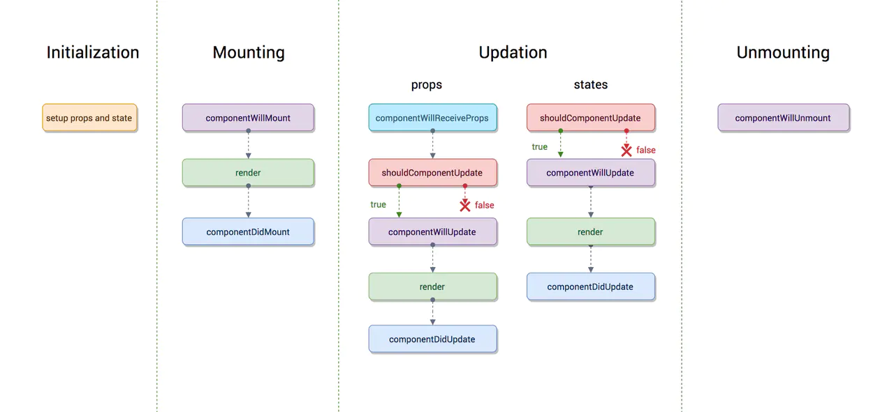
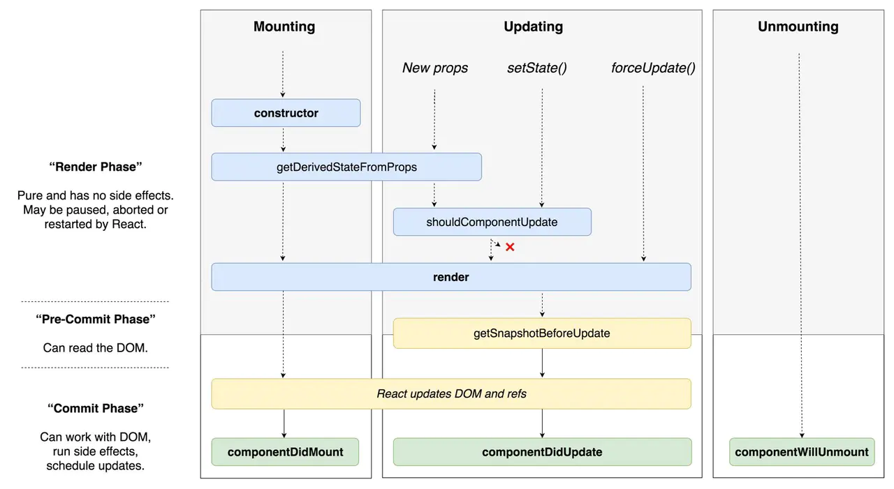

react 异步渲染

## 1. 同步渲染的问题
假设有一个超大的 React 组件树结构，有 1000 个组件，每个组件平均使用 1 毫秒，那么，要做一次完整的渲染就要花费 1000 毫秒也就是 1 秒钟，然而 JavaScript 运行环境是单线程的，也就是说，React 用同步渲染方式，渲染最根部组件的时候，会同步引发渲染子组件，再同步渲染子组件的子组件……最后完成整个组件树。在这 1 秒钟内，同步渲染霸占 JavaScript 唯一的线程，其他的操作什么都做不了，在这 1 秒钟内，如果用户要点击什么按钮，或者在某个输入框里面按键，都不会看到立即的界面反应，这也就是俗话说的“卡顿”。
在同步渲染下，要解决“卡顿”的问题，只能是尽量缩小组件树的大小，以此缩短渲染时间，但是，应用的规模总是在增大的，不是说缩小就能缩小的，虽然我们利用定义 shouldComponentUpdate 的方法可以减少不必要的渲染，但是这也无法从根本上解决大量同步渲染带来的“卡顿”问题。

## 2. 异步渲染：两阶段渲染
`React Fiber` 引入了`异步渲染`，有了异步渲染之后，React 组件的渲染过程是分时间片的，不是一口气从头到尾把子组件全部渲染完，而是每个时间片渲染一点，然后每个时间片的间隔都可去看看有没有更紧急的任务（比如用户按键），如果有，就去处理紧急任务，如果没有那就继续照常渲染。

根据 `React Fiber` 的设计，一个组件的渲染被分为两个阶段：
1. 第一个阶段（也叫做 `render 阶段`）是可以被 `React` 打断的，一旦被打断，这阶段所做的所有事情都被废弃，当 `React` 处理完紧急的事情回来，依然会重新渲染这个组件，这时候第一阶段的工作会重做一遍；
2. 第二个阶段叫做 `commit` 阶段，一旦开始就不能中断，也就是说第二个阶段的工作会稳稳当当地做到这个组件的渲染结束。

两个阶段的分界点，就是 `render 函数`。`render 函数`之前的所有`生命周期函数`（包括 `render`)都属于第一阶段，之后的都属于第二阶段。

开启异步渲染，虽然我们获得了更好的感知性能，但是考虑到**第一阶段的的生命周期函数可能会被重复调用，不得不对历史代码做一些调整**。

在 React v16.3 之前，`render` 之前的生命周期函数（也就是第一阶段生命周期函数）包括这些：
1. componentWillReceiveProps
2. shouldComponentUpdate
3. componentWillUpdate
4. componentWillMount
5. render
为什么不在 componentWillMount 里去做AJAX？componentWillMount 可是比 componentDidMount 更早调用啊，更早调用意味着更早返回结果，那样性能不是更高吗？
首先，一个组件的 componentWillMount 比 componentDidMount 也早调用不了几微秒，性能没啥提高；而且，等到异步渲染开启的时候，componentWillMount 就可能被中途打断，中断之后渲染又要重做一遍，想一想，在 componentWillMount 中做 AJAX 调用，代码里看到只有调用一次，但是实际上可能调用 N 多次，这明显不合适。相反，若把 AJAX 放在 componentDidMount，因为 componentDidMount 在第二阶段，所以绝对不会多次重复调用，这才是 AJAX 合适的位置

 React v16.3 之前的完整的生命周期函数图：

## 3. getDerivedStateFromProps

到了 `React v16.3`，`React` 干脆引入了一个新的生命周期函数 `getDerivedStateFromProps`，这个生命周期函数是一个 `static` 函数，在里面根本不能通过 `this` 访问到当前组件，输入只能通过参数，对组件渲染的影响只能通过返回值。没错，`getDerivedStateFromProps` `应该是一个纯函数，React` 就是通过要求这种纯函数，强制开发者们必须适应异步渲染。
到了 React v16.3，React 生命周期函数全图如下:

注意，上图中并包含全部`React`生命周期函数，在React v16发布时，还增加了一个`componentDidCatch`，当异常发生时，一个可以捕捉到异常的`componentDidCatch`就排上用场了。不过，很快React觉着这还不够，在v16.6.0又推出了一个新的捕捉异常的生命周期函数`getDerivedStateFromError`。

如果异常发生在第一阶段（render阶段），React就会调用`getDerivedStateFromError`，如果异常发生在第二阶段（commit阶段），React会调用`componentDidCatch`。这个区别也体现出两个阶段的区分对待。

## 4. 适应异步渲染的组件原则
你的代码应该做到在 render 之前最多只能这些函数被调用：

构造函数
`getDerivedStateFromProps`
`shouldComponentUpdate`
幸存的这些第一阶段函数，除了构造函数，其余两个全都必须是纯函数，也就是不应该做任何有副作用的操作。

实际上，如果之前你的用法规范，除了 `shouldComponentUpdate` 不怎么使用第一阶段生命周期函数，你还会发现不怎么需要改动代码，比如 `componentWillMount` 中的代码移到构造函数中就可以了。但是如果用法错乱，比如滥用`componentWillReceiveProps`，那就不得不具体情况具体分析，从而决定这些代码移到什么位置。