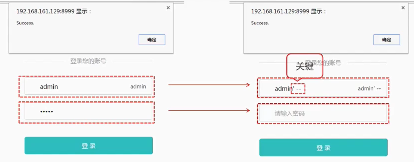
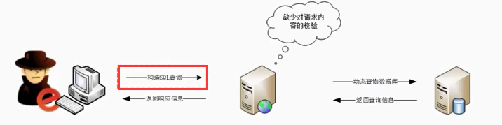

<div class="title">SQL注入</div>

## 1. 原理

我们先举一个万能钥匙的例子来说明其原理：



```html
<form action="/login" method="POST">
    <p>Username: <input type="text" name="username" /></p>
    <p>Password: <input type="password" name="password" /></p>
    <p><input type="submit" value="登陆" /></p>
</form>
```

后端的 SQL 语句可能是如下这样的：

```sql
let querySQL = `
    SELECT *
    FROM user
    WHERE username='${username}'
    AND psw='${password}'
`;
// 接下来就是执行 sql 语句...
```

这是我们经常见到的登录页面，但如果有一个恶意攻击者输入的用户名是 `admin' --` ，密码随意输入，就可以直接登入系统了。why! ----这就是SQL注入

我们之前预想的SQL 语句是:

```sql
SELECT * FROM user WHERE username='admin' AND psw='password'
```

但是恶意攻击者用奇怪用户名将你的 SQL 语句变成了如下形式：

```sql
SELECT * FROM user WHERE username='admin' --' AND psw='xxxx'
```

在 SQL 中, `' --` 是闭合和注释的意思，-- 是注释后面的内容的意思，所以查询语句就变成了：

```sql
SELECT * FROM user WHERE username='admin'
```

所谓的万能密码, 本质上就是SQL注入的一种利用方式。

一次SQL注入的过程包括以下几个过程：

* 获取用户请求参数
* 拼接到代码当中
* SQL语句按照我们构造参数的语义执行成功

**SQL注入的必备条件： 1. 可以控制输入的数据 2. 服务器要执行的代码拼接了控制的数据**。



我们会发现SQL注入流程中与正常请求服务器类似，只是黑客控制了数据，构造了SQL查询，而正常的请求不会SQL查询这一步，**SQL注入的本质: 数据和代码未分离，即数据当做了代码来执行。**

## 2. 危害

* 获取数据库信息
  + 管理员后台用户名和密码
  + 获取其他数据库敏感信息：用户名、密码、手机号码、身份证、银行卡信息……
  + 整个数据库：脱裤
* 获取服务器权限
* 植入`Webshell`，获取服务器后门
* 读取服务器敏感文件

## 3. 如何防御

1. `严格限制Web应用的数据库的操作权限`，给此用户提供仅仅能够满足其工作的最低权限，从而最大限度的减少注入攻击对数据库的危害
1. `后端代码检查输入的数据是否符合预期`，严格限制变量的类型，例如使用正则表达式进行一些匹配处理。
1. `对进入数据库的特殊字符（'，"，\，<，>，&，*，; 等）进行转义处理，或编码转换`。基本上所有的后端语言都有对字符串进行转义处理的方法，比如 lodash 的 lodash._escapehtmlchar 库。
1. `所有的查询语句建议使用数据库提供的参数化查询接口`，参数化的语句使用参数而不是将用户输入变量嵌入到 SQL 语句中，即不要直接拼接 SQL 语句。例如 Node.js 中的 mysqljs 库的 query 方法中的 ? 占位参数。

