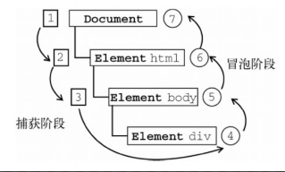

## 事件流



`DOM2级事件` 规定的事件流包括三个阶段： `事件捕获阶段` 、 `处于目标阶段` 、 `事件冒泡阶段` 。

> * 捕获阶段不会涉及事件目标
> * IE9、Opera、Firefox、Chrome和Safari都支持DOM事件流；IE8及更早版本不支持DOM事件流。
> * HTML事件、DOM0级事件不会触发捕获间断，DOM2级事件(addEventListener)的第三个参数，如果为false触发 `目标阶段` 和 `冒泡阶段` ，如果为false触发 `捕获阶段` 和 `目标阶段`
> * event对象属性eventPhase，1代表捕获阶段，2代表目标阶段，3代表冒泡阶段

## 事件处理程序

### 1. HTML事件处理程序
直接在html中绑定事件。

```
<input type="button" value="Click Me" onclick="handleClick(event)" />
<input type="button" value="Click Me" onblur="handleBlur(this)" />
```

> event变量，可以直接访问事件对象, this值等于事件的目标元素

#### 缺点：

* (1). 存在一个时差问题。因为用户可能会在HTML元素一出现在页面上就触发相应的事件，但当时的事件处理程序有可能尚不具备执行条件。
* (2). 这样扩展事件处理程序的作用域链在不同浏览器中会导致不同结果。不同JavaScript引擎遵循的标识符解析规则略有差异，很可能会在访问非限定对象成员时出错

### 2. DOM0级事件处理程序

是将一个函数赋值给一个事件处理程序属性。

``` js
var btn = document.getElementById("myBtn");
btn.onclick = function() {
    alert("Clicked");
};
// 程序中的this引用当前元素。
// 删除事件处理程序
btn.onclick = null;
```

### 3、DOM2级事件处理程序

“DOM2级事件”定义了两个方法，用于处理指定和删除事件处理程序的操作： `addEventListener()` 和 `removeEventListener()` 。所有DOM节点中都包含这两个方法，并且它们都接受3个参数：

* 1. 要处理的事件名、
* 2. 作为事件处理程序的函数
* 3. 一个布尔值。最后这个布尔值参数如果是 `true` ，表示在捕获阶段调用事件处理程序；如果是 `false` ，表示在冒泡阶段调用事件处理程序。

> 使用DOM2级方法添加事件处理程序的主要好处是可以添加多个事件处理程序。

```
var btn = document.getElementById("myBtn");
btn.addEventListener("click", function(){alert(this.id);}, false);

btn.addEventListener("click", function(){alert("Hello world!"); }, false);
```

> 扩展：DOM3级事件规定的是事件类型比如鼠标事件，键盘事件，以及一些html5事件

## dom渲染（回流和重绘）load、DOMContentLoaded等等事件的触发顺序

## document 中的load事件和DOMContentLoaded事件之间的区别是什么？

当初始的 HTML 文档被完全加载和解析完成之后， `DOMContentLoaded` 事件被触发，而无需等待样式表、图像和子框架的完成加载。

`window` 的 `load` 事件仅在 DOM 和所有相关资源全部完成加载后才会触发。
