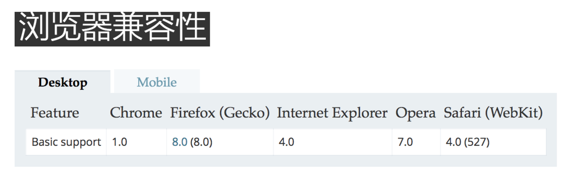

<div class="title">原生dom操作方法</div>

## 1. createElement()
用于创建一个由标签名称 `tagName` 指定的 DOM 元素。如果用户代理无法识别 tagName，则会生成一个未知 HTML 元素 HTMLUnknownElement。
```js
var element = document.createElement(tagName[, options]);

```

```js
document.body.onload = addElement;

function addElement () {
  // 创建一个新的 div 元素
  let newDiv = document.createElement("div");
  // 给它一些内容
  let newContent = document.createTextNode("Hi there and greetings!");
  // 添加文本节点 到这个新的 div 元素
  newDiv.appendChild(newContent);

  // 将这个新的元素和它的文本添加到 DOM 中
  let currentDiv = document.getElementById("div1");
  document.body.insertBefore(newDiv, currentDiv);
}
```

## 2. appendChild()
将一个节点添加到指定父节点的子节点列表末尾, 如果传入到appendChild()中的节点已经是文档的一部分了，那结果就是将该节点从原来的位置转移到新位置。即使可以将DOM树看成是由一系列指针连接起来的，但任何DOM节点也不能同时出现在文档中的多个位置上。

```js
//将一个节点添加到指定父节点的子节点列表末尾。
const child = node.appendChild(child);
// node: 是要插入子节点的父节点.
// child: 即是参数又是这个方法的返回值.
```

## 3. insertBefore()
参考节点之前插入一个节点作为一个指定父节点的子节点

```js
const insertedElement = parentElement.insertBefore(newElement, referenceElement);
//1. referenceElement为null则newElement将被插入到子节点的末尾。
//2. 如果newElement已经在DOM树中，newElement首先会从DOM树中移除。
```

> `insertedElement` 是被插入的节点，即 newElement

`parentElement` 是新插入节点的父节点
`newElement` 是被插入的节点
`referenceElement` 在插入newElement之前的那个节点

## 4. replaceChild()
接受的两个参数是：要插入的节点和要替换的节点

```js
const replacedNode = parentNode.replaceChild(newChild, oldChild);
// newChild 用来替换 oldChild 的新节点。如果该节点已经存在于DOM树中，则它会被从原始位置删除。
// oldChild  被替换掉的原始节点。
// replacedNode 和 oldChild相等。
// 返回被替换掉的节点
```

## 5. removeChild()
从DOM中删除一个子节点。返回删除的节点

```js
let oldChild = node.removeChild(child);
//OR
element.removeChild(child);
// child 是要移除的那个子节点.
// node 是child的父节点.
// oldChild保存对删除的子节点的引用. oldChild === child.
```

## 6. cloneNode()
接受一个布尔值参数，表示是否执行深复制。在参数为true的情况下，执行深复制，也就是复制节点及其整个子节点树；在参数为false的情况下，执行浅复制，即只复制节点本身。

## 7. normalize()

> cloneNode 和 normalize 所有类型的节点都有

## 8. insertAdjacentHTML()
将指定的文本解析为HTML或XML，并将结果节点插入到DOM树中的指定位置。它不会重新解析它正在使用的元素，因此它不会破坏元素内的现有元素。这避免了额外的序列化步骤，使其比直接innerHTML操作更快。

### 8.1. 语法
```
element.insertAdjacentHTML(position, text);
```
>position是相对于元素的位置，并且必须是以下字符串之一：
>* `beforebegin`: 元素自身的前面。
>* `afterbegin`: 插入元素内部的第一个子节点之前。
>* `beforeend`: 插入元素内部的最后一个子节点之后。
>* `afterend`: 元素自身的后面。
>text是要被解析为HTML或XML,并插入到DOM树中的字符串。

位置名称的可视化：
```html
<!-- beforebegin -->
<p>
<!-- afterbegin -->
foo
<!-- beforeend -->
</p>
<!-- afterend -->
```
> 注意： beforebegin和afterend位置,仅在节点在树中且节点具有一个parent元素时工作.
### 8.2. eg
```
// <div id="one">one</div>
var d1 = document.getElementById('one');
d1.insertAdjacentHTML('afterend', '<div id="two">two</div>');

// 此时，新结构变成：
// <div id="one">one</div><div id="two">two</div>
```
### 8.3. 游览器兼容


参考标准：[MDN-element.insertAdjacentHTML](https://developer.mozilla.org/zh-CN/docs/Web/API/Element/insertAdjacentHTML)

## 9. ul li li li  调换第一个和最后一个dom的位置

```html
<ul>
  <li> 1 </li>
  <li> 2 </li>
  <li > 3 </li>
  <li> 4 </li>
</ul>
```

``` js

  const ulEl = document.querySelector('ul');
  const liElList = document.querySelectorAll('ul li');
  const liElListLength = liElList.length;
  const lastLi = liElList[liElListLength - 1];
  const firstLi = ulEl.replaceChild(liElList[liElListLength - 1], liElList[0])
  ulEl.appendChild(firstLi);
```
