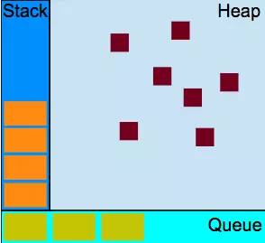
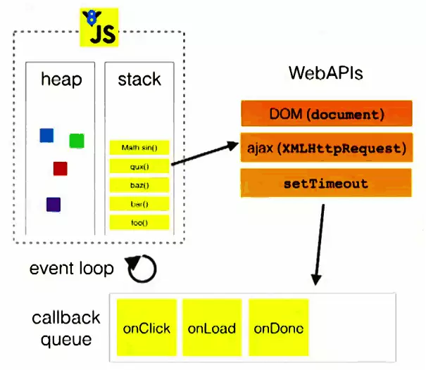
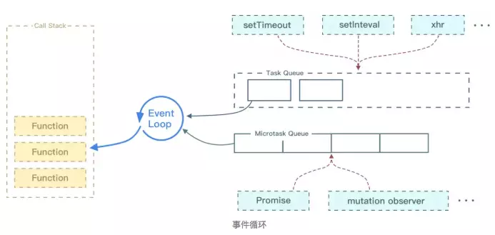
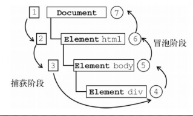

# js篇

## 作用域， 作用域链
### 1.作用域：
代码的执行环境，全局执行环境就是全局作用域，函数的执行环境就是私有作用域，它们都是栈内存
* 私有作用域 ----> 函数执行都会形成一个私有作用域
* 全局作用域 ----> 页面一打开就会形成一个全局的作用域

### 2.作用域链
代码在一个环境中执行时，会创建变量对象的一个作用域链（作用域形成的链条）
* 作用域链的前端，始终都是当前执行的代码所在环境的变量对象
* 作用域链中的下一个对象来自于外部环境，而在下一个变量对象则来自下一个外部环境，一直到全局执行环境
* 全局执行环境的变量对象始终都是作用域链上的最后一个对象

ES5 只有全局作用域和函数作用域，没有块级作用域，es6 块级作用域

## 箭头函数与普通函数的不同点
* 1.函数体内的this对象，就是定义时所在的对象，而不是使用时所在的对象。

* 2.不可以当作构造函数，也就是说，不可以使用new命令，否则会抛出一个错误。

* 3.不可以使用arguments对象，该对象在函数体内不存在。如果要用，可以用 rest 参数代替。

* 4.不可以使用yield命令，因此箭头函数不能用作 Generator 函数。

## prototype 属性的作用
原型对象的所有属性和方法，都能被实例对象共享。也就是说，如果属性和方法定义在原型上，那么所有实例对象就能共享. 好处，1. 节省了内存 2. 体现了实例对象之间的联系。
> 每个函数都有一个`prototype`属性，指向一个对象。对于普通函数来说，该属性基本无用。但是，对于构造函数来说，生成实例的时候，该属性会自动成为实例对象的原型

```js
function f() {}
typeof f.prototype // "object"

function Animal(name) {
  this.name = name;
}
Animal.prototype.color = 'white';

var cat1 = new Animal('大毛');
var cat2 = new Animal('二毛');

cat1.color // 'white'
cat2.color // 'white'
```

## constructor 属性
### 1.简述
`prototype对象`有一个`constructor`属性，默认指向`prototype对象`所在的`构造函数`。
```js
function P() {}
P.prototype.constructor === P // true
```
constructor属性定义在prototype对象上面，意味着可以被所有实例对象继承。
```js
function P() {}
var p = new P();

p.constructor === P // true
p.constructor === P.prototype.constructor // true
p.hasOwnProperty('constructor') // false
```
### 2. 作用
#### (1). 可以得知某个实例对象，到底是哪一个构造函数产生的。
```js
function F() {};
var f = new F();

f.constructor === F // true
f.constructor === RegExp // false
```
#### (2). 可以从一个实例对象新建另一个实例。
```js
function Constr() {}
var x = new Constr();

var y = new x.constructor();
y instanceof Constr // true
```
> instanceof: 运算符返回一个布尔值，表示对象是否为某个构造函数的实例。

## 原型、原型链
对象都有自己的原型对象(`prototype`)。任何一个对象，都可以充当其他对象的原型，而原型对象也是对象，所以它也有自己的原型。因此，就会形成一个“原型链”（`prototype chain`）：对象到原型，再到原型的原型，如果一层层地上溯，所有对象的原型最终都可以上溯到`Object.prototype`，即`Object`构造函数的`prototype`属性。也就是说，所有对象都继承了`Object.prototype`的属性。这就是所有对象都有`valueOf和toString`方法的原因，因为这是从`Object.prototype`继承的。`Object.prototype`的原型是`null`
> `Object.getPrototypeOf`方法返回参数对象的原型

## this
### 1.this简述
`this` a.在构造函数之中，表示实例对象. b.this就是属性或方法“当前”所在的对象. c.用apply,call,bind的情况略为特殊
```js
this.property
```
> this就代表property属性当前所在的对象。

```js
var person = {
  name: '张三',
  describe: function () {
    return '姓名：'+ this.name;
  }
};
```
> this就代表person所在的对象。

### 2.辨别函数内部this的指向
#### (1). 非严格模式: 根据调用环境上下文确定
```html
<html lang="en">
<body>
  <p>hello word</p>
</body>
<script type="text/javascript">
    function getName(){
        console.log('this', this);
    }

    getName() // window

    const a = {
                name: 'xxx'
        getName
    }
    a.b() // object a
</script>
</html>
```
#### (2). 严格模式: 在严格模式下，未指定环境对象而调用函数，则this值不会转型为window。除非明确把函数添加到某个对象或者调用apply(),call(), bind，否则this值将是undefined。
```html
<!DOCTYPE html>
<html lang="en">
<body>
  <p>hello word</p>
</body>
<script type="text/javascript">
    'use strict'
    // 验证第一条剪头函数this指向
    const getName = () => { console.log(this) }
    getName() // window

    function getAge(){
        console.log('this', this);
    }
    getAge() // undefined
    const obj = {
      name: 'xxx',
      age: 32,
      getAge,
      getName
    }
    obj.getAge() // object a
    obj.getName() // window
</script>
</html>
```
#### (3). apply(), call(), bind 指定

## new 命令的原理
1. 创建一个空对象，作为将要返回的对象实例。
2. 将这个空对象的原型，指向构造函数的prototype属性。
3. 将这个空对象赋值给函数内部的this关键字。
4. 开始执行构造函数内部的代码。

## 宿主对象（host objects）和原生对象（native objects）的区别是什么？
* 原生对象：是由 ECMAScript 规范定义的 JavaScript 内置对象，比如String、Math、RegExp、Object、Function等等。
* 宿主对象：是由运行时环境（浏览器或 Node）提供，比如window、XMLHTTPRequest等等。

## 如何在改变一个对象的属性时对其进行拦截。
```js
  const obj = {}
  let bValue = ''
  Object.defineProperty(obj, "b", {
    get: function(){
      return bValue+10;
    },

    set: function (newValue) {
      console.log('newValue', newValue)
      bValue = newValue;
    }
  });
  obj.b = 3;
  console.log(';2323', obj)
```

## JS中如何自定义事件。
### 1. CustomEvent
```js
  let customEvent = new CustomEvent('customEventName', {
    detail: {
      a: 1
    }
  })
  document.dispatchEvent(customEvent)
  document.addEventListener('customEventName', e => {
    console.log(e)
    console.log(e.detail.a) // 1
  })
```
### 2. createEvent
```js
let ev = document.createEvent('CustomEvent')
ev.initCustomEvent('ev', false, true, {b: 2})
document.dispatchEvent(ev)
document.addEventListener('ev', e => {
    console.log(e)
    console.log(e.detail.b) // 2
})
```
## JS中0.1 + 0.2 不等于0.3的具体原因是什么， 如何解决这个问题？

## flat函数
## 找出数组中和为给定值的两个元素，如：[1, 2, 3, 4, 5]中找出和为6的两个元素。

## 闭包
闭包的定义：函数 A 内部有一个函数 B，函数 B 可以访问到函数 A 中的变量，那么函数 B 就是闭包。
```js
function A() {
  let a = 1
  window.B = function () {
      console.log(a)
  }
}
A()
B() // 1
```

>意义: 1.就是让我们可以间接访问函数内部的变量。2.让这些变量的值始终保持在内存中

## ES5/ES6的实现类的区别还有什么区别？
1. 严格模式： 类和模块的内部，默认就是严格模式，
2. 不存在提升
3. class 的所有方法（包括静态方法和实例方法）都是不可枚举的。
4. class 的所有方法（包括静态方法和实例方法）都没有原型对象 prototype，所以也没有[[construct]]，不能使用 new 来调用
5. 必须使用 new 调用 class。
6. class 内部无法重写类名。

## setTimeout 经典问题
```js
for (var i = 1; i <= 5; i++) {
  setTimeout(function timer() {
    console.log(i)
  }, i * 1000)
}
// 输出结果：输出一堆 6。
```
#### 输出1,2,3,4,5方法
* 方法1, 闭包
```js
for (var i = 1; i <= 5; i++) {
  ;(function(j) {
    setTimeout(function timer() {
      console.log(j)
    }, j * 1000)
  })(i)
}
```
* 方法2，setTimeout第三个参数
```js
for (var i = 1; i <= 5; i++) {
  setTimeout(
    function timer(j) {
      console.log(j)
    },
    i * 1000,
    i
  )
}
```
* 方法3， let方法
```js
for (let i = 1; i <= 5; i++) {
  setTimeout(function timer() {
    console.log(i)
  }, i * 1000)
}
```

## js引擎执行队列、微任务、宏任务(并发模型与事件循环)
### 并发（concurrency）和并行（parallelism）区别
* **并发是宏观概念**，我分别有任务 A 和任务 B，在一段时间内通过任务间的切换完成了这两个任务，这种情况就可以称之为并发。

* **并行是微观概念**，假设 CPU 中存在两个核心，那么我就可以同时完成任务 A、B。同时完成多个任务的情况就可以称之为并行。

JavaScript 的并发模型基于“事件循环”。
### 1.运行时概念


Javascript执行引擎的主线程运行的时候，产生`堆（heap`）和`栈（stack）`，程序中代码依次进入栈中等待执行，若执行时遇到异步方法，该异步方法会被添加到用于回调的队列（queue）中【即JavaScript执行引擎的主线程拥有一个执行栈/堆和一个任务队列

* **栈：** 函数调用形成了一个栈帧
```
function foo(b) {
  var a = 10;
  return a + b + 11;
}

function bar(x) {
  var y = 3;
  return foo(x * y);
}

console.log(bar(7)); // 返回 42
```
当调用 bar 时，创建了第一个帧 ，帧中包含了 bar 的参数和局部变量。当 bar 调用 foo 时，第二个帧就被创建，并被压到第一个帧之上，帧中包含了 foo 的参数和局部变量。当 foo 返回时，最上层的帧就被弹出栈（剩下 bar 函数的调用帧 ）。当 bar 返回的时候，栈就空了。
* **堆：** 对象被分配在一个堆中，即用以表示一大块非结构化的内存区域。
* **队列：** 一个 JavaScript 运行时包含了一个待处理的消息队列。每一个消息都关联着一个用以处理这个消息的函数。
在[事件循环](https://developer.mozilla.org/zh-CN/docs/Web/JavaScript/EventLoop#Event_loop)期间的某个时刻，运行时从最先进入队列的消息开始处理队列中的消息。为此，这个消息会被移出队列，并作为输入参数调用与之关联的函数。正如前面所提到的，调用一个函数总是会为其创造一个新的栈帧。
函数的处理会一直进行到执行栈再次为空为止；然后事件循环将会处理队列中的下一个消息（如果还有的话）。

### 2.事件循环（Event Loop）


* **queue :**  如上文的解释，值得注意的是，除了IO设备的事件(如load)会被添加到queue中，用户操作产生 的事件（如click,touchmove）同样也会被添加到queue中。队列中的这些事件会在主线程的执行栈被清空时被依次读取（**队列先进先出，即先被压入队列中的事件会被先执行**）。
* **callback:** 被主线程挂起来的代码，等主线程执行队列中的事件时，事件对应的callback代码就会被执行
>【注：因为主线程从”任务队列”中读取事件的过程是循环不断的，因此这种运行机制又称为`Event Loop（事件循环）`】

```
console.log(1);
setTimeout(function() {
    console.log(2);
},5000);
console.log(3);
//输出结果：
//1
//3
//2
```
###### 解释：
* 1. JavaScript执行引擎主线程运行，产生heap和stack
* 2. 从上往下执行同步代码,log(1)被压入执行栈，因为log是webkit内核支持的普通方法而非WebAPIs的方法，因此立即出栈被引擎执行，输出1
* 3. JavaScript执行引擎继续往下，遇到setTimeout()t异步方法（如图，setTimeout属于WebAPIs），将setTimeout(callback,5000)添加到执行栈
* 4. 因为setTimeout()属于WebAPIs中的方法，JavaScript执行引擎在将setTimeout()出栈执行时，注册setTimeout()延时方法交由浏览器内核其他模块（以webkit为例，是webcore模块）处理
* 5. 继续运行setTimeout()下面的log(3)代码，原理同步骤2
* 6. 当延时方法到达触发条件，即到达设置的延时时间时（5秒后），该延时方法就会被添加至任务队列里。这一过程由浏览器内核其他模块处理，与执行引擎主线程独立
* 7. JavaScript执行引擎在主线程方法执行完毕，到达空闲状态时，会从任务队列中顺序获取任务来执行。
* 8. 将队列的第一个回调函数重新压入执行栈，执行回调函数中的代码log(2)，原理同步骤2，回调函数的代码执行完毕，清空执行栈
* 9. JavaScript执行引擎继续轮循队列，直到队列为空
* 10. 执行完毕

### 3.微任务(Macrotask) 和 宏任务(Microtask)

不同的任务源会被分配到不同的 Task 队列中，任务源可以分为 `微任务（microtask）` 和 `宏任务（macrotask）`。在 ES6 规范中，microtask 称为 jobs，macrotask 称为 task。


##### Event Loop 执行顺序如下所示：

* 1. 首先执行同步代码，这属于宏任务
* 2. 当执行完所有同步代码后，执行栈为空，查询是否有异步代码需要执行
* 3. 执行所有微任务
* 4. 当执行完所有微任务后，如有必要会渲染页面
* 5. 然后开始下一轮 Event Loop，执行宏任务中的异步代码，也就是 setTimeout 中的回调函数
##### 实例代码
```js
console.log('script start')

async function async1() {
  await async2()
  console.log('async1 end')
}
async function async2() {
  console.log('async2 end')
}
async1()

setTimeout(function() {
  console.log('setTimeout')
}, 0)

new Promise(resolve => {
  console.log('Promise')
  resolve()
})
  .then(function() {
    console.log('promise1')
  })
  .then(function() {
    console.log('promise2')
  })

console.log('script end')
// script start
// async2 end
// Promise
// script end
// promise1
// promise2
// async1 end
// setTimeout
```

###### 微任务包括: `promise` ，`MutationObserver`。
###### 宏任务包括: `script` ， `setTimeout` ，`setInterval` ，`setImmediate` ，`I/O` ，`UI rendering`。
这里很多人会有个误区，认为微任务快于宏任务，其实是错误的。因为宏任务中包括了 script ，浏览器会先执行一个宏任务，接下来有异步代码的话才会先执行微任务。

### 4.永不阻塞
事件循环模型的一个非常有趣的特性是，与许多其他语言不同，JavaScript 永不阻塞。 处理 I/O 通常通过事件和回调来执行，所以当一个应用正等待一个 [`IndexedDB`](https://developer.mozilla.org/zh-CN/docs/Web/API/IndexedDB_API "IndexedDB 是一种低级API，用于客户端存储大量结构化数据(包括, 文件/ blobs)。该API使用索引来实现对该数据的高性能搜索。虽然 Web Storage 对于存储较少量的数据很有用，但对于存储更大量的结构化数据来说，这种方法不太有用。IndexedDB提供了一个解决方案。") 查询返回或者一个 [`XHR`](https://developer.mozilla.org/zh-CN/docs/Web/API/XMLHttpRequest "使用XMLHttpRequest (XHR)对象可以与服务器交互。您可以从URL获取数据，而无需让整个的页面刷新。这使得Web页面可以只更新页面的局部，而不影响用户的操作。XMLHttpRequest在 Ajax 编程中被大量使用。")请求返回时，它仍然可以处理其它事情，比如用户输入。

遗留的例外是存在的，如 `alert` 或者同步 XHR，但应该尽量避免使用它们。

## js垃圾回收的方法有哪些
### 1.标记清除（mark-and-sweep）
目前主流的垃圾收集算法，这种算法的思想是给当前不使用的值加上标记，然后再回收其内存
### 2.引用计数
引用计数的含义是跟踪记录每个值被引用的次数。当声明了一个变量并将一个引用类型值赋给该变量时，则这个值的引用次数就是1。如果同一个值又被赋给另一个变量，则该值的引用次数加1。相反，如果包含对这个值引用的变量又取得了另外一个值，则这个值的引用次数减1。当这个值的引用次数变成0时，则说明没有办法再访问这个值了，因而就可以将其占用的内存空间回收回来。
> V8 的垃圾回收策略主要基于分代式垃圾回收机制。所谓分代式，就是将内存空间分为新生代和老生代两种，然后采用不同的回收算法进行回收。[查看详细](https://www.jianshu.com/p/7e74b6dcde69)

## js延迟加载的方式有哪些， defer和async的区别
### 1.defer属性
这个属性的用途是表明脚本在执行时不会影响页面的构造。也就是说，脚本会被延迟到整个页面都解析完毕后再运行。因此，在`<script>`元素中设置defer属性，相当于告诉浏览器立即下载，但延迟执行。
### 2.async属性
同样与defer类似，async只适用于外部脚本文件，并告诉浏览器立即下载文件。但与defer不同的是，标记为async的脚本并不保证按照指定它们的先后顺序执行。
### 3.动态创建DOM方式
```js
function downloadJSAtOnload() {
    varelement = document.createElement("script");
    element.src = "defer.js";
    document.body.appendChild(element);
}
```
### 4.放body底部

## 事件委托
用于处理“事件处理程序过多”问题，利用事件冒泡，只指定一个事件处理程序，就可以管理某一类型的所有事件。
### 优点：
1.只添加一个事件处理程序所需的DOM引用更少，所花的时间也更少。
2.整个页面占用的内存空间更少，能够提升整体性能。
3.如果是给document对象很快就可以访问，而且可以在页面生命周期的任何时点上为它添加事件处理程序（无需等待DOMCon-tentLoaded或load事件）

## bind, call, apply解释
### 一、函数4种调用的方式
* 1.函数模式
* 2.方法模式
* 3.构造函数模式
* 4.上下文模式(也有叫apply模式)

### 二、apply, call, bind用法

在JavaScript 中，call、apply 和 bind 是 Function 对象自带的三个方法，这三个方法的主要作用是改变函数调用过程中的 this 指向

#### 1. apply(thisArgs, [argsArray])
* 第一个参数：指定函数体内this对象的指向
  thisArgs 的取值有以下4种情况：
  * 不传，或者传`null`,`undefined`， **非严格模式下** 函数中的 `this` 指向 `window` 对象。 **严格模式**下`不传`、`undefined` 函数中`this`指向`undefined`。`传入null`函数中`this`指向`null`
  * 传递另一个函数的函数名，函数中的 `this` 指向这个函数的引用
  * 传递字符串、数值或布尔类型等基础类型，**非严格模式**函数中的 `this` 指向其对应的包装对象，如 `String`、`Number`、`Boolean`。**严格模式**，指向传入的值
  * 传递一个对象，函数中的 `this` 指向这个对象
* 第二个参数：可以是数组或类数组,apply方法把这个集合中的元素作为参数传递给被调用的函数

```javascript
var func = function(a, b, c) {
  console.log([a, b, c]); // [1,2,3]
}
func.apply(null, [1,2,3])
```

#### 2. call(thisArgs, arg1, arg2, ...)
* 第一个参数thisArgs： 的取值跟apply一样
* 后面是个参数列表`arg1, arg2, ...`
```javascript
function a(){
    console.log(this); //输出函数a中的this对象
}
function b(){} //定义函数b

var obj = {name:'onepixel'}; //定义对象obj
// 严格模式
a.call(); //undefined
a.call(null); //null
a.call(undefined);//undefined
a.call(1); //1
a.call(''); // ''
a.call(true); //true
a.call(b);// function b(){}
a.call(obj); //Object
 // 非严格模式
a.call(); //window
a.call(null); //window
a.call(undefined);//window
a.call(1); //Number
a.call(''); //String
a.call(true); //Boolean
a.call(b);// function b(){}
a.call(obj); //Object
```
> 当使用call或则apply的时候，如果我们传入的第一个参数是null．函数体内的this会指向默认的宿主对象，在游览器中则是window

```javascript
var func = function( a, b, c ){
  alert ( this === window );    // 输出true
};
func.apply( null, [ 1, 2, 3 ] );
```
>但如果是在严格模式下，函数体内的this还是为null：

```javascript
var func = function( a, b, c ){
  "use strict";
  alert ( this === null );     // 输出true
}
func.apply( null, [ 1, 2, 3 ] );
```
有时候我们使用call或者apply的目的不在于指定this指向，而是另有用途，比如借用其他对象的方法。
那么我们可以传入null来代替某个具体的对象：
`Math.max.apply( null, [ 1, 2, 5, 3, 4 ] )    // 输出：5`
>apply 和 call 的唯一区别是第二个参数的传递方式不同，apply 的第二个参数必须是一个数组，而 call 允许传递一个参数列表。值得你注意的是，虽然 apply 接收的是一个参数数组，但在传递给调用函数时，却是以参数列表的形式传递，我们看个简单的例子：

### 3. bind(thisArgs, arg1, arg2, ...)

bind是ES5 新增的一个方法，它的传参和call类似，但又和 call/apply 有着显著的不同，即调用 call 或 apply 都会自动执行对应的函数，而 bind 不会执行对应的函数，只是返回一个原函数的拷贝，并拥有指定的this值和初始参数。

```
var obj = {name:'onepixel'};
/**
 * 给document添加click事件监听，并绑定onClick函数
 * 通过bind方法设置onClick的this为obj，并传递参数p1,p2
 */
document.addEventListener('click',onClick.bind(obj,'p1','p2'),false);

//当点击网页时触发并执行
function onClick(a,b){
  console.log(
    this.name, //onepixel
    a, //p1
    b  //p2
  )
}
```

## CMD、AMD、CommonJS、ES Modules说明

## 跨域。如何允许所有域名跨域（不能通过代理转发）？
### 1、同源策略：
协议相同、域名相同、端口相同

### 2、目的
同源政策的目的，是为了保证用户信息的安全，防止恶意的网站窃取数据。否则 Cookie 可以共享，互联网就毫无安全可言
设想这样一种情况：A网站是一家银行，用户登录以后，又去浏览其他网站。如果其他网站可以读取A网站的 Cookie，会发生什么？
很显然，如果 Cookie 包含隐私（比如存款总额），这些信息就会泄漏。更可怕的是，Cookie 往往用来保存用户的登录状态，如果用户没有退出登录，其他网站就可以冒充用户，为所欲为。因为浏览器同时还规定，提交表单不受同源政策的限制。

### 3、限制范围
* Cookie、LocalStorage 和 IndexDB 无法读取。
* DOM 无法获得。
* AJAX 请求发送后，结果被浏览器拦截了。
> 跨域并不是请求发不出去，请求能发出去，服务端能收到请求并正常返回结果，只是结果被浏览器拦截了
有三个标签是允许跨域加载资源：

* ``
* `<link href=XXX>`
* `<script src=XXX>`
>注意：
> * **第一：如果是协议和端口造成的跨域问题“前端”是无能为力的。**
> * **第二：在跨域问题上，仅仅是通过“URL的首部”来识别而不会根据域名对应的IP地址是否相同来判断。“URL的首部”可以理解为“协议, 域名和端口必须匹配”**。

### 跨域方法
#### 一、JSONP
* **原理：** 网页通过添加一个`<script>`元素，向服务器请求JSON数据，这种做法不受同源政策限制；服务器收到请求后，将数据放在一个指定名字的回调函数里传回来。JSONP请求一定需要对方的服务器做支持才可以。
* **优点：** 简单适用，老式浏览器全部支持，服务器改造非常小。
* **缺点：**  仅支持get方法具有局限性,不安全可能会遭受XSS攻击。
* **基础实现**

```js
// 客户端
function jsonp({ url, params, callback }) {
  return new Promise((resolve, reject) => {
    let script = document.createElement('script')
    window[callback] = function(data) {
      resolve(data)
      document.body.removeChild(script)
    }
    params = { ...params, callback } // wd=b&callback=show
    let arrs = []
    for (let key in params) {
      arrs.push(`${key}=${params[key]}`)
    }
    script.src = `${url}?${arrs.join('&')}`
    document.body.appendChild(script)
  })
}

jsonp({
  url: 'http://example.com/say',
  params: { wd: 'Iloveyou' },
  callback: 'getIp'
}).then(data => {
  console.log(data)
})

// 服务端
let express = require('express')
let app = express()
app.get('/say', function(req, res) {
  let { wd, callback } = req.query
  res.end(`${callback}({
  "ip": "8.8.8.8"
})`)
})
```

#### 二、WebSocket
WebSocket是一种通信协议，使用`ws://`（非加密）和`wss://`（加密）作为协议前缀。该协议不实行同源政策，只要服务器支持，就可以通过它进行跨源通信。

下面是一个例子，浏览器发出的WebSocket请求的头信息（摘自[维基百科](https://en.wikipedia.org/wiki/WebSocket)）。

```
GET /chat HTTP/1.1
Host: server.example.com
Upgrade: websocket
Connection: Upgrade
Sec-WebSocket-Key: x3JJHMbDL1EzLkh9GBhXDw==
Sec-WebSocket-Protocol: chat, superchat
Sec-WebSocket-Version: 13
Origin: http://example.com
```

上面代码中，有一个字段是`Origin`，表示该请求的请求源（origin），即发自哪个域名。
正是因为有了`Origin`这个字段，所以WebSocket才没有实行同源政策。因为服务器可以根据这个字段，判断是否许可本次通信。如果该域名在白名单内，服务器就会做出如下回应。

```
HTTP/1.1 101 Switching Protocols
Upgrade: websocket
Connection: Upgrade
Sec-WebSocket-Accept: HSmrc0sMlYUkAGmm5OPpG2HaGWk=
Sec-WebSocket-Protocol: chat
```

#### 三、 CORS
CORS是跨源资源分享（Cross-Origin Resource Sharing）的缩写。它是W3C标准，是跨源AJAX请求的根本解决方法。相比JSONP只能发`GET`请求，CORS允许任何类型的请求。需要浏览器和后端同时支持。IE 8 和 9 需要通过 XDomainRequest 来实现。
浏览器会自动进行 CORS 通信，实现 CORS 通信的关键是后端。只要后端实现了 CORS，就实现了跨域。

#### 四、 postMessage
`postMessage`是HTML5 XMLHttpRequest Level 2中的API，且是为数不多可以跨域操作的window属性之一，它可用于解决以下方面的问题：

* 1. 页面和其打开的新窗口的数据传递(window.open)
* 2. 多窗口之间消息传递
* 3. 页面与嵌套的iframe消息传递
* 4. 上面三个场景的跨域数据传递

> 注意： 据我 实际项目使用中，IE11在跨域的情况下传输信息很不稳定，如果要兼容IE11,慎用。  建议用修改domain的方法

**postMessage()方法允许来自不同源的脚本采用异步方式进行有限的通信，可以实现跨文本档、多窗口、跨域消息传递**。

> otherWindow.postMessage(message, targetOrigin, [transfer]);

* message: 将要发送到其他 window的数据。
* targetOrigin:通过窗口的origin属性来指定哪些窗口能接收到消息事件，其值可以是字符串"*"（表示无限制）或者一个URI。在发送消息的时候，如果目标窗口的协议、主机地址或端口这三者的任意一项不匹配targetOrigin提供的值，那么消息就不会被发送；只有三者完全匹配，消息才会被发送。
* transfer(可选)：是一串和message 同时传递的 Transferable 对象. 这些对象的所有权将被转移给消息的接收方，而发送一方将不再保有所有权。

接下来我们看个例子： `http://localhost:3000/a.html`页面向`http://localhost:4000/b.html`传递“我爱你”,然后后者传回"我不爱你"。

```
// a.html
  <iframe src="http://localhost:4000/b.html" frameborder="0" id="frame" onload="load()"></iframe> //等它加载完触发一个事件
  //内嵌在http://localhost:3000/a.html
    <script>
      function load() {
        let frame = document.getElementById('frame')
        frame.contentWindow.postMessage('我爱你', 'http://localhost:4000') //发送数据
        window.onmessage = function(e) { //接受返回数据
          console.log(e.data) //我不爱你
        }
      }
    </script>
```
```
// b.html
  window.onmessage = function(e) {
    console.log(e.data) //我爱你
    e.source.postMessage('我不爱你', e.origin)
 }
```

#### 五、 window.name + iframe
window.name属性的独特之处：name值在不同的页面（甚至不同域名）加载后依旧存在，并且可以支持非常长的 name 值（2MB）。

其中a.html和b.html是同域的，都是`http://localhost:3000`;而c.html是`http://localhost:4000`

```
 // a.html(http://localhost:3000/b.html)
  <iframe src="http://localhost:4000/c.html" frameborder="0" onload="load()" id="iframe"></iframe>
  <script>
    let first = true
    // onload事件会触发2次，第1次加载跨域页，并留存数据于window.name
    function load() {
      if(first){
      // 第1次onload(跨域页)成功后，切换到同域代理页面
        let iframe = document.getElementById('iframe');
        iframe.src = 'http://localhost:3000/b.html';
        first = false;
      }else{
      // 第2次onload(同域b.html页)成功后，读取同域window.name中数据
        console.log(iframe.contentWindow.name);
      }
    }
  </script>
```
b.html为中间代理页，与a.html同域，内容为空。

```
 // c.html(http://localhost:4000/c.html)
  <script>
    window.name = '我不爱你'
  </script>
```
总结：通过iframe的src属性由外域转向本地域，跨域数据即由iframe的window.name从外域传递到本地域。这个就巧妙地绕过了浏览器的跨域访问限制，但同时它又是安全操作。

#### 七、location.hash + iframe
实现原理： a.html欲与c.html跨域相互通信，通过中间页b.html来实现。 三个页面，不同域之间利用iframe的location.hash传值，相同域之间直接js访问来通信。

具体实现步骤：一开始a.html给c.html传一个hash值，然后c.html收到hash值后，再把hash值传递给b.html，最后b.html将结果放到a.html的hash值中。
同样的，a.html和b.html是同域的，都是`http://localhost:3000`;而c.html是`http://localhost:4000`

```
 // a.html
  <iframe src="http://localhost:4000/c.html#iloveyou"></iframe>
  <script>
    window.onhashchange = function () { //检测hash的变化
      console.log(location.hash);
    }
  </script>
```
```
 // b.html
  <script>
    window.parent.parent.location.hash = location.hash
    //b.html将结果放到a.html的hash值中，b.html可通过parent.parent访问a.html页面
  </script>
```
```
 // c.html
 console.log(location.hash);
  let iframe = document.createElement('iframe');
  iframe.src = 'http://localhost:3000/b.html#idontloveyou';
  document.body.appendChild(iframe);
```

#### 八、document.domain + iframe
**该方式只能用于二级域名相同的情况下，比如 `a.test.com` 和 `b.test.com` 适用于该方式**。
只需要给页面添加 `document.domain ='test.com'` 表示二级域名都相同就可以实现跨域。

实现原理：两个页面都通过js强制设置document.domain为基础主域，就实现了同域。
##### 常用场景：
* 1. 页面和其打开的新窗口的数据传递(window.open)
* 3. 页面与嵌套的iframe消息传递

我们看个例子：页面`a.zf1.cn:3000/a.html`获取页面`b.zf1.cn:3000/b.html`中a的值
```
// a.html
<body>
 helloa
  <iframe src="http://b.zf1.cn:3000/b.html" frameborder="0" onload="load()" id="frame"></iframe>
  <script>
    document.domain = 'zf1.cn'
    function load() {
      console.log(frame.contentWindow.a);
    }
  </script>
</body>
```
```
// b.html
<body>
   hellob
   <script>
     document.domain = 'zf1.cn'
     var a = 100;
   </script>
</body>
```

#### 九、Cookie

Cookie 是服务器写入浏览器的一小段信息，只有同源的网页才能共享。
* 两个网页一级域名相同，只是二级域名不同，浏览器允许通过设置document.domain共享 Cookie。
举例来说，A网页是http://w1.example.com/a.html，B网页是http://w2.example.com/b.html，那么只要设置相同的document.domain，两个网页就可以共享Cookie。

```js
document.domain = 'example.com';
```

现在，A网页通过脚本设置一个 Cookie。
```js
document.cookie = "test1=hello";
```

B网页就可以读到这个 Cookie。

```js
var allCookie = document.cookie;
```

>* 注意，这种方法只适用于 Cookie 和 iframe 窗口，LocalStorage 和 IndexDB 无法通过这种方法，规避同源政策，而要使用下文介绍的PostMessage API。
> * 服务器也可以在设置Cookie的时候，指定Cookie的所属域名为一级域名，比如.example.com。

```js
Set-Cookie: key=value; domain=.example.com; path=/
```

这样的话，二级域名和三级域名不用做任何设置，都可以读取这个Cookie。

#### 十、Node中间件代理(两次跨域)
实现原理：**同源策略是浏览器需要遵循的标准，而如果是服务器向服务器请求就无需遵循同源策略。**
代理服务器，需要做以下几个步骤：
* 接受客户端请求 。
* 将请求 转发给服务器。
* 拿到服务器 响应 数据。
* 将响应 转发给客户端。


我们先来看个例子：本地文件index.html文件，通过代理服务器`http://localhost:3000`向目标服务器`http://localhost:4000`请求数据。

```js
// index.html(http://127.0.0.1:5500)
 <script src="https://cdn.bootcss.com/jquery/3.3.1/jquery.min.js"></script>
    <script>
      $.ajax({
        url: 'http://localhost:3000',
        type: 'post',
        data: { name: 'xiamen', password: '123456' },
        contentType: 'application/json;charset=utf-8',
        success: function(result) {
          console.log(result) // {"title":"fontend","password":"123456"}
        },
        error: function(msg) {
          console.log(msg)
        }
      })
     </script>
```

```js
// server1.js 代理服务器(http://localhost:3000)
const http = require('http')
// 第一步：接受客户端请求
const server = http.createServer((request, response) => {
  // 代理服务器，直接和浏览器直接交互，需要设置CORS 的首部字段
  response.writeHead(200, {
    'Access-Control-Allow-Origin': '*',
    'Access-Control-Allow-Methods': '*',
    'Access-Control-Allow-Headers': 'Content-Type'
  })
  // 第二步：将请求转发给服务器
  const proxyRequest = http
    .request(
      {
        host: '127.0.0.1',
        port: 4000,
        url: '/',
        method: request.method,
        headers: request.headers
      },
      serverResponse => {
        // 第三步：收到服务器的响应
        var body = ''
        serverResponse.on('data', chunk => {
          body += chunk
        })
        serverResponse.on('end', () => {
          console.log('The data is ' + body)
          // 第四步：将响应结果转发给浏览器
          response.end(body)
        })
      }
    )
    .end()
})
server.listen(3000, () => {
  console.log('The proxyServer is running at http://localhost:3000')
})
```

```js
// server2.js(http://localhost:4000)
const http = require('http')
const data = { title: 'fontend', password: '123456' }
const server = http.createServer((request, response) => {
  if (request.url === '/') {
    response.end(JSON.stringify(data))
  }
})
server.listen(4000, () => {
  console.log('The server is running at http://localhost:4000')
})
```
上述代码经过两次跨域，值得注意的是浏览器向代理服务器发送请求，也遵循同源策略，最后在index.html文件打印出`{"title":"fontend","password":"123456"}`

#### 十一、反向代理
跟五点类似，利用nginx,apache,等服务设置反向代理

```bash
// proxy服务器
server {
  listen       80;
  server_name  www.domain1.com;
  location / {
    proxy_pass   http://www.domain2.com:8080;  #反向代理
    proxy_cookie_domain www.domain2.com www.domain1.com; #修改cookie里域名
    index  index.html index.htm;
    # 当用webpack-dev-server等中间件代理接口访问nignx时，此时无浏览器参与，故没有同源限制，下面的跨域配置可不启用
    add_header Access-Control-Allow-Origin http://www.domain1.com;  #当前端只跨域不带cookie时，可为*
    add_header Access-Control-Allow-Credentials true;
  }
}
```

> 参考文献
> * http://www.ruanyifeng.com/blog/2016/04/same-origin-policy.html
> * https://juejin.im/post/5c23993de51d457b8c1f4ee1

## 高阶函数说明
高阶函数定义：
* 以一个函数作为参数
* 以一个函数作为返回结果

### 1. 高阶函数捕获参数
##### 为啥需要创建一个以函数为返回值的函数？
高阶函数的参数是用来“配置”返回函数的行为的。
eg： makeAdder, 它参数配置了其返回函数每次添加数值的大小
```
var add100 = makeAdder(100);
add100(40) // => 140
```
通过将函数makeAdder的返回函数命名为add100， 这里特别强调了返回函数是如何被"配置"的。 这是非常有用的，但其能力有限。不同的是， 经常会看到一个函数返回一个捕获变量的函数。

### 2. 捕获变量的好处
假如需要一个生产唯一字符串的函数
```
function uniqueString(len) {
  return Math.random().toString(36).substr(2, len);
}
uniqueString(10); // => '3rms32dsx'
```
然而，如果要生成具有特定前缀的唯一字符串，怎么办? 可将uniqueString修改为
```
function uniqueString(prefix) {
  return [prefix, new Date().getTIme()].join('');
};
uniqueString('test')
uniqueString(10); // => 'test3rms32dsx'
```
如果需要再次变更， 需要返回一个添加了前缀，并且从某一个值开始增长的字符串，这种情况下，上述方法就不行了。 具体效果如下
```
uniqueString('ghosts'); // => 'ghosts0'
uniqueString('test'); // => 'test1'
```
实现如下
```
function makeUniqueStringFunction(start) {
   let count = start;
  return (prefix)=>[prefix, count++].join('');
}
var uniqueString = makeUniqueStringFunction(0);

uniqueString('ghosts'); // => 'ghosts0'
uniqueString('test'); // => 'test1'
```
> makeUniqueStringFunction 使用了conut的变量来追踪当前值。 虽然对于外界操作来说，该变量是安全的， 但是它的存在会增加复杂度，当一个函数的返回值只依赖于它的参数时， 被称为：**引用透明**。 实际当中我们应该尽量避免这样的函数， 除非他们是绝对必要的。


## 浅比较or深比较
1.`浅比较`:（也被称为 `引用相等`）只检查两个不同 变量 是否为同一对象的引用；与之相反，

2.`深比较`:（也被称为 `原值相等`）必须检查两个对象所有属性的 值 是否相等。

>所以，浅比较就是简单的（且快速的）a === b，而深比较需要以递归的方式遍历两个对象的所有属性，在每一个循环中对比各个属性的值。

## promise
`Promise` 是异步编程的一种解决方案, ES6 原生提供了Promise对象。简单说就是一个容器，里面保存着某个未来才会结束的事件（通常是一个异步操作）
### 1.特点：
* (1).对象的状态不受外界影响, 三种状态：`pending（进行中）`、`fulfilled（已成功）`、`rejected（已失败)`
* (2).一旦状态改变，就不会再变，任何时候都可以得到这个结果。Promise对象的状态改变，只有两种可能：从pending变为fulfilled和从pending变为rejected

### 2.缺点：
* (1). 无法取消Promise，一旦新建它就会立即执行，无法中途取消。
* (2). 如果不设置回调函数，Promise内部抛出的错误，不会反应到外部。
* (3). 当处于pending状态时，无法得知目前进展到哪一个阶段（刚刚开始还是即将完成）。

### 3.Promise中 .then的第二个参数与.catch有什么区别
`.catch`写法可以捕获前面then方法执行中的错误.
```js
// bad
promise
  .then(function(data) {
    // success
  }, function(err) {
    // error
  });

// good
promise
  .then(function(data) { //cb
    // success
  })
  .catch(function(err) {
    // error
  });
```
> 一般不要在then方法里面定义 Reject 状态的回调函数（即then的第二个参数），总是使用catch方法。Promise 对象后面要跟catch方法，这样可以处理 Promise 内部发生的错误。catch方法返回的还是一个 Promise 对象，因此后面还可以接着调用then方法。

## 常见的web安全问题
### 一、XSS(跨站脚本攻击)
#### 1. 原理：
攻击者往 Web 页面里插入可执行脚本代码，当用户浏览该页之时，脚本代码会被执行，从而盗取用户信息或侵犯用户安全隐私的目的
#### 2. 跨站脚本攻击有可能造成以下影响:
* (1). 利用虚假输入表单骗取用户个人信息。
* (2). 窃取用户的Cookie值，帮助攻击者发送恶意请求。
* (3). 显示伪造的文章或图片。

### 3. 分类
#### A.非持久型 XSS（反射型 XSS ）
非持久型 XSS 漏洞，一般是通过 **带有恶意脚本代码参数的 URL**，当 URL 地址被打开时，特有的恶意代码参数被 HTML 解析、执行。
##### 防御：
* (1).Web 页面渲染的所有内容或者渲染的数据都必须来自于服务端。
* (2).尽量不要从 `URL`，`document.referrer`，`document.forms` 等这种 DOM API 中获取数据直接渲染。
* 不要使用 `eval`, `new Function()`，`document.write()`，`document.writeln()`，`window.setInterval()`，`window.setTimeout()`，`innerHTML`，`document.createElement()` 等可执行字符串的方法。
* 如果做不到以上几点，也必须对涉及 DOM 渲染的方法传入的字符串参数做 `escape` 转义。

#### B.持久型 XSS（存储型 XSS）
持久型 XSS 漏洞，一般存在于 Form 表单提交等交互功能，利用的 XSS 漏洞，将内容经正常功能提交进入数据库持久保存，当前端页面获得后端从数据库中读出的注入代码时，将其渲染执行。

##### 1.攻击成功条件：
* POST 请求提交表单后端没做转义直接入库。
* 后端从数据库中取出数据没做转义直接输出给前端。
* 前端拿到后端数据没做转义直接渲染成 DOM。

#### 2.防御
##### (1). HttpOnly
游览器将禁止页面的javascript访问带有HttpOnly属性的cookie
> HttpOnly并非为了对抗XSS——HttpOnly解决的是XSS后的Cookie劫持攻击。

##### (2). 输入检查 `XSS Filter`
检查用户输入的数据中是否包含一些特殊字符或者单纯，如`<`、`>`、`'`、`"`、`<script>`等。如果发现存在特殊字符，则将这些字符**过滤**或者**编码**。

##### (3). 输出检查
一般来说，除了富文本的输出外，在变量输出到HTML页面时，可以使用编码或转义的方式来防御XSS攻击。

#### (3). 安全的编码函数
###### a、HTML代码的编码方式是`HtmlEncode`。在HtmlEncode中要求至少转换以下字符：
```html
& --> &amp;
< --> &lt;
> --> &gt;
" --> &quot;
' --> &#x27;
/ --> &#x2F;　　
```

###### b、js的编码方式可以使用JavascriptEncode。
###### c、在CSS中输出在CSS和style、style attribute中形成XSS 使用`encodeForCSS()`。

###### d、在地址中输出： 在URL的path（路径）或者search（参数）中输出，使用`URLEncode`。

##### (4). 处理富文本
a. 在过滤富文本时，“事件”应该被严格禁止

b. 危险的标签，比如`<iframe>`、`<script>`、`<base>`、`<form>`等，也是应该严格禁止的。在标签的选择上，应该使用白名单，避免使用黑名单。比如，只允许`<a>`、``、`<div>`等比较“安全”的标签存在。

### 二、CSRF(跨站请求伪造)(Cross Site Request Forgery)
它利用用户已登录的身份，在用户毫不知情的情况下，以用户的名义完成非法操作

#### 防御方法
##### 1、验证码
验证码强制用户必须与应用进行交互，才能完成最终请求。因此在通常情况下，验证码能够很好地遏制CSRF攻击。但是验证码并非万能。很多时候，出于用户体验考虑，网站不能给所有的操作都加上验证码。因此，验证码只能作为防御CSRF的一种辅助手段，而不能作为最主要的解决方案。
##### 2、Referer Check
Referer Check在互联网中最常见的应用就是“防止图片盗链”。同理，Referer Check也可以被用于检查请求是否来自合法的“源”。
> Referer Check的缺陷在于，服务器并非什么时候都能取到Referer。很多用户出于隐私保护的考虑，限制了Referer的发送。在某些情况下，浏览器也不会发送Referer，比如从HTTPS跳转到HTTP，出于安全的考虑，浏览器也不会发送Ref-erer。
#### 3、Anti CSRF Token
现在业界针对CSRF的防御，一致的做法是使用一个Token。

### 三、点击劫持
点击劫持是一种视觉上的欺骗手段。攻击者使用一个透明的、不可见的iframe，覆盖在一个网页上，然后诱使用户在该网页上进行操作，此时用户将在不知情的情况下点击透明的iframe页面。通过调整iframe页面的位置，可以诱使用户恰好点击在iframe页面的一些功能性按钮上。
#### 防御方法
##### 1、frame busting
通常可以写一段JavaScript代码，以禁止iframe的嵌套。这种方法叫frame busting。
但是frame busting也存在一些缺陷。由于它是用JavaScript写的，控制能力并不是特别强，因此有许多方法可以绕过它。
##### 2、HTTP头 X-Frame-Options
它有三个可选的值：
* `DENY`： 浏览器会拒绝当前页面加载任何frame页面；
* `SAMEORIGIN`：则frame页面的地址只能为同源域名下的页面
* ALLOW-FROM origin：可以定义允许frame加载的页面地址。

### 四、URL跳转漏洞
定义：借助未验证的URL跳转，将应用程序引导到不安全的第三方区域，从而导致的安全问题。

#### 1.实现方式：
* Header头跳转
* Javascript跳转
* META标签跳转

#### 2.防御
##### (1).referer的限制
如果确定传递URL参数进入的来源，我们可以通过该方式实现安全限制，保证该URL的有效性，避免恶意用户自己生成跳转链接

##### (2).加入有效性验证Token

### 五、SQL注入
SQL注入是一种常见的Web安全漏洞，攻击者利用这个漏洞，可以访问或修改数据，或者利用潜在的数据库漏洞进行攻击。

#### 1.SQL注入的原理
一次SQL注入的过程包括以下几个过程：

* 获取用户请求参数
* 拼接到代码当中
* SQL语句按照我们构造参数的语义执行成功

#### 2.SQL注入的必备条件
* (1).可以控制输入的数据
* (2).服务器要执行的代码拼接了控制的数据。


#### 3.危害
* 获取数据库信息
* 获取服务器权限
* 植入Webshell，获取服务器后门
* 读取服务器敏感文件

#### 4.防御
* (1). **严格限制Web应用的数据库的操作权限:** 给此用户提供仅仅能够满足其工作的最低权限，从而最大限度的减少注入攻击对数据库的危害
* (2). **后端代码检查输入的数据是否符合预期:** 严格限制变量的类型，例如使用正则表达式进行一些匹配处理。
* (3). **对进入数据库的特殊字符（'，"，\，<，>，&，*，; 等）进行转义处理，或编码转换**。基本上所有的后端语言都有对字符串进行转义处理的方法，比如 lodash 的 lodash._escapehtmlchar 库。
* (4). **所有的查询语句建议使用数据库提供的参数化查询接口:** 参数化的语句使用参数而不是将用户输入变量嵌入到 SQL 语句中，即不要直接拼接 SQL 语句。例如 Node.js 中的 mysqljs 库的 query 方法中的 ? 占位参数。

### 六、OS命令注入攻击
OS命令注入和SQL注入差不多，只不过SQL注入是针对数据库的，而OS命令注入是针对操作系统的。OS命令注入攻击指通过Web应用，执行非法的操作系统命令达到攻击的目的。只要在能调用Shell函数的地方就有存在被攻击的风险。倘若调用Shell时存在疏漏，就可以执行插入的非法命令。

命令注入攻击可以向Shell发送命令，让Windows或Linux操作系统的命令行启动程序。也就是说，通过命令注入攻击可执行操作系统上安装着的各种程序。

### 2.如何防御
* 后端对前端提交内容进行规则限制（比如正则表达式）。
* 在调用系统命令前对所有传入参数进行命令行参数转义过滤。
* 不要直接拼接命令语句，借助一些工具做拼接、转义预处理，例如 Node.js 的 `shell-escape npm`包

> 详细见： https://www.jianshu.com/p/348b8fc76529

## 函数节流，防抖
### 一、函数节流`throttle`
* 主要功能： 在 wait 秒内最多执行 func 一次的函数。
* 常用场景
  1. 计算鼠标移动的距离（mousemove）
  2. Canvas 模拟画板功能（mousemove）
  3. 游戏的 mousedown/keydown 事件（单位时间只触发一次攻击）
  6. scroll事件
* 基本实现：

```js
export default function throttle(fn, threshhold = 250, scope) {
  let last;
  let deferTimer;

  return function () {
    let context = scope || this;
    let now = +new Date;
    let args = arguments;
    if (last && now < last + threshhold) {
      clearTimeout(deferTimer);
      deferTimer = setTimeout(function () {
        last = now;
        fn.apply(context, args);
      }, threshhold);
    } else {
      last = now;
      fn.apply(context, args);
    }
  };
}
```

### 二、 函数防抖 `debounce`
* 主要功能：频繁触发的函数，在规定时间内，只让最后一次生效，前面的不生效。
* 常用场景： onChange、mouseEnter、resize等事件
* 原理： 通过闭包保存一个标记来保存 setTimeout 返回的值，每当事件调用防抖函数时如果没有超过指定时间间隔则把前一个 setTimeout clear 掉，然后又创建一个新的 setTimeout。如果超过指定时间间隔则调用事件任务

* 基本实现
```js
export default function debounce(func, wait, immediate) {
  let timeout;
  let args;
  let context;
  let timestamp;
  let result;

  const later = function later() {
    const last = +(new Date()) - timestamp;

    if (last < wait && last >= 0) {
      timeout = setTimeout(later, wait - last);
    } else {
      timeout = null;
      if (!immediate) {
        result = func.apply(context, args);
        if (!timeout) {
          context = null;
          args = null;
        }
      }
    }
  };

  return function debounced() {
    context = this;
    args = arguments;
    timestamp = +(new Date());

    const callNow = immediate && !timeout;
    if (!timeout) {
      timeout = setTimeout(later, wait);
    }

    if (callNow) {
      result = func.apply(context, args);
      context = null;
      args = null;
    }

    return result;
  };
}
```

## 事件流


`DOM2级事件` 规定的事件流包括三个阶段：`事件捕获阶段`、`处于目标阶段`、`事件冒泡阶段`。
> * 捕获阶段不会涉及事件目标
> * IE9、Opera、Firefox、Chrome和Safari都支持DOM事件流；IE8及更早版本不支持DOM事件流。
> * HTML事件、DOM0级事件不会触发捕获间断，DOM2级事件(addEventListener)的第三个参数，如果为false触发`目标阶段`和`冒泡阶段`，如果为false触发`捕获阶段`和`目标阶段`
> * event对象属性eventPhase，1代表捕获阶段，2代表目标阶段，3代表冒泡阶段

## 事件处理程序
### 1. HTML事件处理程序
直接在html中绑定事件。
```
<input type="button" value="Click Me" onclick="handleClick(event)" />
<input type="button" value="Click Me" onblur="handleBlur(this)" />
```
> event变量，可以直接访问事件对象, this值等于事件的目标元素
#### 缺点：
* (1). 存在一个时差问题。因为用户可能会在HTML元素一出现在页面上就触发相应的事件，但当时的事件处理程序有可能尚不具备执行条件。
* (2). 这样扩展事件处理程序的作用域链在不同浏览器中会导致不同结果。不同JavaScript引擎遵循的标识符解析规则略有差异，很可能会在访问非限定对象成员时出错

## 2. DOM0级事件处理程序
是将一个函数赋值给一个事件处理程序属性。
```js
var btn = document.getElementById("myBtn");
btn.onclick = function(){alert("Clicked");};
// 程序中的this引用当前元素。
// 删除事件处理程序
btn.onclick = null;
```

#### 3、DOM2级事件处理程序
“DOM2级事件”定义了两个方法，用于处理指定和删除事件处理程序的操作：`addEventListener()`和`removeEventListener()`。所有DOM节点中都包含这两个方法，并且它们都接受3个参数：
* 1. 要处理的事件名、
* 2. 作为事件处理程序的函数
* 3. 一个布尔值。最后这个布尔值参数如果是`true`，表示在捕获阶段调用事件处理程序；如果是`false`，表示在冒泡阶段调用事件处理程序。

> 使用DOM2级方法添加事件处理程序的主要好处是可以添加多个事件处理程序。

```
var btn = document.getElementById("myBtn");
btn.addEventListener("click", function(){alert(this.id);}, false);

btn.addEventListener("click", function(){alert("Hello world!"); }, false);
```
> 扩展：DOM3级事件规定的是事件类型比如鼠标事件，键盘事件，以及一些html5事件


## 浏览器的事件循环和nodejs事件循环的区别

## dom渲染（回流和重绘）load、DOMContentLoaded等等事件的触发顺序

## 数组常用方法， 数组怎么去重

## let var const 的区别
### var
1.声明的变量只有全局作用域和函数作用域
2.有变量提升

### let const
1.块级作用域
2.无变量提升(暂时性死区): 在代码块内，使用`let`命令声明变量之前，该变量都是不可用的。这在语法上

## const 定义的 Array/Object 中间元素能否被修改? 如果能被修改，const 的意义何在？然后 怎么能防止修改？
可以被修改，`const`保证的变量指向的那个内存地址所保存的数据不得改动，而引用类型数据内存地址存储的只是指向实际数据的指针。 用`const`定义引用类似可以保证变量的数据类型不会发生变化。

冻结对象使用Object.freeze方法
```js
const foo = Object.freeze({});

// 常规模式时，下面一行不起作用；
// 严格模式时，该行会报错
foo.prop = 123;
```
## 原生dom操作方法
1. `appendChild()`: 将一个节点添加到指定父节点的子节点列表末尾, 如果传入到appendChild()中的节点已经是文档的一部分了，那结果就是将该节点从原来的位置转移到新位置。即使可以将DOM树看成是由一系列指针连接起来的，但任何DOM节点也不能同时出现在文档中的多个位置上。
```
//将一个节点添加到指定父节点的子节点列表末尾。
const child = node.appendChild(child);
// node: 是要插入子节点的父节点.
// child: 即是参数又是这个方法的返回值.
```
2. `insertBefore()` 参考节点之前插入一个节点作为一个指定父节点的子节点
```
const insertedElement = parentElement.insertBefore(newElement, referenceElement);
//1. referenceElement为null则newElement将被插入到子节点的末尾。
//2. 如果newElement已经在DOM树中，newElement首先会从DOM树中移除。
```
>`insertedElement` 是被插入的节点，即 newElement
`parentElement`  是新插入节点的父节点
`newElement` 是被插入的节点
`referenceElement` 在插入newElement之前的那个节点

3.`replaceChild()`: 接受的两个参数是：要插入的节点和要替换的节点
```
replacedNode = parentNode.replaceChild(newChild, oldChild);
// newChild 用来替换 oldChild 的新节点。如果该节点已经存在于DOM树中，则它会被从原始位置删除。
// oldChild  被替换掉的原始节点。
// replacedNode 和 oldChild相等。
// 返回被替换掉的节点
```
4. `removeChild()` 从DOM中删除一个子节点。返回删除的节点

```
let oldChild = node.removeChild(child);
//OR
element.removeChild(child);
// child 是要移除的那个子节点.
// node 是child的父节点.
// oldChild保存对删除的子节点的引用. oldChild === child.
```

5. `cloneNode()`: 接受一个布尔值参数，表示是否执行深复制。在参数为true的情况下，执行深复制，也就是复制节点及其整个子节点树；在参数为false的情况下，执行浅复制，即只复制节点本身。
6. `normalize()`

> cloneNode 和 normalize 所有类型的节点都有

## ul li li li  调换第一个和最后一个dom的位置
```js
  <ul>
    <li>1</li>
    <li>2</li>
    <li>3</li>
    <li>4</li>
  </ul>
  const ulEl = document.querySelector('ul');
  const liElList = document.querySelectorAll('ul li');
  const liElListLength = liElList.length;
  const lastLi = liElList[liElListLength-1];
  const firstLi = ulEl.replaceChild(liElList[liElListLength-1], liElList[0])
  ulEl.appendChild(firstLi);
```

## 图片懒加载如何实现

## js的sort方法内部使用的什么排序
> 各游览器引擎实现方式有区别
### Mozilla/Firefox : 归并排序（jsarray.c 源码）
### Webkit
底层实现用了 C++ 库中的 qsort() 方法（JSArray.cpp 源码）: http://trac.webkit.org/browser/trunk/Source/JavaScriptCore/runtime/JSArray.cpp#L428

### v8
sort源码： https://github.com/v8/v8/blob/ad82a40509c5b5b4680d4299c8f08d6c6d31af3c/src/js/array.js
```js
// In-place QuickSort algorithm.
// For short (length <= 22) arrays, insertion sort is used for efficiency
```

v8 InsertionSort 和 QuickSort，数量小于22的数组使用 InsertionSort，比22大的数组则使用 QuickSort。


## 用JavaScript的异步实现sleep函数
### es5 简易版
```js
console.log('start...');
console.log('now time: ' + Date(/\d{10,10}/.exec(Date.now())));
function sleep(sleepTime) {
  for(var start = Date.now(); Date.now() - start <= sleepTime; ) { }
}
sleep(5000); // sleep 5 seconds
console.log('end...');
console.log('end time: ' + Date(/\d{10,10}/.exec(Date.now())));
```

### es6 简易版
```js
function sleep(interval) {
  return new Promise(resolve => {
    setTimeout(resolve, interval);
  })
}

// 用法
async function one2FiveInAsync() {
  for(let i = 1; i <= 5; i++) {
    console.log(i);
    await sleep(1000);
  }
}

one2FiveInAsync();
```

## 如何实现深拷贝
引用类型：对引用类型等号赋值，会进行地址的拷贝，最终两个变量指向同一份数据
那么如何切断a和b之间的关系呢，根据拷贝的层级不同可以分为`浅拷贝`和`深拷贝`，浅拷贝就是只进行`一层拷贝`，深拷贝就是`无限层级拷贝`

### 深拷贝
深拷贝的问题其实可以分解成两个问题，浅拷贝+递归
假设要写个`function`实现深拷贝需要注意的问题
1. 对参数的检验
2. 判断是否对象的逻辑要严谨
3. 考虑数组的兼容
4. 对Symbol，function等数据类型copy问题
5. 递归爆栈问题
6. 循环引用问题

#### 一、递归实现
```js
export function clone(x) {
  if (/*如果不是引用类型直接返回*/) {
    return x;
  }
  const t = checkType(x);//检测试array还是object

  let res;

  if (t === 'array') {
    res = [];
    for (let i = 0; i < x.length; i++) {
        // 避免一层死循环 a.b = a
      res[i] = x[i] === x ? res: clone(x[i]);
    }
  } else if (t === 'object') {
    res = {};
    for(let key in x) {
      if (hasOwnProp(x, key)) {
        // 避免一层死循环 a.b = a
        res[key] = x[key] === x ? res : clone(x[key]);
      }
    }
  }

    return res;
}
```
> 此方法递归层数过大之后会有爆栈问题，// Maximum call stack size exceeded

#### 二、JSON 方法实现
```js
// 通过JSON深拷贝
export function cloneJSON(x, errOrDef = true) {
  if (/*如果不是引用类型直接返回*/) {
    return x;
  }

  try {
    return JSON.parse(JSON.stringify(x));
  } catch(e) {
    if (errOrDef === true) {
      throw e;
    } else {
      console.error('cloneJSON error: ' + e.message);
      return errOrDef;
    }
  }
}
```
> 1. 也有爆栈问题//// Maximum call stack size exceeded
> 2. 循环引用情况直接报错// // Uncaught TypeError: Converting circular structure to JSON
> 3. `undefined`、任意的`function`以及 `symbol`值，在序列化过程中会被忽略（出现在非数组对象的属性值中时）或者被转换成 null（出现在数组中时）
> 4. symbol 为属性键的属性都会被完全忽略掉，即便 replacer 参数中强制指定包含了它们。

#### 三、递归爆栈（消除递归，使用循环）
```js
// 循环
export function cloneLoop(x) {
  const t = checkType(x);

  let root = x;

  if (t === 'array') {
    root = [];
  } else if (t === 'object') {
    root = {};
  }

    // 循环数组
  const loopList = [
    {
      parent: root,
      key: undefined,
      data: x,
    }
  ];

    while(loopList.length) {
        // 深度优先
        const node = loopList.pop();
        const parent = node.parent;
        const key = node.key;
        const data = node.data;
        const tt = type(data);

        // 初始化赋值目标，key为undefined则拷贝到父元素，否则拷贝到子元素
        let res = parent;
        if (typeof key !== 'undefined') {
            res = parent[key] = tt === 'array' ? [] : {};
        }

        if (tt === 'array') {
            for (let i = 0; i < data.length; i++) {
                // 避免一层死循环 a.b = a
                if (data[i] === data) {
                    res[i] = res;
                } else if (isClone(data[i])) {
                    // 下一次循环
                    loopList.push({
                        parent: res,
                        key: i,
                        data: data[i],
                    });
                } else {
                    res[i] = data[i];
                }
            }
        } else if (tt === 'object'){
            for(let k in data) {
                if (hasOwnProp(data, k)) {
                    // 避免一层死循环 a.b = a
                    if (data[k] === data) {
                        res[k] = res;
                    } else if (isClone(data[k])) {
                        // 下一次循环
                        loopList.push({
                            parent: res,
                            key: k,
                            data: data[k],
                        });
                    } else {
                        res[k] = data[k];
                    }
                }
            }
        }
    }

    return root;
}
```
> 1.无爆栈问题
> 2.依然无法解决循环引用问题

### 四、copy缓存对象(解决循环引用问题)
```js
const UNIQUE_KEY = 'bee' + (new Date).getTime();

// weakmap：处理对象关联引用
class SimpleWeakmap {
  constructor() {
    this.cacheArray = [];
  }

  set(key, value) {
    this.cacheArray.push(key);
    key[UNIQUE_KEY] = value;
  }

  get(key) {
    return key[UNIQUE_KEY];
  }

  clear() {
    for (let i = 0; i < this.cacheArray.length; i++) {
        let key = this.cacheArray[i];
        delete key[UNIQUE_KEY];
    }
    this.cacheArray.length = 0;
  }
}

function getWeakMap(){
    let result;
    if(typeof WeakMap !== 'undefined' && type(WeakMap)== 'function'){
        result = new WeakMap();
        if(type(result) == 'weakmap'){
            return result;
        }
    }
    result = new SimpleWeakmap();

    return result;
}

export function cloneForce(x) {
    const uniqueData = getWeakMap();

    const t = type(x);

    let root = x;

    if (t === 'array') {
        root = [];
    } else if (t === 'object') {
        root = {};
    }

    // 循环数组
    const loopList = [
        {
            parent: root,
            key: undefined,
            data: x,
        }
    ];

    while(loopList.length) {
        // 深度优先
        const node = loopList.pop();
        const parent = node.parent;
        const key = node.key;
        const source = node.data;
        const tt = type(source);

        // 初始化赋值目标，key为undefined则拷贝到父元素，否则拷贝到子元素
        let target = parent;
        if (typeof key !== 'undefined') {
            target = parent[key] = tt === 'array' ? [] : {};
        }

        // 复杂数据需要缓存操作
        if (isClone(source)) {
            // 命中缓存，直接返回缓存数据
            let uniqueTarget = uniqueData.get(source);
            if (uniqueTarget) {
                parent[key] = uniqueTarget;
                continue; // 中断本次循环
            }

            // 未命中缓存，保存到缓存
            uniqueData.set(source, target);
        }

        if (tt === 'array') {
            for (let i = 0; i < source.length; i++) {
                if (isClone(source[i])) {
                    // 下一次循环
                    loopList.push({
                        parent: target,
                        key: i,
                        data: source[i],
                    });
                } else {
                    target[i] = source[i];
                }
            }
        } else if (tt === 'object'){
            for(let k in source) {
                if (hasOwnProp(source, k)) {
                    if(k === UNIQUE_KEY) continue;
                    if (isClone(source[k])) {
                        // 下一次循环
                        loopList.push({
                            parent: target,
                            key: k,
                            data: source[k],
                        });
                    } else {
                        target[k] = source[k];
                    }
                }
            }
        }
    }

    uniqueData.clear && uniqueData.clear();

    return root;
}
```
> 参考文献： https://segmentfault.com/a/1190000016672263

## 检测数组的方式
```js
value instanceof Array

Array.isArray() (es5)

Object.prototype.toString.call()
```

## sessionStorage,localStorage,cookie 区别
1. 都会在浏览器端保存，有大小限制，同源限制
2. cookie 会在请求时发送到服务器，作为会话标识，服务器可修改 cookie；web storage 不会发送到服务器
3. cookie 有 path 概念，子路径可以访问父路径 cookie，父路径不能访问子路径 cookie
4. 有效期：cookie 在设置的有效期内有效，默认为浏览器关闭；sessionStorage 在窗口关闭前有效，localStorage 长期有效，直到用户删除
5. 共享：sessionStorage 不能共享，localStorage 在同源文档之间共享，cookie 在同源且符合 path 规则的文档之间共享
6. localStorage 的修改会促发其他文档窗口的 update 事件
7. cookie 有 secure 属性要求 HTTPS 传输
8. 浏览器不能保存超过 300 个 cookie，单个服务器不能超过 20 个，每个 cookie 不能超过 4k。web storage 大小支持能达到 5M

## iframe的优缺点
> iframe的缺点
* 1、页面样式调试麻烦，出现多个滚动条；
* 2、浏览器的后退按钮失效；
* 3、过多会增加服务器的HTTP请求；
* 4、小型的移动设备无法完全显示框架；
* 5、产生多个页面，不易管理；
* 6、不容易打印；
* 7、代码复杂，无法被一些搜索引擎解读。

> iframe的优点：
* 1.iframe能够原封不动的把嵌入的网页展现出来。
* 2.如果有多个网页引用iframe，那么你只需要修改iframe的内容，就可以实现调用的每一个页面内容的更改，方便快捷。
* 3.网页如果为了统一风格，头部和版本都是一样的，就可以写成一个页面，用iframe来嵌套，可以增加代码的可重用。
* 4.如果遇到加载缓慢的第三方内容如图标和广告，这些问题可以由iframe来解决。
* 5.重载页面时不需要重载整个页面，只需要重载页面中的一个框架页(减少了数据的传输，增加了网页下载速度)

## document 中的load事件和DOMContentLoaded事件之间的区别是什么？
当初始的 HTML 文档被完全加载和解析完成之后，`DOMContentLoaded`事件被触发，而无需等待样式表、图像和子框架的完成加载。

`window`的`load`事件仅在 DOM 和所有相关资源全部完成加载后才会触发。
