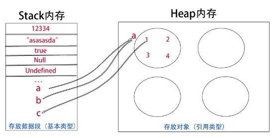
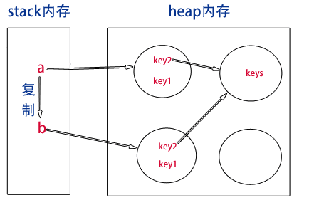
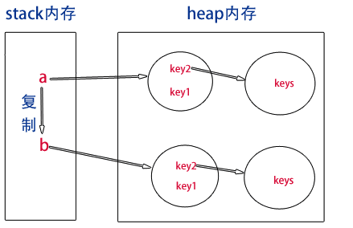

<div class="title">js的栈、堆、深拷贝、浅拷贝</div>

## 1. 栈（stack）和堆（heap）

* stack为自动分配的内存空间，它由系统自动释放。
* heap则是动态分配的内存，大小不定也不会自动释放。

## 2. 基本类型和引用类型

* 基本类型：存放在栈内存中的简单数据段，数据大小确定，内存空间大小可以分配。

5种基本数据类型有 `Undefined` 、 `Null` 、 `Boolean` 、 `Number` 、 `String` 、 `Symbol ` ，它们是直接按值存放的，所以可以直接访问。

* 引用类型：存放在 `堆（heap）` 内存中的对象，变量实际保存的是一个**指针**，这个指针指向 `堆（heap）` 的对象。每个空间大小不一样，要根据情况开进行特定的分配。

当我们需要访问**引用类型（如对象，数组，函数等）**的值时，首先从栈中获得该对象的地址指针，然后再从堆内存中取得所需的数据。

## 3. 传值与传址

```js
var a = [1,2,3,4,5];
var b = a; //传址 ,对象中传给变量的数据是引用类型的，会存储在堆中；
var c = a[0]; //传值，把对象中的属性/数组中的数组项赋值给变量，这时变量c是基本数据类型，存储在栈内存中；改变栈中的数据不会影响堆中的数据
//改变数值
b[4] = 6;
c = 7;
console.log('a[4]', a[4]) // 6
console.log('a[0]', a[0]) // 1
console.log('c', c) // 7
```

传值与传址的区别。因为a是数组，属于引用类型，所以它赋予给b的时候传的是栈中的地址（相当于新建了一个不同名“指针”），而不是堆内存中的对象。而c仅仅是从a堆内存中获取的一个数据值，并保存在栈中。所以b修改的时候，会根据地址回到a堆中修改，c则直接在栈中修改，并且不能指向a堆内存中。


> JavaScript不允许直接访问内存中的位置，也就是说不能直接操作对象的内存空间。在操作对象时，实际上是在操作对象的引用而不是实际的对象。为此，引用类型的值是按引用访问的。

### 3.1. 扩展

#### 3.1.1. `const`
**简述：** `const` 声明一个只读的常量。一旦声明，常量的值就不能改变。
`const` 实际上保证的，并不是变量的值不得改动，而是变量指向的那个内存地址不得改动。
基本类型的数据，值就保存在变量指向的那个 `栈（stack）` 地址，因此等同于常量。
引用类型的数据，变量的指向的 `栈（stack）` 地址，保存的是一个指针，const只能保证这个指针是固定的，至于指针指向的 `堆（heap）` 数据结构就完全不能控制了。所以一下代码是没有错误的；

```js
const a = [];
a.push('school');
```

## 4. 浅拷贝

在定义一个引用类型时，变量存放的往往只是一个指针地址。当我们使用对象拷贝时，如果属性是 `对象` 或 `数组` 时，这时候传递的也只是一个地址。因此子对象在访问该属性时，会根据地址回溯到父对象指向的堆内存中，即父子对象发生了关联，两者的属性值会指向同一内存空间。

```js
    const obj1 = {
      name:"张三",
      address:['乐山', '成都']
    }
    function clone(obj) {
      const obj2 = {};
      for (const key in obj) {
  　　  obj2[key] = obj[key];
      }
      return obj2;
　　 }
    const obj2 = clone(obj1);
    obj2.age = '23';
    console.log('obj2.name', obj2.name);     //张三
    console.log('obj2.age', obj2.age);    // 23
    console.log('obj1.age', obj1.age);    //undefined

  obj2.address.push("德阳");
  console.log('obj2.address', obj2.address);  // ['乐山', '成都', '德阳']
  console.log('obj1.address', obj1.address);  // ['乐山', '成都', '德阳']
```



## 5. 深拷贝

既然属性值类型是数组和或象时只会传址，那么我们就用递归来解决这个问题，把父对象中所有属于对象的属性类型都遍历赋给子对象即可。



> 参考文献： https://www.cnblogs.com/huangshikun/p/6510482.html

