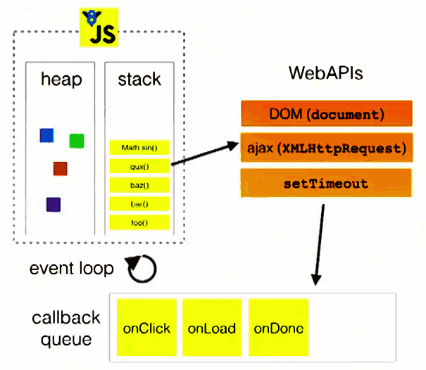
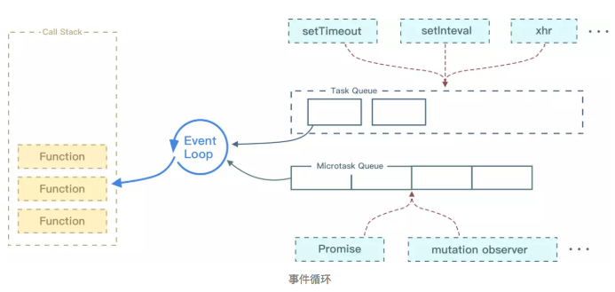
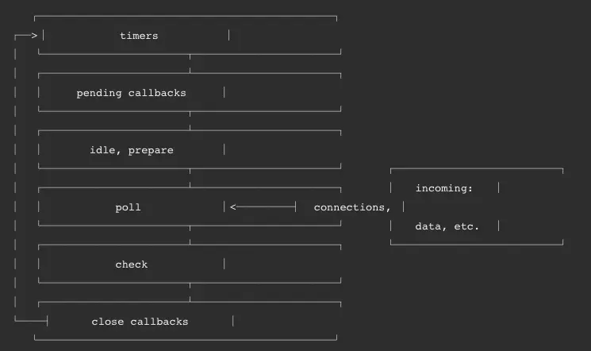

<div class="title"> js引擎执行队列、微任务、宏任务(并发模型与事件循环)</div>

## 1. 并发（concurrency）和并行（parallelism）区别

* **并发是宏观概念**，我分别有任务 A 和任务 B，在一段时间内通过任务间的切换完成了这两个任务，这种情况就可以称之为并发。

* **并行是微观概念**，假设 CPU 中存在两个核心，那么我就可以同时完成任务 A、B。同时完成多个任务的情况就可以称之为并行。

JavaScript 的并发模型基于“事件循环”。

### 1.1. 运行时概念


Javascript执行引擎的主线程运行的时候，产生 `堆（heap` ）和 `栈（stack）` ，程序中代码依次进入栈中等待执行，若执行时遇到异步方法，该异步方法会被添加到用于回调的队列（queue）中【即JavaScript执行引擎的主线程拥有一个执行栈/堆和一个任务队列

* **栈：** 函数调用形成了一个栈帧

```js
function foo(b) {
  var a = 10;
  return a + b + 11;
}

function bar(x) {
  var y = 3;
  return foo(x * y);
}

console.log(bar(7)); // 返回 42
```

当调用 bar 时，创建了第一个帧 ，帧中包含了 bar 的参数和局部变量。当 bar 调用 foo 时，第二个帧就被创建，并被压到第一个帧之上，帧中包含了 foo 的参数和局部变量。当 foo 返回时，最上层的帧就被弹出栈（剩下 bar 函数的调用帧 ）。当 bar 返回的时候，栈就空了。

* **堆：** 对象被分配在一个堆中，即用以表示一大块非结构化的内存区域。
* **队列：** 一个 JavaScript 运行时包含了一个待处理的消息队列。每一个消息都关联着一个用以处理这个消息的函数。

在[事件循环](https://developer.mozilla.org/zh-CN/docs/Web/JavaScript/EventLoop#Event_loop)期间的某个时刻，运行时从最先进入队列的消息开始处理队列中的消息。为此，这个消息会被移出队列，并作为输入参数调用与之关联的函数。正如前面所提到的，调用一个函数总是会为其创造一个新的栈帧。
函数的处理会一直进行到执行栈再次为空为止；然后事件循环将会处理队列中的下一个消息（如果还有的话）。

### 1.2. 事件循环（Event Loop）



* **queue :**  如上文的解释，值得注意的是，除了IO设备的事件(如load)会被添加到queue中，用户操作产生 的事件（如click, touchmove）同样也会被添加到queue中。队列中的这些事件会在主线程的执行栈被清空时被依次读取（**队列先进先出，即先被压入队列中的事件会被先执行**）。
* **callback:** 被主线程挂起来的代码，等主线程执行队列中的事件时，事件对应的callback代码就会被执行

> 【注：因为主线程从”任务队列”中读取事件的过程是循环不断的，因此这种运行机制又称为 `Event Loop（事件循环）` 】

```js
console.log(1);
setTimeout(function() {
    console.log(2);
},5000);
console.log(3);
//输出结果：
//1
//3
//2
```

#### 1.2.1. 解释：

1. JavaScript执行引擎主线程运行，产生heap和stack
2. 从上往下执行同步代码, log(1)被压入执行栈，因为log是webkit内核支持的普通方法而非WebAPIs的方法，因此立即出栈被引擎执行，输出1
3. JavaScript执行引擎继续往下，遇到setTimeout()t异步方法（如图，setTimeout属于WebAPIs），将setTimeout(callback, 5000)添加到执行栈
4. 因为setTimeout()属于WebAPIs中的方法，JavaScript执行引擎在将setTimeout()出栈执行时，注册setTimeout()延时方法交由浏览器内核其他模块（以webkit为例，是webcore模块）处理
5. 继续运行setTimeout()下面的log(3)代码，原理同步骤2
6. 当延时方法到达触发条件，即到达设置的延时时间时（5秒后），该延时方法就会被添加至任务队列里。这一过程由浏览器内核其他模块处理，与执行引擎主线程独立
7. JavaScript执行引擎在主线程方法执行完毕，到达空闲状态时，会从任务队列中顺序获取任务来执行。
8. 将队列的第一个回调函数重新压入执行栈，执行回调函数中的代码log(2)，原理同步骤2，回调函数的代码执行完毕，清空执行栈
9. JavaScript执行引擎继续轮循队列，直到队列为空
10. 执行完毕

## 2. 三、微任务(Macrotask) 和 宏任务(Microtask)



不同的任务源会被分配到不同的 Task 队列中，任务源可以分为 `微任务（microtask）` 和 `宏任务（macrotask）` 。在 ES6 规范中，microtask 称为 jobs，macrotask 称为 task。

### 2.1. Event Loop 执行顺序如下所示：

1. 首先执行同步代码，这属于宏任务
2. 当执行完所有同步代码后，执行栈为空，查询是否有异步代码需要执行
3. 执行所有微任务
4. 当执行完所有微任务后，如有必要会渲染页面
5. 然后开始下一轮 Event Loop，执行宏任务中的异步代码，也就是 setTimeout 中的回调函数

### 2.2. 实例代码

```js
console.log('script start')

async function async1() {
  await async2()
  console.log('async1 end')
}
async function async2() {
  console.log('async2 end')
}
async1()

setTimeout(function() {
  console.log('setTimeout')
}, 0)

new Promise(resolve => {
  console.log('Promise')
  resolve()
})
  .then(function() {
    console.log('promise1')
  })
  .then(function() {
    console.log('promise2')
  })

console.log('script end')
// script start
// async2 end
// Promise
// script end
// promise1
// promise2
// async1 end
// setTimeout
```

### 2.3. 微任务包括: `promise` ， `MutationObserver` 。

### 2.4. 宏任务包括: `script` ， `setTimeout` ， `setInterval` ， `setImmediate` ， `I/O` ， `UI rendering` 。
这里很多人会有个误区，认为微任务快于宏任务，其实是错误的。因为宏任务中包括了 script ，浏览器会先执行一个宏任务，接下来有异步代码的话才会先执行微任务。

## 3. 永不阻塞

事件循环模型的一个非常有趣的特性是，与许多其他语言不同，JavaScript 永不阻塞。 处理 I/O 通常通过事件和回调来执行，所以当一个应用正等待一个 [ `IndexedDB` ](https://developer.mozilla.org/zh-CN/docs/Web/API/IndexedDB_API "IndexedDB 是一种低级API，用于客户端存储大量结构化数据(包括, 文件/ blobs)。该API使用索引来实现对该数据的高性能搜索。虽然 Web Storage 对于存储较少量的数据很有用，但对于存储更大量的结构化数据来说，这种方法不太有用。IndexedDB提供了一个解决方案。") 查询返回或者一个 [ `XHR` ](https://developer.mozilla.org/zh-CN/docs/Web/API/XMLHttpRequest "使用XMLHttpRequest (XHR)对象可以与服务器交互。您可以从URL获取数据，而无需让整个的页面刷新。这使得Web页面可以只更新页面的局部，而不影响用户的操作。XMLHttpRequest在 Ajax 编程中被大量使用。")请求返回时，它仍然可以处理其它事情，比如用户输入。

遗留的例外是存在的，如  `alert`  或者同步 XHR，但应该尽量避免使用它们。

> 参考： https://developer.mozilla.org/zh-CN/docs/Web/JavaScript/Guide/Using_promises

[前端面试之道](https://juejin.im/book/5bdc715fe51d454e755f75ef/section/5be04a8e6fb9a04a072fd2cd)


## 4. 单线程带来的好处？

## 5. nodejs事件循环
Node 的 `Event Loop` 分为 6 个阶段，它们会按照顺序反复运行。每当进入某一个阶段的时候，都会从对应的回调队列中取出函数去执行。当队列为空或者执行的回调函数数量到达系统设定的阈值，就会进入下一阶段。


### 5.1. timer
timers 阶段会执行 setTimeout 和 setInterval 回调，并且是由 poll 阶段控制的。
同样，在 Node 中定时器指定的时间也不是准确时间，只能是尽快执行。

### 5.2. I/O
I/O 阶段会处理一些上一轮循环中的少数未执行的 I/O 回调

### 5.3. idle, prepare
idle, prepare 阶段内部实现，这里就忽略不讲了。

### 5.4. poll
poll 是一个至关重要的阶段，这一阶段中，系统会做两件事情
回到 timer 阶段执行回调
执行 I/O 回调
并且在进入该阶段时如果没有设定了 timer 的话，会发生以下两件事情

如果 poll 队列不为空，会遍历回调队列并同步执行，直到队列为空或者达到系统限制
如果 poll 队列为空时，会有两件事发生
如果有 setImmediate 回调需要执行，poll 阶段会停止并且进入到 check 阶段执行回调
如果没有 setImmediate 回调需要执行，会等待回调被加入到队列中并立即执行回调，这里同样会有个超时时间设置防止一直等待下去
当然设定了 timer 的话且 poll 队列为空，则会判断是否有 timer 超时，如果有的话会回到 timer 阶段执行回调。

### 5.5. check
check 阶段执行 setImmediate

### 5.6. close callbacks
close callbacks 阶段执行 close 事件

在以上的内容中，看出Node 中的 Event Loop 的执行顺序，接下来我们将会通过代码的方式来深入理解这块内容。

首先在有些情况下，定时器的执行顺序其实是随机的
```js
setTimeout(() => {
    console.log('setTimeout')
}, 0)
setImmediate(() => {
    console.log('setImmediate')
})
对于以上代码来说，setTimeout 可能执行在前，也可能执行在后

首先 setTimeout(fn, 0) === setTimeout(fn, 1)，这是由源码决定的
进入事件循环也是需要成本的，如果在准备时候花费了大于 1ms 的时间，那么在 timer 阶段就会直接执行 setTimeout 回调
那么如果准备时间花费小于 1ms，那么就是 setImmediate 回调先执行了
当然在某些情况下，他们的执行顺序一定是固定的，比如以下代码：

const fs = require('fs')

fs.readFile(__filename, () => {
    setTimeout(() => {
        console.log('timeout');
    }, 0)
    setImmediate(() => {
        console.log('immediate')
    })
})
在上述代码中，setImmediate 永远先执行。因为两个代码写在 IO 回调中，IO 回调是在 poll 阶段执行，当回调执行完毕后队列为空，发现存在 setImmediate 回调，所以就直接跳转到 check 阶段去执行回调了。

上面介绍的都是 `macrotask` 的执行情况，对于 `microtask` 来说，它会在以上每个阶段完成前清空 `microtask` 队列，下图中的 Tick 就代表了 `microtask`


```js
setTimeout(() => {
  console.log('timer21')
}, 0)

Promise.resolve().then(function() {
  console.log('promise1')
})
```

`对于以上代码来说，其实和浏览器中的输出是一样的，microtask` 永远执行在 `macrotask` 前面。

最后我们来讲讲 Node 中的 `process.nextTick`，这个函数其实是独立于 `Event Loop` 之外的，它有一个自己的队列，当每个阶段完成后，如果存在 nextTick 队列，就会清空队列中的所有回调函数，并且优先于其他 microtask 执行。
```js
setTimeout(() => {
 console.log('timer1')

 Promise.resolve().then(function() {
   console.log('promise1')
 })
}, 0)

process.nextTick(() => {
 console.log('nextTick')
 process.nextTick(() => {
   console.log('nextTick')
   process.nextTick(() => {
     console.log('nextTick')
     process.nextTick(() => {
       console.log('nextTick')
     })
   })
 })
})
```
对于以上代码，大家可以发现无论如何，永远都是先把 nextTick 全部打印出来。