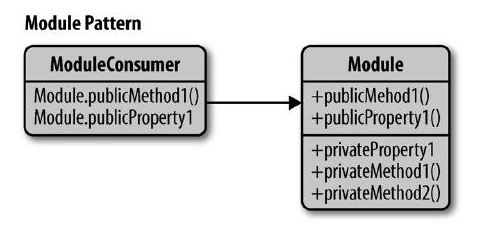

# 设计模式

## 反模式
反模式是一种值得记录的不良设
### 常见反模式
1. 在全局上下文中定义大量的变量污染全局命名空间。
2. 向setTimeout或setInterval传递字符串，而不是函数，这会触发eval()的内部使用。
3. 修改Object类的原型（这是一个特别不良的反模式）。
4. 以内联形式使用JavaScript，它是不可改变的。
5. 在使用document.createElement等原生DOM方法更合适的情况下使用document.write。

## 设计模式的类别
### 1. 创建型设计模式
`Constructor（构造器）`、`Fac-tory（工厂）`、 `Abstract（抽象）`、 `Prototype（原型）`、`Single-ton（单例）`和`Builder（生成器）`。

### 2. 结构型设计模式
`Decorator（装饰者）`、`Facade（外观）`、`Flyweight（享元）`、`Adapter（适配器）`和`Proxy（代理）`

### 3. 行为设计模式
`Iterator（迭代器）`、`Mediator（中介者）`、`Observer（观察者）`和`Visitor（访问者）`

## Constructor（构造器）模式
实则就是构建对象的方式，在创建对象的方式中详述

## Module（模块）模式
JavaScript中，有几种用于实现模块的方法，包括：
1. 对象字面量表示法
1. Module模式
1. AMD模块
1. CommonJS模块
1. ECMAScript Harmony模块

### 1. 对象字面量
在直接用对象字面量的方式在对象中定义`方法`,`value`等

### 2. Module（模块）模式
能够使一个单独的对象拥有公有/私有方法和变量，从而屏蔽来自全局作用域的特殊部分。

#### 实例
```js
var myNamespace = (function () {
  // 私有计数器变量
  var myPrivateVar = 0;
  // 记录所有参数的私有函数
  var myPrivateMethod = function (foo) { console.log(foo);};
  return {
    // 公有变量
    myPublicVar: "foo",
    // 调用私有变量和方法的公有函数
    myPublicFunction: function (bar) {
      // 增加私有计数器值
      myPrivateVar++;
      // 传入bar 调用私有方法
       myPrivateMethod(bar);
      }
    };
  })();
```