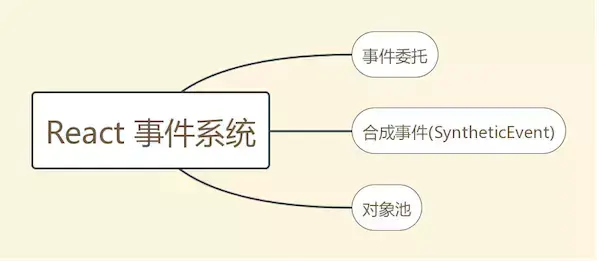
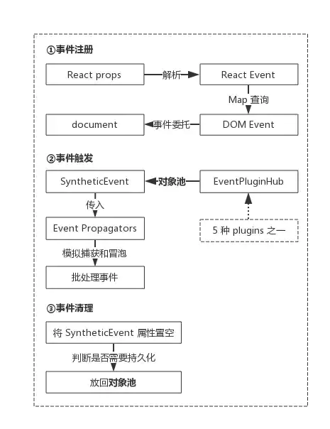
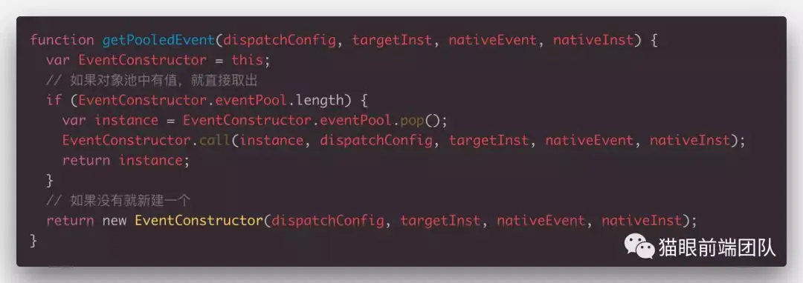
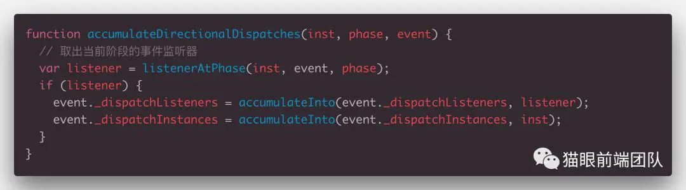
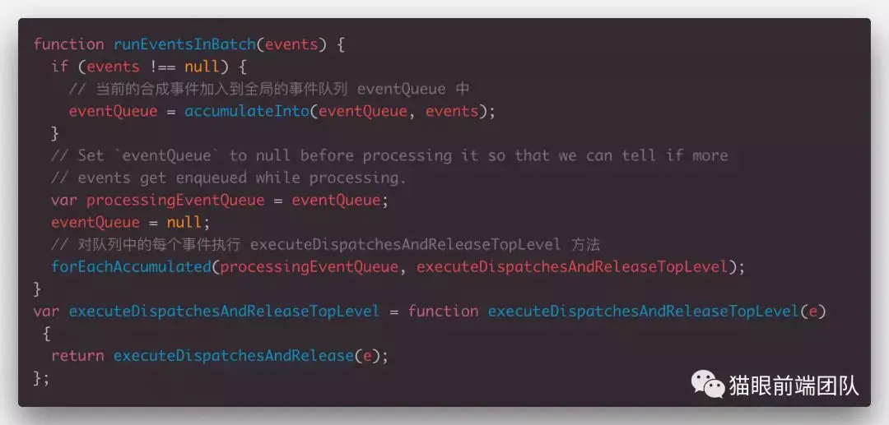
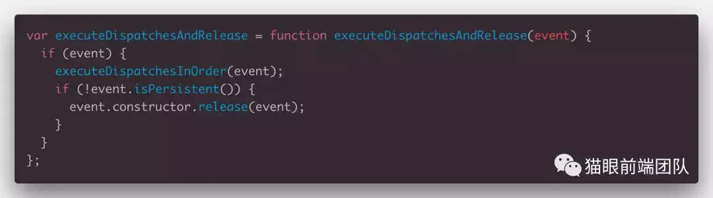
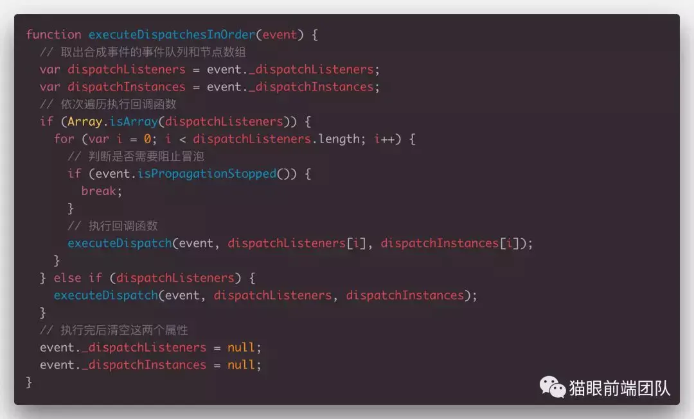

<div class="title">React 事件系统介绍及源码分析</div>

## 1. React 事件系统


| 概念   | 操作           | 优点 |
|--------|---------------|---|
| 事件委托 | 几乎将所有事件都委托到 document | 减少内存占用和避免频繁的操作DOM |
| 合成事件 | 对原生 DOM事件对象的封装  | 所有浏览器中都表现一致，实现了跨浏览器兼容 |
| 对象池   | 利用对象池来管理合成事件对象的创建和销毁 | 便于统一管理；可以减少垃圾回收和新建对象过程中内存的分配操作，提高了性能 |

### 1.1. 对象池是什么？
对象池其实就是一个集合，里面包含了我们需要的对象集合，这些对象都被对象池所管理，如果需要这样的对象，从池子里取出来就行，但是用完需要归还。

### 1.2. 什么时候使用对象池?
初始化、实例化的代价高，且有需求需要经常实例化，但每次实例化的数量又比较少的情况下，使用对象池可以获得显著的效能提升。

### 1.3. 大体流程
事件注册 → 事件触发 → 事件清理



## 2. 源码分析

### 2.1. 事件注册

1. 事件注册入口
```js
// 给最后要渲染的真实DOM对象设置属性
function setInitialDOMProperties(
  tag: string,
  domElement: Element,
  rootContainerElement: Element | Document,
  nextProps: Object,
  isCustomComponentTag: boolean,
): void {
  // propKey 为属性名字
  for (const propKey in nextProps) {
    if (!nextProps.hasOwnProperty(propKey)) {
      continue;
    }
    const nextProp = nextProps[propKey];
      // Relies on `updateStylesByID` not mutating `styleUpdates`.
      setValueForStyles(domElement, nextProp);
    } else if (propKey === DANGEROUSLY_SET_INNER_HTML) {
      const nextHtml = nextProp ? nextProp[HTML] : undefined;
      if (nextHtml != null) {
        setInnerHTML(domElement, nextHtml);
      }
    } else if (propKey === CHILDREN) {
      if (typeof nextProp === 'string') {
        // Avoid setting initial textContent when the text is empty. In IE11 setting
        // textContent on a <textarea> will cause the placeholder to not
        // show within the <textarea> until it has been focused and blurred again.
        // https://github.com/facebook/react/issues/6731#issuecomment-254874553
        const canSetTextContent = tag !== 'textarea' || nextProp !== '';
        if (canSetTextContent) {
          setTextContent(domElement, nextProp);
        }
      } else if (typeof nextProp === 'number') {
        setTextContent(domElement, '' + nextProp);
      }
    } else if (
      (enableDeprecatedFlareAPI && propKey === DEPRECATED_flareListeners) ||
      propKey === SUPPRESS_CONTENT_EDITABLE_WARNING ||
      propKey === SUPPRESS_HYDRATION_WARNING
    ) {
      // Noop
    } else if (propKey === AUTOFOCUS) {

      // registrationNameDependencies 是一个保存了与React事件相关的属性对象
      // 判断该属性是否为与事件相关的属性
    } else if (registrationNameDependencies.hasOwnProperty(propKey)) {
      if (nextProp != null) {
        ensureListeningTo(rootContainerElement, propKey);
      }
    } else if (nextProp != null) {
      setValueForProperty(domElement, propKey, nextProp, isCustomComponentTag);
    }
  }
}
```
2. 确定事件最终注册到哪
利用了事件委托，几乎所有的事件最终都会被委托到 `document` 或者 `Fragment` 上。

```js
export function ensureListeningTo(
  rootContainerInstance: Element | Node,
  reactPropEvent: string,
): void {
  // If we have a comment node, then use the parent node,
  // which should be an element.
  // 判断当前根节点是不是document或者fragment, 不是的话就赋值为document
  const rootContainerElement =
    rootContainerInstance.nodeType === COMMENT_NODE
      ? rootContainerInstance.parentNode
      : rootContainerInstance;
  // Containers should only ever be element nodes. We do not
  // want to register events to document fragments or documents
  // with the modern plugin event system.
  listenToReactEvent(reactPropEvent, ((rootContainerElement: any): Element));
}
```

3. 获取原生 DOM 事件名和绑定事件的方式
```js
function listenToReactEvent(
  reactPropEvent: string,
  rootContainerElement: Element,
): void {
  const listenerMap = getEventListenerMap(rootContainerElement);
  // For optimization, let's check if we have the registration name
  // on the rootContainerElement.
  if (listenerMap.has(reactPropEvent)) {
    return;
  }
  // Add the registration name to the map, so we can avoid processing
  // this React prop event again.
  listenerMap.set(reactPropEvent, null);
  //是一个存储了React事件名与原生事件名映射的Map
  //例如获取原生DOM事件名, regis 为onClick
  const dependencies = registrationNameDependencies[reactPropEvent];
  const dependenciesLength = dependencies.length;
  // If the dependencies length is 1, that means we're not using a polyfill
  // plugin like ChangeEventPlugin, BeforeInputPlugin, EnterLeavePlugin and
  // SelectEventPlugin. SimpleEventPlugin always only has a single dependency.
  // Given this, we know that we never need to apply capture phase event
  // listeners to anything other than the SimpleEventPlugin.
  const registrationCapturePhase =
    isCaptureRegistrationName(reactPropEvent) && dependenciesLength === 1;
  // 遍历将原生DOM事件名数组，将事件一次进行绑定
  for (let i = 0; i < dependenciesLength; i++) {
    const dependency = dependencies[i];
    const capture =
      capturePhaseEvents.has(dependency) || registrationCapturePhase;
    listenToNativeEvent(
      dependency,
      rootContainerElement,
      listenerMap,
      PLUGIN_EVENT_SYSTEM,
      capture,
    );
  }
}
```

4. 绑定冒泡阶段的事件监听函数
```js
export function listenToNativeEvent(
  topLevelType: DOMTopLevelEventType,
  target: EventTarget,
  listenerMap: ElementListenerMap,
  eventSystemFlags: EventSystemFlags,
  isCapturePhaseListener: boolean,
  isPassiveListener?: boolean,
  priority?: EventPriority,
): void {
  // TOP_SELECTION_CHANGE needs to be attached to the document
  // otherwise it won't capture incoming events that are only
  // triggered on the document directly.
  if (topLevelType === TOP_SELECTION_CHANGE) {
    target = (target: any).ownerDocument || target;
    listenerMap = getEventListenerMap(target);
  }
  const listenerMapKey = getListenerMapKey(
    topLevelType,
    isCapturePhaseListener,
  );
  const listenerEntry = ((listenerMap.get(
    listenerMapKey,
  ): any): ElementListenerMapEntry | void);
  const shouldUpgrade = shouldUpgradeListener(listenerEntry, isPassiveListener);

  // If the listener entry is empty or we should upgrade, then
  // we need to trap an event listener onto the target.
  if (listenerEntry === undefined || shouldUpgrade) {
    // If we should upgrade, then we need to remove the existing trapped
    // event listener for the target container.
    if (shouldUpgrade) {
      removeTrappedEventListener(
        target,
        topLevelType,
        isCapturePhaseListener,
        ((listenerEntry: any): ElementListenerMapEntry).listener,
      );
    }
    if (isCapturePhaseListener) {
      eventSystemFlags |= IS_CAPTURE_PHASE;
    }

    // 利用原生的addeventListener 将事件绑定到document上
    const listener = addTrappedEventListener(
      target,
      topLevelType,
      eventSystemFlags,
      isCapturePhaseListener,
      false,
      isPassiveListener,
      priority,
    );
    listenerMap.set(listenerMapKey, {passive: isPassiveListener, listener});
  }
}
```

### 2.2. 事件触发
**1. 事件执行入口**
```js
export function dispatchEvent(
  topLevelType: DOMTopLevelEventType,
  nativeEvent: AnyNativeEvent,
) {
  const nativeEventTarget = getEventTarget(nativeEvent);
  let targetInst = getClosestInstanceFromNode(nativeEventTarget);
  if (
    targetInst !== null &&
    typeof targetInst.tag === 'number' &&
    !isFiberMounted(targetInst)
  ) {
    // If we get an event (ex: img onload) before committing that
    // component's mount, ignore it for now (that is, treat it as if it was an
    // event on a non-React tree). We might also consider queueing events and
    // dispatching them after the mount.
    targetInst = null;
  }

  const bookKeeping = getTopLevelCallbackBookKeeping(
    topLevelType,
    nativeEvent,
    targetInst,
  );

  try {
    // Event queue being processed in the same cycle allows
    // `preventDefault`.
    // 批处理更新，这里实际上就是将当前触发的事件放入了批处理队列中
    batchedUpdates(handleTopLevel, bookKeeping);
  } finally {
    releaseTopLevelCallbackBookKeeping(bookKeeping);
  }
}


// handleTopLevel 最终会调用 runExtractedEventsInBatch
export function runExtractedEventsInBatch(
  topLevelType: TopLevelType,
  targetInst: Fiber,
  nativeEvent: AnyNativeEvent,
  nativeEventTarget: EventTarget,
) {
  // 生产合成事件
  const events = extractEvents(
    topLevelType,
    targetInst,
    nativeEvent,
    nativeEventTarget,
  );
  // 批处理事件
  runEventsInBatch(events, false);
}
```

**2. 生产合成事件**
```js
function extractEvents(
  topLevelType: TopLevelType,
  targetInst: Fiber,
  nativeEvent: AnyNativeEvent,
  nativeEventTarget: EventTarget,
): Array<ReactSyntheticEvent> | ReactSyntheticEvent | null {
  let events = null;
  // 不同类型的事件会采用不同的Plugin 来构造合成事件
  for (let i = 0; i < plugins.length; i++) {
    // Not every plugin in the ordering may be loaded at runtime.
    const possiblePlugin: PluginModule<AnyNativeEvent> = plugins[i];
    if (possiblePlugin) {
      // 每个plugin都有一个extractEvents 方法，用于生产特定事件类型的合成事件
      const extractedEvents = possiblePlugin.extractEvents(
        topLevelType,
        targetInst,
        nativeEvent,
        nativeEventTarget,
      );
      if (extractedEvents) {
        events = accumulateInto(events, extractedEvents);
      }
    }
  }
  return events;
}
```

```js
const SimpleEventPlugin: PluginModule<MouseEvent> & {
  isInteractiveTopLevelEventType: (topLevelType: TopLevelType) => boolean,
} = {
  eventTypes: eventTypes,

  isInteractiveTopLevelEventType(topLevelType: TopLevelType): boolean {
    const config = topLevelEventsToDispatchConfig[topLevelType];
    return config !== undefined && config.isInteractive === true;
  },

  extractEvents: function(
    topLevelType: TopLevelType,
    targetInst: Fiber,
    nativeEvent: MouseEvent,
    nativeEventTarget: EventTarget,
  ): null | ReactSyntheticEvent {
    const dispatchConfig = topLevelEventsToDispatchConfig[topLevelType];
    if (!dispatchConfig) {
      return null;
    }
    let EventConstructor;
    switch (topLevelType) {
      case DOMTopLevelEventTypes.TOP_KEY_PRESS:
        // Firefox creates a keypress event for function keys too. This removes
        // the unwanted keypress events. Enter is however both printable and
        // non-printable. One would expect Tab to be as well (but it isn't).
        if (getEventCharCode(nativeEvent) === 0) {
          return null;
        }
      /* falls through */
      case DOMTopLevelEventTypes.TOP_KEY_DOWN:
      case DOMTopLevelEventTypes.TOP_KEY_UP:
        EventConstructor = SyntheticKeyboardEvent;
        break;
      case DOMTopLevelEventTypes.TOP_BLUR:
      case DOMTopLevelEventTypes.TOP_FOCUS:
        EventConstructor = SyntheticFocusEvent;
        break;
      case DOMTopLevelEventTypes.TOP_CLICK:
        // Firefox creates a click event on right mouse clicks. This removes the
        // unwanted click events.
        if (nativeEvent.button === 2) {
          return null;
        }
      /* falls through */
      case DOMTopLevelEventTypes.TOP_DOUBLE_CLICK:
      case DOMTopLevelEventTypes.TOP_MOUSE_DOWN:
      case DOMTopLevelEventTypes.TOP_MOUSE_MOVE:
      case DOMTopLevelEventTypes.TOP_MOUSE_UP:
      // TODO: Disabled elements should not respond to mouse events
      /* falls through */
      case DOMTopLevelEventTypes.TOP_MOUSE_OUT:
      case DOMTopLevelEventTypes.TOP_MOUSE_OVER:
      case DOMTopLevelEventTypes.TOP_CONTEXT_MENU:
        EventConstructor = SyntheticMouseEvent;
        break;
      case DOMTopLevelEventTypes.TOP_DRAG:
      case DOMTopLevelEventTypes.TOP_DRAG_END:
      case DOMTopLevelEventTypes.TOP_DRAG_ENTER:
      case DOMTopLevelEventTypes.TOP_DRAG_EXIT:
      case DOMTopLevelEventTypes.TOP_DRAG_LEAVE:
      case DOMTopLevelEventTypes.TOP_DRAG_OVER:
      case DOMTopLevelEventTypes.TOP_DRAG_START:
      case DOMTopLevelEventTypes.TOP_DROP:
        EventConstructor = SyntheticDragEvent;
        break;
      case DOMTopLevelEventTypes.TOP_TOUCH_CANCEL:
      case DOMTopLevelEventTypes.TOP_TOUCH_END:
      case DOMTopLevelEventTypes.TOP_TOUCH_MOVE:
      case DOMTopLevelEventTypes.TOP_TOUCH_START:
        EventConstructor = SyntheticTouchEvent;
        break;
      case DOMTopLevelEventTypes.TOP_ANIMATION_END:
      case DOMTopLevelEventTypes.TOP_ANIMATION_ITERATION:
      case DOMTopLevelEventTypes.TOP_ANIMATION_START:
        EventConstructor = SyntheticAnimationEvent;
        break;
      case DOMTopLevelEventTypes.TOP_TRANSITION_END:
        EventConstructor = SyntheticTransitionEvent;
        break;
      case DOMTopLevelEventTypes.TOP_SCROLL:
        EventConstructor = SyntheticUIEvent;
        break;
      case DOMTopLevelEventTypes.TOP_WHEEL:
        EventConstructor = SyntheticWheelEvent;
        break;
      case DOMTopLevelEventTypes.TOP_COPY:
      case DOMTopLevelEventTypes.TOP_CUT:
      case DOMTopLevelEventTypes.TOP_PASTE:
        EventConstructor = SyntheticClipboardEvent;
        break;
      case DOMTopLevelEventTypes.TOP_GOT_POINTER_CAPTURE:
      case DOMTopLevelEventTypes.TOP_LOST_POINTER_CAPTURE:
      case DOMTopLevelEventTypes.TOP_POINTER_CANCEL:
      case DOMTopLevelEventTypes.TOP_POINTER_DOWN:
      case DOMTopLevelEventTypes.TOP_POINTER_MOVE:
      case DOMTopLevelEventTypes.TOP_POINTER_OUT:
      case DOMTopLevelEventTypes.TOP_POINTER_OVER:
      case DOMTopLevelEventTypes.TOP_POINTER_UP:
        EventConstructor = SyntheticPointerEvent;
        break;
      default:
        // HTML Events
        // @see http://www.w3.org/TR/html5/index.html#events-0
        EventConstructor = SyntheticEvent;
        break;
    }
    // 从事件池中取一个合成事件对象
    const event = EventConstructor.getPooled(
      dispatchConfig,
      targetInst,
      nativeEvent,
      nativeEventTarget,
    );
    // 模拟捕获和冒泡
    accumulateTwoPhaseDispatches(event);
    return event;
  },
};

```

**3. 从对象池中取出合成事件**

React 事件系统的一大亮点，它将所有的合成事件都缓存在 对象池 中，可以大大降低对象的创建和销毁的时间，提升性能


**4. 模拟捕获和冒泡**
* 生成合成事件之后，会调用 `accumulateTwoPhaseDispatches(event)`，该方法最终会调用 `traverseTwoPhase。`

* 模拟过程中会把所有事件监听函数及其对应的节点都加入到 event(合成事件) 的属性中。



### 2.3. 执行事件

1. 按序执行和清理事件
这也就是为什么当我们在需要异步读取操作一个合成事件对象的时候，需要执行 event.persist()，不然 React 就会在这里释放掉这个事件。

2. 回调函数真正被执行

* React 在收集回调数组的时候并不会去管我们是否调用了 stopPropagation ，而是会在事件执行的阶段才会去检查是否需要停止冒泡。


## 3. 例子

1. 当 React 事件和原生事件混用时的阻止冒泡
* 在 React 事件系统 中调用 e.stopPropagation() 可以阻止 React 的合成事件以及绑定在 window 上的原生事件；
* 在原生事件 中调用 e.stopPropagation()，如果是在 document 之前，那么所有的 React 事件都会被阻止。


1. 点击 button 之后，输出结果是什么？(ABCDE排序)
2. 分别把 (1) 和 (2) 的 e.stopPropagation() 加上，输出结果又是什么？(ABCDE排序)

## 4. 参考
对象池解读： https://www.jianshu.com/p/c67aac019f5f

## 5. 其他问题：
### 5.1. React为什么要用合成事件