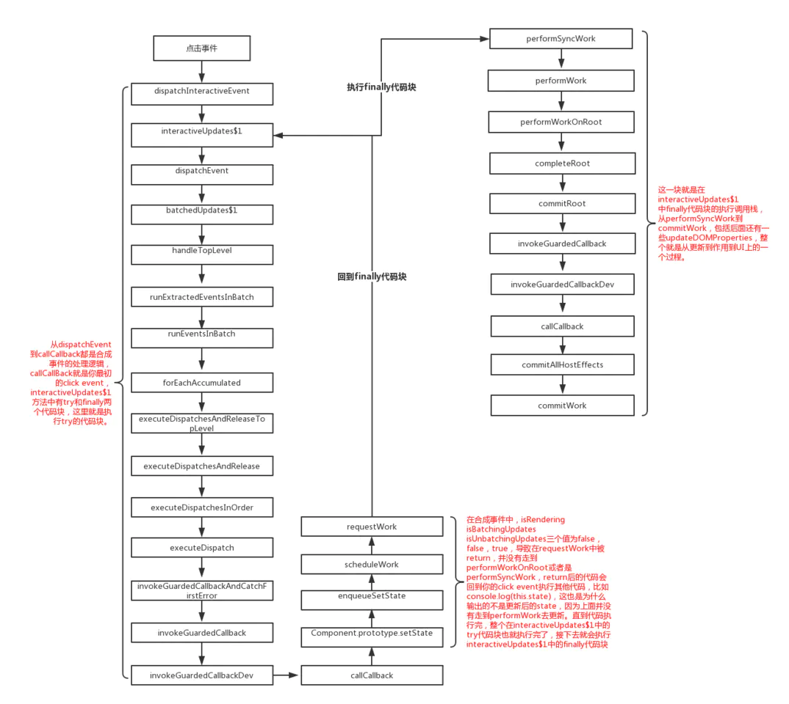
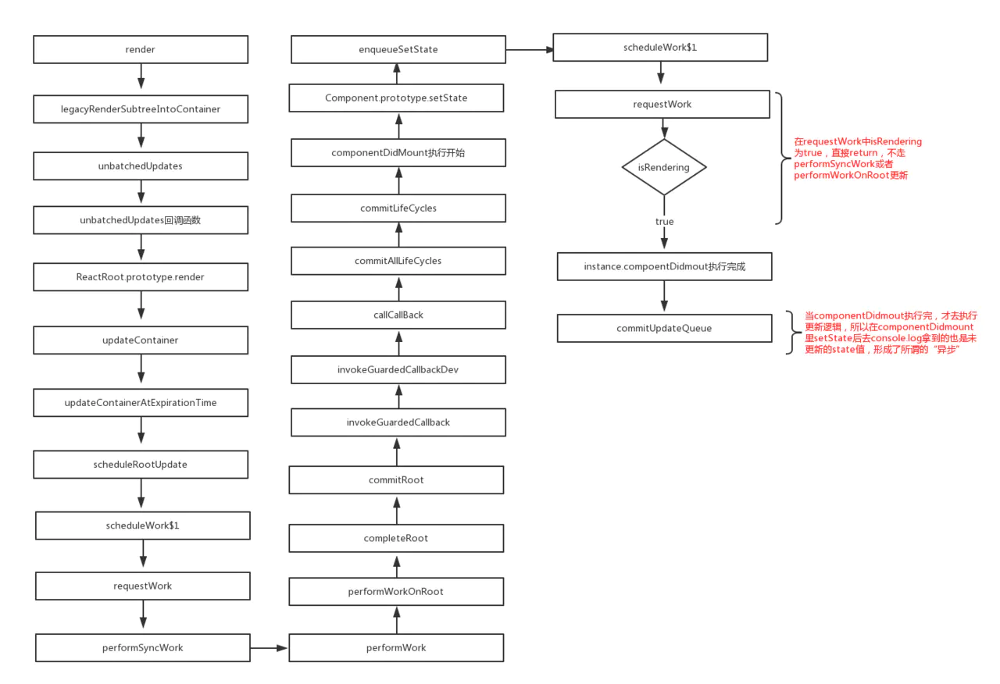

<div class="title">setState解读</div>

``` js
export default class Demo extends React.PureComponent {
    state = {
        percent: 0,
    };

    componentDidMount() {
        this.setState({
            percent: this.state.percent + 1
        });
        console.log('percent', this.state.percent);
        this.setState({
            percent: this.state.percent + 1
        });
        console.log('percent', this.state.percent);

        setTimeout(() => {
            this.setState({
                percent: this.state.percent + 1
            });
            console.log('setTimeout', this.state.percent);
            this.setState({
                percent: this.state.percent + 1
            });
            console.log('setTimeout', this.state.percent);
        });
    }
}
```

## 1. 问题：

* `react`中`setState`是同步的还是异步？
* 什么场景下是异步的，可不可能是同步，什么场景下又是同步？
* 异步是正在的异步吗

## 2. setState真的是异步的吗？

`react` 源码分析 (版本是16.4.1)。
为了方便理解和简化流程，我们默认react内部代码执行到`performWork`
、`performWorkOnRoot`、`performSyncWork`、`performAsyncWork`这四个方法的时候，就是react去update更新并且作用到UI上。

#### 2.0.1. 一、合成事件中的setState

```js
class App extends Component {
  state = { val: 0 }
  increment = () => {
    this.setState({ val: this.state.val + 1 })
    console.log(this.state.val) // 输出的是更新前的val --> 0
  }
  render() {
    return (
      <div onClick={this.increment}>
        { `Counter is: ${this.state.val}` }
      </div>
    )
  }
}
```

合成事件中的 `setState` 写法比较常见，点击事件里去改变 `this.state.val` 的状态值，在 `increment` 事件中打个断点可以看到调用栈，流程图如下：



从 `dispatchInteractiveEvent` 到 `callCallBack` 为止，都是对合成事件的处理和执行，从 `setState` 到 `requestWork` 是调用 `this.setState` 的逻辑，这边主要看下 `requestWork` 这个函数（从 `dispatchEvent` 到 `requestWork` 的调用栈是属于 `interactiveUpdates$1` 的 `try` 代码块，下文会提到）

```js
function requestWork(root, expirationTime) {
  addRootToSchedule(root, expirationTime);

  if (isRendering) {
    // Prevent reentrancy. Remaining work will be scheduled at the end of
    // the currently rendering batch.
    return;
  }

  if (isBatchingUpdates) {
    // Flush work at the end of the batch.
    if (isUnbatchingUpdates) {
      // ...unless we're inside unbatchedUpdates, in which case we should
      // flush it now.
      nextFlushedRoot = root;
      nextFlushedExpirationTime = Sync;
      performWorkOnRoot(root, Sync, false);
    }
    return;
  }

  // TODO: Get rid of Sync and use current time?
  if (expirationTime === Sync) {
    performSyncWork();
  } else {
    scheduleCallbackWithExpiration(expirationTime);
  }
}
```

在 `requestWork` 中有三个if分支，三个分支中有两个方法 `performWorkOnRoot` 和 `performSyncWork` ，就是我们默认的 `update` 函数，但是在合成事件中，走的是第二个if分支，第二个分支中有两个标识 `isBatchingUpdates` 和 `isUnbatchingUpdates` 两个初始值都为  false ，但是在 `interactiveUpdates$1` 中会把 `isBatchingUpdates` 设为 `true` ，下面就是 `interactiveUpdates$1` 的代码：

```js
function interactiveUpdates$1(fn, a, b) {
  if (isBatchingInteractiveUpdates) {
    return fn(a, b);
  }
  // If there are any pending interactive updates, synchronously flush them.
  // This needs to happen before we read any handlers, because the effect of
  // the previous event may influence which handlers are called during
  // this event.
  if (!isBatchingUpdates && !isRendering && lowestPendingInteractiveExpirationTime !== NoWork) {
    // Synchronously flush pending interactive updates.
    performWork(lowestPendingInteractiveExpirationTime, false, null);
    lowestPendingInteractiveExpirationTime = NoWork;
  }
  var previousIsBatchingInteractiveUpdates = isBatchingInteractiveUpdates;
  var previousIsBatchingUpdates = isBatchingUpdates;
  isBatchingInteractiveUpdates = true;
  isBatchingUpdates = true;  // 把requestWork中的isBatchingUpdates标识改为true
  try {
    return fn(a, b);
  } finally {
    isBatchingInteractiveUpdates = previousIsBatchingInteractiveUpdates;
    isBatchingUpdates = previousIsBatchingUpdates;
    if (!isBatchingUpdates && !isRendering) {
      performSyncWork();
    }
  }
}
```

在这个方法中把 `isBatchingUpdates` 设为了 `true` , 导致在 `requestWork` 方法中， `isBatchingUpdates` 为 `true` ，但是 `isUnbatchingUpdates` 是 `false` ，而被直接return了。

那return完的逻辑回到哪里呢，最终正是回到了 `interactiveUpdates$1` 这个方法，仔细看一眼，这个方法里面有个[try finally](https://link.juejin.im?target=http%3A%2F%2Fjavascript.ruanyifeng.com%2Fgrammar%2Ferror.html%23toc12)语法，简单的说就是会先执行 `try` 代码块中的语句，然后再执行 `finally` 中的代码，而 `fn(a, b)` 是在try代码块中，刚才说到在 `requestWork` 中被return掉的也就是这个fn（上文提到的 `从dispatchEvent` 到 `requestWork` 的一整个调用栈）。

所以当你在 `increment` 中调用 `setState` 之后去console.log的时候，是属于 `try` 代码块中的执行，但是由于是合成事件，try代码块执行完state并没有更新，所以你输入的结果是更新前的 `state` 值，这就导致了所谓的"异步"，但是当你的try代码块执行完的时候（也就是你的increment合成事件），这个时候会去执行 `finally` 里的代码，在 `finally` 中执行了 `performSyncWork` 方法，这个时候才会去更新你的 `state` 并且渲染到UI上。

#### 2.0.2. 二、生命周期函数中的setState

```js
class App extends Component {
  state = { val: 0 }
 componentDidMount() {
    this.setState({ val: this.state.val + 1 })
   console.log(this.state.val) // 输出的还是更新前的值 --> 0
 }
  render() {
    return (
      <div>
        { `Counter is: ${this.state.val}` }
      </div>
    )
  }
}

```



```
其实还是和合成事件一样，当 componentDidmount 执行的时候，react内部并没有更新，执行完componentDidmount  后才去 commitUpdateQueue 更新。这就导致你在 componentDidmount 中 setState 完去console.log拿的结果还是更新前的值。
```

### 2.1. 三、原生事件中的 `setState`

```js
class App extends Component {

  state = { val: 0 }

  changeValue = () => {
    this.setState({ val: this.state.val + 1 })
    console.log(this.state.val) // 输出的是更新后的值 --> 1
  }

 componentDidMount() {
    document.body.addEventListener('click', this.changeValue, false)
 }

  render() {
    return (
      <div>
        { `Counter is: ${this.state.val}` }
      </div>
    )
  }
}

```


原生事件是指非react合成事件，原生自带的事件监听 `addEventListener` ，或者也可以用原生js、jq直接 `document.querySelector().onclick` 这种绑定事件的形式都属于原生事件。

[图片上传失败... (image-5235b9-1561542562577)]

<figcaption></figcaption>

原生事件的调用栈就比较简单了，因为没有走合成事件的那一大堆，直接触发click事件，到 `requestWork` , 在 `requestWork` 里由于 `expirationTime === Sync` 的原因，直接走了 `performSyncWork` 去更新，并不像合成事件或钩子函数中被return，所以当你在原生事件中setState后，能同步拿到更新后的state值。

### 2.2. 四、setTimeout中的 `setState`

```js
class App extends Component {

  state = { val: 0 }

 componentDidMount() {
    setTimeout(_ => {
      this.setState({ val: this.state.val + 1 })
      console.log(this.state.val) // 输出更新后的值 --> 1
    }, 0)
 }

  render() {
    return (
      <div>
        { `Counter is: ${this.state.val}` }
      </div>
    )
  }
}
```

在 `setTimeout` 中去 `setState` 并不算是一个单独的场景，它是随着你外层去决定的，因为你可以在合成事件中 `setTimeout` ，可以在钩子函数中 `setTimeout` ，也可以在原生事件 `setTimeout` ，但是不管是哪个场景下，基于[event loop](https://link.juejin.im?target=https%3A%2F%2Fwww.youtube.com%2Fwatch%3Fv%3D6XRNXXgP_0)的模型下， `setTimeout` 中里去 `setState` 总能拿到最新的state值。

举个栗子，比如之前的合成事件，由于你是 `setTimeout(_ => { this.setState()}, 0)` 是在 `try` 代码块中, 当你 `try` 代码块执行到 `setTimeout` 的时候，把它丢到列队里，并没有去执行，而是先执行的 `finally` 代码块，等 `finally` 执行完了， `isBatchingUpdates` 又变为了 `false` ，导致最后去执行队列里的 `setState` 时候， `requestWork` 走的是和原生事件一样的 `expirationTime === Sync` if分支，所以表现就会和原生事件一样，可以同步拿到最新的state值。

### 2.3. 五、 `setState` 中的批量更新

```js
class App extends Component {

  state = { val: 0 }

  batchUpdates = () => {
    this.setState({ val: this.state.val + 1 })
    this.setState({ val: this.state.val + 1 })
    this.setState({ val: this.state.val + 1 })
 }

  render() {
    return (
      <div onClick={this.batchUpdates}>
        { `Counter is ${this.state.val}` } // 1
      </div>
    )
  }
}
```

上面的结果最终是1，在 `setState` 的时候react内部会创建一个 `updateQueue` ，通过 `firstUpdate` 、 `lastUpdate` 、 `lastUpdate.next` 去维护一个更新的队列，在最终的 `performWork` 中，相同的key会被覆盖，只会对最后一次的 `setState` 进行更新，下面是部分实现代码：

```js
function createUpdateQueue(baseState) {
  var queue = {
    expirationTime: NoWork,
    baseState: baseState,
    firstUpdate: null,
    lastUpdate: null,
    firstCapturedUpdate: null,
    lastCapturedUpdate: null,
    firstEffect: null,
    lastEffect: null,
    firstCapturedEffect: null,
    lastCapturedEffect: null
  };
  return queue;
}

function appendUpdateToQueue(queue, update, expirationTime) {
  // Append the update to the end of the list.
  if (queue.lastUpdate === null) {
    // Queue is empty
    queue.firstUpdate = queue.lastUpdate = update;
  } else {
    queue.lastUpdate.next = update;
    queue.lastUpdate = update;
  }
  if (queue.expirationTime === NoWork || queue.expirationTime > expirationTime) {
    // The incoming update has the earliest expiration of any update in the
    // queue. Update the queue's expiration time.
    queue.expirationTime = expirationTime;
  }
}
```

### 2.4. 例子

```js
class App extends React.Component {
  state = { val: 0 }

  componentDidMount() {
    this.setState({ val: this.state.val + 1 })
    console.log(this.state.val)

    this.setState({ val: this.state.val + 1 })
    console.log(this.state.val)

    setTimeout(_ => {
      this.setState({ val: this.state.val + 1 })
      console.log(this.state.val);

      this.setState({ val: this.state.val + 1 })
      console.log(this.state.val)
    }, 0)
  }

  render() {
    return <div>{this.state.val}</div>
  }
}

```

结合上面分析的，钩子函数中的 `setState` 无法立马拿到更新后的值，所以前两次都是输出0，当执行到 `setTimeout` 里的时候，前面两个state的值已经被更新，由于 `setState` 批量更新的策略， `this.state.val` 只对最后一次的生效，为1，而在 `setTimmout` 中 `setState` 是可以同步拿到更新结果，所以 `setTimeout` 中的两次输出2，3，最终结果就为 `0, 0, 2, 3` 。

### 2.5. 总结 :

1. `setState` 只在合成事件和钩子函数中是“异步”的，在原生事件和 `setTimeout` 中都是同步的。
2. `setState` 的“异步”并不是说内部由异步代码实现，其实本身执行的过程和代码都是同步的，只是合成事件和钩子函数的调用顺序在更新之前，导致在合成事件和钩子函数中没法立马拿到更新后的值，形式了所谓的“异步”，当然可以通过第二个参数 setState(partialState, callback) 中的callback拿到更新后的结果。
3. `setState` 的批量更新优化也是建立在“异步”（合成事件、钩子函数）之上的，在原生事件和setTimeout 中不会批量更新，在“异步”中如果对同一个值进行多次 `setState` ， `setState` 的批量更新策略会对其进行覆盖，取最后一次的执行，如果是同时 `setState` 多个不同的值，在更新时会对其进行合并批量更新。

