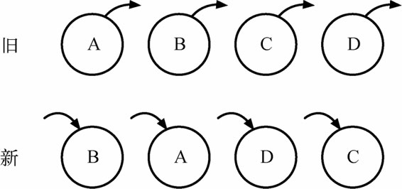
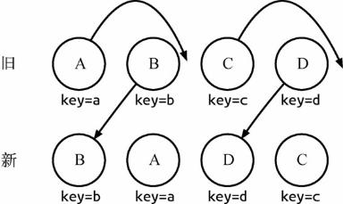

虚拟DOM、diff算法

## 1. 传统diff算法
传统diff算法通过循环递归对节点进行依次对比，效率低下，算法复杂度达到 `O(n3)`，其中n是树中节点的总数。`O(n3)`到底有多可怕呢？这意味着如果要展示1000个节点，就要依次执行上十亿次的比较。

## 2. react diff 算法
React通过制定大胆的策略，将O(n3)复杂度的问题转换成 O(n)复杂度的问题。

### 2.1. 3个diff策略
策略一：Web UI中DOM节点跨层级的移动操作特别少，可以忽略不计。   •策略二：拥有相同类的两个组件将会生成相似的树形结构，拥有不同类的两个组件将会
1. 策略一：Web UI中DOM节点跨层级的移动操作特别少，可以忽略不计。
2. 策略二：拥有相同类的两个组件将会生成相似的树形结构，拥有不同类的两个组件将会生成不同的树形结构。
3. 策略三：对于同一层级的一组子节点，它们可以通过唯一id进行区分

基于以上策略，React分别对`tree diff`、`component diff`、`element diff`进行算法优化。事实也证明这3个前提策略是合理且准确的，它保证了整体界面构建的性能。

### 2.2. tree diff
基于策略一，React对树的算法进行了简洁明了的优化，即对树进行分层比较，两棵树只会对同一层次的节点进行比较。既然DOM节点跨层级的移动操作少到可以忽略不计，针对这一现象，React通过`updateDepth`对`Virtual DOM`树进行层级控制，只会对相同层级的DOM节点进行比较，即同一个父节点下的所有子节点。当发现节点已经不存在时，则该节点及其子节点会被完全删除掉，不会用于进一步的比较。这样只需要对树进行一次遍历，便能完成整个`DOM树`的比较。
所以当出现节点跨层级移动时，并不会出现移动操作， 因此官方建议不要进行DOM节点跨层级的操作。在开发组件时，保持稳定的DOM结构会有助于性能的提升。

### 2.3. component diff
React是基于组件构建应用的，对于组件间的比较所采取的策略也是非常简洁、高效的。
1. 如果是同一类型的组件，按照原策略继续比较Virtual DOM树即可。
1. 如果不是，则将该组件判断为dirty component，从而替换整个组件下的所有子节点。
1. 对于同一类型的组件，有可能其VirtualDOM没有任何变化，如果能够确切知道这点，那么就可以节省大量的diff运算时间。因此，React允许用户通过shouldComponentUpdate()来判断该组件是否需要进行diff算法分析。

### 2.4. element diff
当节点处于同一层级时，diff提供了3种节点操作，分别为`INSERT_MARKUP（插入）`、`MOVE_EX-ISTING（移动）`、`REMOVE_NODE（删除）`。
1. INSERT_MARKUP：新的组件类型不在旧集合里，即全新的节点，需要对新节点执行插入操作。
2. MOVE_EXISTING：旧集合中有新组件类型，且element是可更新的类型，generateCompo-nentChildren已调用receiveComponent，这种情况下prevChild=nextChild，就需要做移动操作，可以复用以前的DOM节点。   3.
3. REMOVE_NODE：旧组件类型，在新集合里也有，但对应的element不同则不能直接复用和更新，需要执行删除操作，或者旧组件不在新集合里的，也需要执行删除操作。

如图3-21所示，旧集合中包含节点A、B、C和D，更新后的新集合中包含节点B、A、D和C，此时新旧集合进行diff差异化对比，发现B != A，则创建并插入B至新集合，删除旧集合A；以此类推，创建并插入A、D和C，删除B、C和D。React发现这类操作烦琐冗余，因为这些都是相同的节点，但由于位置发生变化，导致需要进行繁杂低效的删除、创建操作，其实只要对这些节点进行位置移动即可。

针对这一现象，React提出优化策略：允许开发者对同一层级的同组子节点，添加唯一key进行区分，虽然只是小小的改动，性能上却发生了翻天覆地的变化！
新旧集合所包含的节点如图3-22所示，进行diff差异化对比后，通过key发现新旧集合中的节点都是相同的节点，因此无需进行节点删除和创建，只需要将旧集合中节点的位置进行移动，更新为新集合中节点的位置，此时React给出的diff结果为：B、D不做任何操作，A、C进行移动操作即可。
#### 2.4.1. 运作原理
首先，对新集合中的节点进行循环遍历for(name in nextChildren)，通过唯一的key判断新旧集合中是否存在相同的节点`if (prevChild === nextChild)`，如果存在相同节点，则进行移动操作，但在移动前需要将当前节点在旧集合中的位置与lastIndex进行比较`if (child._mountIndex <lastIndex)`，否则不执行该操作。这是一种顺序优化手段，lastIndex一直在更新，表示访问过的节点在旧集合中最右的位置（即最大的位置）。如果新集合中当前访问的节点比lastIndex大，说明当前访问节点在旧集合中就比上一个节点位置靠后，则该节点不会影响其他节点的位置，因此不用添加到差异队列中，即不执行移动操作。只有当访问的节点比lastIndex小时，才需要进行移动操作。

参考：
* https://www.cnblogs.com/zhuzhenwei918/p/7271305.html
* https://github.com/livoras/blog/issues/13

## 3. 写React/Vue项目时 为什么要在列表组件中写key， 其作用是什么。
原理看： element diff
总结：
### 3.1. 不用key
1. **就地复用节点**：在比较新旧两个节点是否是同一个节点的过程中会判断成新旧两个节点是同一个节点，因为a.key和b.key都是undefined。所以不会重新创建节点和删除节点只会在节点的属性层面上进行比较和更新，所以可能在某种程度上(创建和删除节点方面)会有渲染性能上的提升
2. **无法维持组件的状态**：由于就地复用节点的关系，可能在维持组件状态方面会导致不可预知的错误， 比如无法维持改组件的动画效果和开关状态。
3. **也有可能贷款性能下降**： 因为直接复用节点， 如果修改的组件，需要复用很多节点，顺序有何原来的完全不同的话， 那么创建和删除节点的数量就会比带key的时候增加很多， 性能就会有所下降

### 3.2. 用key
1. **维持组件的状态， 保证组件的复用**： 因为有key唯一标识了组件，不会在每次比较新旧两个节点是否是同一个节点的时候直接判断为同一个节点，而是会继续在接下来的节点中找到key相同的节点去比较，能找到相同的key的话就复用节点，不能找到的话就增加或者删除节点。(key相同只更新属性，key不同，这先销毁再创建)
2. **查找性能的提升**：有key的时候，会生成hash，这样在查找的时候就是hash查找了， 基本上就是O(1)的复杂度。
3. **节点复用带来的性能提升**：因为有key唯一标识了组件，所以会尽可能的对组件进行复用，那么创建和删除节点的数量就会变少，这方面的消耗就会下降，带来系能提升。

总结： 性能提升不能只考虑一方面， 不是diff快了性能就快，不是增删节点少了性能就快， 不考虑量级去评价性能，都是泛泛而谈。

## 4. 原生DOM操作VSreact框架操作
### 4.1. 原生 DOM 操作 vs. 通过框架封装操作
这是一个性能 vs. 可维护性的取舍。框架的意义在于为你掩盖底层的 DOM 操作，让你用更声明式的方式来描述你的目的，从而让你的代码更容易维护。没有任何框架可以比纯手动的优化 DOM 操作更快，因为框架的 DOM 操作层需要应对任何上层 API 可能产生的操作，它的实现必须是普适的。针对任何一个 benchmark，我都可以写出比任何框架更快的手动优化，但是那有什么意义呢？在构建一个实际应用的时候，你难道为每一个地方都去做手动优化吗？出于可维护性的考虑，这显然不可能。框架给你的保证是，你在不需要手动优化的情况下，我依然可以给你提供过得去的性能。

### 4.2. 对 React 的 Virtual DOM 的误解。React 从来没有说过 “React 比原生操作 DOM 快”。

React 的基本思维模式是每次有变动就整个重新渲染整个应用。如果没有 Virtual DOM，简单来想就是直接重置 innerHTML。很多人都没有意识到，在一个大型列表所有数据都变了的情况下，重置 innerHTML 其实是一个还算合理的操作... 真正的问题是在 “全部重新渲染” 的思维模式下，即使只有一行数据变了，它也需要重置整个 innerHTML，这时候显然就有大量的浪费。

我们可以比较一下 `innerHTML vs. Virtual DOM` 的重绘性能消耗：innerHTML: ` render html string O(template size)` + `重新创建所有 DOM 元素 O(DOM size)`

Virtual DOM: `render Virtual DOM` + `diff O(template size)` + `必要的 DOM 更新 O(DOM change)Virtual DOM render` + `diff 显然比渲染 html 字符串要慢`，但是！它依然是纯 js 层面的计算，比起后面的 DOM 操作来说，依然便宜了太多。可以看到，innerHTML 的总计算量不管是 js 计算还是 DOM 操作都是和整个界面的大小相关，但 `Virtual DOM` 的计算量里面，只有 js 计算和界面大小相关，DOM 操作是和数据的变动量相关的。前面说了，和 DOM 操作比起来，js 计算是极其便宜的。这才是为什么要有 `Virtual DOM`：它保证了
1）不管你的数据变化多少，每次重绘的性能都可以接受；

2) 你依然可以用类似 innerHTML 的思路去写你的应用。

### 4.3. 性能比较也要看场合
在比较性能的时候，要分清楚初始渲染、小量数据更新、大量数据更新这些不同的场合。Virtual DOM、脏检查 MVVM、数据收集 MVVM 在不同场合各有不同的表现和不同的优化需求。
* Virtual DOM 为了提升小量数据更新时的性能，也需要针对性的优化，比如 shouldComponentUpdate 或是 immutable data。
  1. 初始渲染：Virtual DOM > 脏检查 >= 依赖收集
  2. 小量数据更新：依赖收集 >> Virtual DOM + 优化 > 脏检查（无法优化） > Virtual DOM 无优化
  3. 大量数据更新：脏检查 + 优化 >= 依赖收集 + 优化 > Virtual DOM（无法/无需优化）>> MVVM 无优化

不要天真地以为 `Virtual DOM` 就是快，diff 不是免费的，batching 么 MVVM 也能做，而且最终 patch 的时候还不是要用原生 API。在我看来` Virtual DOM` 真正的价值从来都不是性能，而是它
1. 为函数式的 UI 编程方式打开了大门；
2. 可以渲染到 DOM 以外的 backend，比如 ReactNative。

https://www.zhihu.com/question/31809713/answer/53544875

