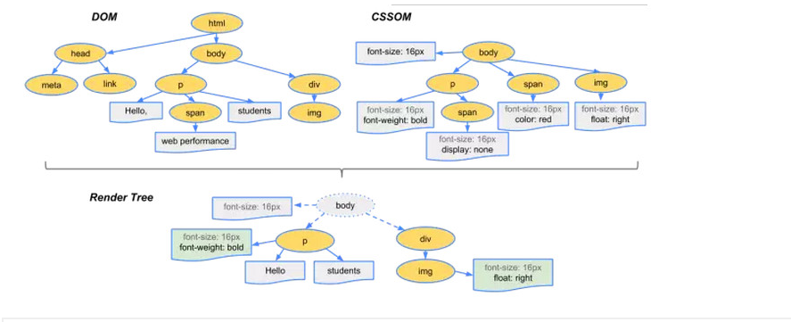
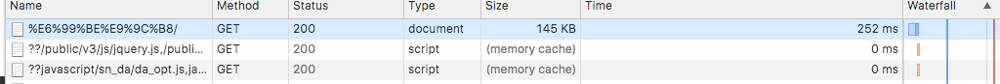
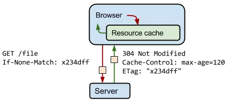

# 理论篇

## 时间复杂度，空间复杂度

## 排序算法（背诵冒泡排序、选择排序、计数排序、快速排序、插入排序、归并排序）

## 前端需要注意哪些SEO

## http method都要哪些， 区别
HTTP/1.1包含: `get` `head` `post` `options` `put` `delete` `trace` `connect`"
### 安全方法（Safe Methods）:
是指用户不管进行多少次操作，资源的状态都不会改变。比如说，`GET`和`HEAD`方法仅能获取资源，而不会执行动作（action），这些方法属于“安全”的方法。
而`POST`，`PUT`，`DELETE`方法改变了资源的状态，可能会执行不安全的动作，使用者应该意识到这一点。

## 从游览器地址输入URL到显示页面的步骤

## 页面渲染过程
> 假设游览器已经获取到了html文件。
### 一、基本流程
解析html以构建dom树 `->` 构建render树 `->` 布局render树 `->` 绘制render树
所以，浏览器会解析三个东西： 
1. `HTML/SVG/XHTML`，解析这三种文件会产生一个 `DOM Tree`。 
2. `CSS`，解析 `CSS` 会产生 `CSS` 规则树。 
3. `js`脚本，主要是通过 `DOM API` 和 `CSSOM API` 来操作 `DOM Tree` 和 `CSS Rule Tree`.

### 二、渲染过程
当浏览器获得一个html文件时，会“自上而下”加载，并在加载过程中进行解析渲染
解析：
1. 浏览器会将`HTML`解析成一个`DOM`树，`DOM` 树的构建过程是一个深度遍历过程：当前节点的所有子节点都构建好后才会去构建当前节点的下一个兄弟节点。
2. 将`CSS`解析成 `CSS Rule Tree` 。
3. 根据`DOM`树和`CSSOM`来构造`Rendering Tree`。注意：`Rendering Tree` 渲染树并不等同于 DOM 树，因为一些像 `Header` 或 `display:none` 的东西就没必要放在渲染树中了。
4. 有了Render Tree，浏览器已经能知道网页中有哪些节点、各个节点的CSS定义以及他们的从属关系。下一步操作称之为Layout，顾名思义就是计算出每个节点在屏幕中的位置。
5. 再下一步就是绘制，即遍历render树，并使用UI后端层绘制每个节点。

> 重点: 上述这个过程是逐步完成的，为了更好的用户体验，渲染引擎将会尽可能早的将内容呈现到屏幕上，并不会等到所有的html都解析完成之后再去构建和布局render树。它是解析完一部分内容就显示一部分内容，同时，可能还在通过网络下载其余内容。

### 三、渲染过程的概念
* 1. **Reflow（回流）**：浏览器要花时间去渲染，当它发现了某个部分发生了变化影响了布局，那就需要倒回去重新渲染。
* 2. **Repaint（重绘）**：如果只是改变了某个元素的背景颜色，文字颜色等，不影响元素周围或内部布局的属性，将只会引起浏览器的repaint，重画某一部分。
> Reflow要比Repaint更花费时间，也就更影响性能。要尽量避免过多的Reflow。

##### reflow的原因：
* 页面初始化的时候；
* 操作DOM时；
* 某些元素的尺寸变了；
* 如果 CSS 的布局属性发生变化了。

> 所以再优化页面渲染性能的时候，减少 reflow/repaint就是基本出发点
> js的加载和执行的特点：
  * 载入后马上执行；
  * 执行时会阻塞页面后续的内容（包括页面的渲染、其它资源的下载）。原因：因为浏览器需要一个稳定的DOM树结构，而JS中很有可能有 代码直接改变了DOM树结构，比如使用 document.write 或 appendChild,甚至是直接使用的location.href进行跳转，浏览器为了防止出现JS修 改DOM树，需要重新构建DOM树的情况，所以 就会阻塞其他的下载和呈现;

### 四、实例[HTML页面加载和解析流程](http://blog.csdn.net/xifeijian/article/details/10813339)
1. 用户输入网址（假设是个html页面，并且是第一次访问），浏览器向服务器发出请求，服务器返回`html`文件； 
2. 浏览器开始载入`html`代码，发现`＜head＞`标签内有一个`＜link＞`标签引用外部`CSS`文件； 
3. 浏览器又发出`CSS`文件的请求，服务器返回这个`CSS`文件； 
4. 浏览器继续载入`html`中`＜body＞`部分的代码，并且`CSS`文件已经拿到手了，可以开始渲染页面了； 
5. 浏览器在代码中发现一个`＜img＞`标签引用了一张图片，向服务器发出请求。此时浏览器不会等到图片下载完，而是继续渲染后面的代码； 
6. 服务器返回图片文件，由于图片占用了一定面积，影响了后面段落的排布，因此浏览器需要回过头来重新渲染这部分代码； 
7. 浏览器发现了一个包含一行`Javascript`代码的`＜script＞`标签，赶快运行它； 
8. `Javascript`脚本执行了这条语句，它命令浏览器隐藏掉代码中的某个`＜div＞ （style.display=”none”）`。突然少了这么一个元素，浏览器不得不重新渲染这部分代码； 
9. 等到了`＜/html＞`的到来结束渲染
10. 用户点了一下界面中的“换肤”按钮，`Javascript`让浏览器换了一下＜link＞标签的CSS路径； 
11. 浏览器召集了在座的各位`＜div＞＜span＞＜ul＞＜li＞`们，“大伙儿收拾收拾行李，咱得重新来过……”，浏览器向服务器请求了新的`CSS`文件，重新渲染页面。

## 一个TCP连接可以对应几个http请求

## 游览器在与服务器建立TCP连接后是否会在一个http请求完成后断开？ 什么情况会断开

默认情况下建立 TCP 连接不会断开，只有在请求报头中声明 `Connection: close` 才会在请求完成后关闭连接

## 为什么有时候刷新页面不需要重新建立SLL连接
TCP连接没有断开

## 游览器对同一host建立TCP连接数量有限制吗？
跟浏览器设置相关(Chrome 最多允许对同一个 Host 建立六个 TCP 连接。)

## 请详细描述三次握手和四次挥手的过程

## http状态码， 含义

## 数据结构， 数组、链表、二叉树、 栈、 队列、 堆

## http(2)和https， https加密原理

## 轮询、长轮询、 websocket
1. 轮询: 浏览器通过定时器每隔一段时间向服务器端发送请求，服务器端收到请求并响应请求。没有新消息时依然需要不断轮询，比较消耗资源。
2. 长轮询: 浏览器端设置较长的等待时间，当发送请求之后，服务器在等待时间之内有消息返回，则返回成功，否则，超过等待时间客户端就会自动响应超时并重新发起一个长轮询请求

## 解释之前做优化的时候把静态资源放在不同的域名上的原因 （单域名请求限制）

## 渐进增强
渐进增强是指在 web 设计时强调可访问性、语义化。保证所有人都能访问页面的基本内容和功能同时为高级浏览器和高带宽用户提供更好的用户体验。核心原则如下:
1. 所有浏览器都必须能访问基本内容
2. 所有浏览器都必须能使用基本功能
3. 所有内容都包含在语义化标签中
4. 通过外部 CSS 提供增强的布局
5. 通过非侵入式、外部 javascript 提供增强功能

## 览器缓存机制
### 缓存位置
### 一、缓存位置
> 从缓存位置上来说分为四种，并且各自有优先级，当依次查找缓存且都没有命中的时候，才会去请求网络
>  1. Service Worker
>  2. Memory Cache
>  3. Disk Cache
>  4. Push Cache

#### 1. Service Worker
#### 2. Memory Cache
`Memory Cache` 也就是内存中的缓存，读取内存中的数据肯定比磁盘快。但是内存缓存虽然读取高效，可是缓存持续性很短，会随着进程的释放而释放。 一旦我们关闭 Tab 页面，内存中的缓存也就被释放了。
当我们访问过页面以后，再次刷新页面，可以发现很多数据都来自于内存缓存



#### 3. Disk Cache
Disk Cache 也就是存储在硬盘中的缓存，读取速度慢点，但是什么都能存储到磁盘中，比之 Memory Cache 胜在容量和存储时效性上。

在所有浏览器缓存中，Disk Cache 覆盖面基本是最大的。它会根据 HTTP Herder 中的字段判断哪些资源需要缓存，哪些资源可以不请求直接使用，哪些资源已经过期需要重新请求。并且即使在跨站点的情况下，相同地址的资源一旦被硬盘缓存下来，就不会再次去请求数据

#### 4. Push Cache
Push Cache 是 HTTP/2 中的内容，当以上三种缓存都没有命中时，它才会被使用。并且缓存时间也很短暂，只在会话（Session）中存在，一旦会话结束就被释放。

### 二、缓存策略
> 通常浏览器缓存策略分为两种：`强缓存`和`协商缓存`，并且缓存策略都是通过设置 HTTP Header 来实现的。

#### 1.强缓存
强缓存可以通过设置两种 HTTP Header 实现：`Expires` 和 `Cache-Control` 。强缓存表示在缓存期间不需要请求，`state code 为 200`。
##### Expires
```
Expires: Wed, 22 Oct 2018 08:41:00 GMT
```
`Expires` 是 HTTP/1 的产物，表示资源会在 `Wed, 22 Oct 2018 08:41:00 GMT` 后过期，需要再次请求。并且 `Expires` 受限于本地时间，如果修改了本地时间，可能会造成缓存失效。

##### Cache-control
```
Cache-control: max-age=30
```
Cache-Control 出现于 HTTP/1.1，优先级高于 Expires 。该属性值表示资源会在 30 秒后过期，需要再次请求。
Cache-Control 可以在请求头或者响应头中设置，并且可以组合使用多种指令


#### 2.协商缓存
如果缓存过期了，就需要发起请求验证资源是否有更新。协商缓存可以通过设置两种 HTTP Header 实现：`Last-Modified` 和 `ETag` 。

当浏览器发起请求验证资源时，如果资源没有做改变，那么服务端就会返回 304 状态码，并且更新浏览器缓存有效期。



##### 1.`Last-Modified` 和 `If-Modified-Since`
`Last-Modified` 表示本地文件最后修改日期，If-Modified-Since 会将 Last-Modified 的值发送给服务器，询问服务器在该日期后资源是否有更新，有更新的话就会将新的资源发送回来，否则返回 304 状态码。

但是 `Last-Modified` 存在一些弊端：

如果本地打开缓存文件，即使没有对文件进行修改，但还是会造成 `Last-Modified` 被修改，服务端不能命中缓存导致发送相同的资源, 因为 `Last-Modified` 只能以秒计时，如果在不可感知的时间内修改完成文件，那么服务端会认为资源还是命中了，不会返回正确的资源
因为以上这些弊端，所以在 HTTP / 1.1 出现了 ETag 。

##### 2.`ETag` 和 `If-None-Match`
`ETag` 类似于文件指纹，`If-None-Match` 会将当前 `ETag` 发送给服务器，询问该资源 `ETag` 是否变动，有变动的话就将新的资源发送回来。并且 `ETag` 优先级比 `Last-Modified` 高。
以上就是缓存策略的所有内容了，看到这里，不知道你是否存在这样一个疑问。如果什么缓存策略都没设置，那么浏览器会怎么处理？
对于这种情况，浏览器会采用一个启发式的算法，通常会取响应头中的 Date 减去 Last-Modified 值的 10% 作为缓存时间。

### 三、实际场景应用缓存策略
#### 1.频繁变动的资源
对于频繁变动的资源，首先需要使用 `Cache-Control: no-cache` 使浏览器每次都请求服务器，然后配合 `ETag` 或者 `Last-Modified` 来验证资源是否有效。这样的做法虽然不能节省请求数量，但是能显著减少响应数据大小。

#### 2.代码文件
这里特指除了 HTML 外的代码文件，因为 HTML 文件一般不缓存或者缓存时间很短。
一般来说，现在都会使用工具来打包代码，那么我们就可以对文件名进行哈希处理，只有当代码修改后才会生成新的文件名。基于此，我们就可以给代码文件设置缓存有效期一年 `Cache-Control: max-age=31536000`，这样只有当 HTML 文件中引入的文件名发生了改变才会去下载最新的代码文件，否则就一直使用缓存。

## 大型网站运作架构

## 前端鉴权的实现
(1). `session-cookie`: 只适用于web系统。后端自动维护`session`，会在`cookie`写一个`JSESSIONID`的值。
(2). `Token`: 适用于app鉴权，微信开发平台`access token`
  1. 客户端使用用户名跟密码请求登录
  2. 服务端收到请求，去验证用户名与密码
  3. 验证成功后，服务端会签发一个 Token，再把这个 Token 发送给客户端
  4. 客户端收到 Token 以后可以把它存储起来，比如放在 Cookie 里或者 Local Storage 里
  5. 客户端每次向服务端请求资源的时候需要带着服务端签发的 Token
  6. 服务端收到请求，然后去验证客户端请求里面带着的 Token，如果验证成功，就向客户端返回请求的数据
(3). `OAuth`: OAuth（开放授权）是一个开放标准，允许用户授权第三方网站访问他们存储在另外的服务提供者上的信息，而不需要将用户名和密码提供给第三方网站或分享他们数据的所有内容，为了保护用户数据的安全和隐私，第三方网站访问用户数据前都需要显式的向用户征求授权。我们常见的提供OAuth认证服务的厂商有支付宝，QQ,微信。

## meta viewport 是做什么用的，怎么写

## H5 缓存机制浅析 - 移动端 Web 加载性能优化
https://segmentfault.com/a/1190000004132566

## 框架原理篇
## vue 双向绑定原理
## react 框架原理
## MVC 和 MVVM 说明
## 同构方案说明
