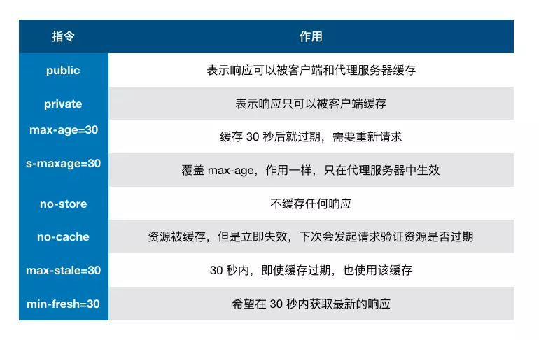

# 理论篇

## 时间复杂度，空间复杂度

## 排序算法（背诵冒泡排序、选择排序、计数排序、快速排序、插入排序、归并排序）

## 前端需要注意哪些SEO

## http method都要哪些， 区别

## 从游览器地址输入URL到显示页面的步骤

## TCP 三次握手

## http状态码， 含义

## 数据结构， 数组、链表、二叉树、 栈、 队列、 堆

## http(2)和https， https加密原理

## 轮询、长轮询、 websocket(websocket的握手过程)

## 解释之前做优化的时候把静态资源放在不同的域名上的原因 （单域名请求限制）

## 渐进增强
渐进增强是指在 web 设计时强调可访问性、语义化。保证所有人都能访问页面的基本内容和功能同时为高级浏览器和高带宽用户提供更好的用户体验。核心原则如下:
1. 所有浏览器都必须能访问基本内容
2. 所有浏览器都必须能使用基本功能
3. 所有内容都包含在语义化标签中
4. 通过外部 CSS 提供增强的布局
5. 通过非侵入式、外部 javascript 提供增强功能

## 览器缓存机制
### 缓存位置
### 一、缓存位置
> 从缓存位置上来说分为四种，并且各自有优先级，当依次查找缓存且都没有命中的时候，才会去请求网络
>  1. Service Worker
>  2. Memory Cache
>  3. Disk Cache
>  4. Push Cache

#### 1. Service Worker
#### 2. Memory Cache
`Memory Cache` 也就是内存中的缓存，读取内存中的数据肯定比磁盘快。但是内存缓存虽然读取高效，可是缓存持续性很短，会随着进程的释放而释放。 一旦我们关闭 Tab 页面，内存中的缓存也就被释放了。
当我们访问过页面以后，再次刷新页面，可以发现很多数据都来自于内存缓存


#### 3. Disk Cache
Disk Cache 也就是存储在硬盘中的缓存，读取速度慢点，但是什么都能存储到磁盘中，比之 Memory Cache 胜在容量和存储时效性上。

在所有浏览器缓存中，Disk Cache 覆盖面基本是最大的。它会根据 HTTP Herder 中的字段判断哪些资源需要缓存，哪些资源可以不请求直接使用，哪些资源已经过期需要重新请求。并且即使在跨站点的情况下，相同地址的资源一旦被硬盘缓存下来，就不会再次去请求数据

#### 4. Push Cache
Push Cache 是 HTTP/2 中的内容，当以上三种缓存都没有命中时，它才会被使用。并且缓存时间也很短暂，只在会话（Session）中存在，一旦会话结束就被释放。

### 二、缓存策略
> 通常浏览器缓存策略分为两种：`强缓存`和`协商缓存`，并且缓存策略都是通过设置 HTTP Header 来实现的。

#### 1.强缓存
强缓存可以通过设置两种 HTTP Header 实现：`Expires` 和 `Cache-Control` 。强缓存表示在缓存期间不需要请求，`state code 为 200`。
##### Expires
```
Expires: Wed, 22 Oct 2018 08:41:00 GMT
```
`Expires` 是 HTTP/1 的产物，表示资源会在 `Wed, 22 Oct 2018 08:41:00 GMT` 后过期，需要再次请求。并且 `Expires` 受限于本地时间，如果修改了本地时间，可能会造成缓存失效。

##### Cache-control
```
Cache-control: max-age=30
```
Cache-Control 出现于 HTTP/1.1，优先级高于 Expires 。该属性值表示资源会在 30 秒后过期，需要再次请求。
Cache-Control 可以在请求头或者响应头中设置，并且可以组合使用多种指令




#### 2.协商缓存
如果缓存过期了，就需要发起请求验证资源是否有更新。协商缓存可以通过设置两种 HTTP Header 实现：`Last-Modified` 和 `ETag` 。

当浏览器发起请求验证资源时，如果资源没有做改变，那么服务端就会返回 304 状态码，并且更新浏览器缓存有效期。


##### 1.`Last-Modified` 和 `If-Modified-Since`
`Last-Modified` 表示本地文件最后修改日期，If-Modified-Since 会将 Last-Modified 的值发送给服务器，询问服务器在该日期后资源是否有更新，有更新的话就会将新的资源发送回来，否则返回 304 状态码。

但是 `Last-Modified` 存在一些弊端：

如果本地打开缓存文件，即使没有对文件进行修改，但还是会造成 `Last-Modified` 被修改，服务端不能命中缓存导致发送相同的资源, 因为 `Last-Modified` 只能以秒计时，如果在不可感知的时间内修改完成文件，那么服务端会认为资源还是命中了，不会返回正确的资源
因为以上这些弊端，所以在 HTTP / 1.1 出现了 ETag 。

##### 2.`ETag` 和 `If-None-Match`
`ETag` 类似于文件指纹，`If-None-Match` 会将当前 `ETag` 发送给服务器，询问该资源 `ETag` 是否变动，有变动的话就将新的资源发送回来。并且 `ETag` 优先级比 `Last-Modified` 高。
以上就是缓存策略的所有内容了，看到这里，不知道你是否存在这样一个疑问。如果什么缓存策略都没设置，那么浏览器会怎么处理？
对于这种情况，浏览器会采用一个启发式的算法，通常会取响应头中的 Date 减去 Last-Modified 值的 10% 作为缓存时间。

### 三、实际场景应用缓存策略
#### 1.频繁变动的资源
对于频繁变动的资源，首先需要使用 `Cache-Control: no-cache` 使浏览器每次都请求服务器，然后配合 `ETag` 或者 `Last-Modified` 来验证资源是否有效。这样的做法虽然不能节省请求数量，但是能显著减少响应数据大小。

#### 2.代码文件
这里特指除了 HTML 外的代码文件，因为 HTML 文件一般不缓存或者缓存时间很短。
一般来说，现在都会使用工具来打包代码，那么我们就可以对文件名进行哈希处理，只有当代码修改后才会生成新的文件名。基于此，我们就可以给代码文件设置缓存有效期一年 `Cache-Control: max-age=31536000`，这样只有当 HTML 文件中引入的文件名发生了改变才会去下载最新的代码文件，否则就一直使用缓存。

## 大型网站运作架构

## 前端鉴权的实现

## meta viewport 是做什么用的，怎么写

## H5 缓存机制浅析 - 移动端 Web 加载性能优化
https://segmentfault.com/a/1190000004132566

## 框架原理篇
## vue 双向绑定原理
## react 框架原理
## MVC 和 MVVM 说明
## 同构方案说明
