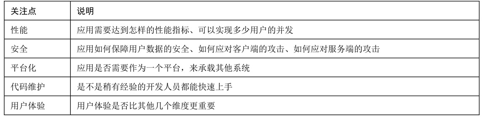

# 前端架构

## 一、架构的设计

### 总体大概步骤

1. 收集利益相关者的需求。倾听业务人员、项目负责人等相关者的需求，进行用户访谈，收集相关的需求。
2. 与相应的技术人员（如开发人员、测试人员）讨论，了解架构上的潜在限制。
3. 寻找潜在的可行性技术方案。
4. 整理出功能列表中的功能性需求和跨功能性需求。
5. 找出会严重影响开发的风险点。
6. 对架构设计进行概念证明。
7. 细化架构的部分实施细节。
8. 结合技术和业务，进行需求排期。

### 相关者的利益

* 产品或业务负责人（PO），关心是否能按时
* 项目经理，根据架构来决定项目计划及项目人选。
* 架构师、开发人员，关心系统的构建、演进及维护。
* 业务分析人员，关心如何分配和安排项目的迭代计划。
* 测试人员，设计合理的测试计划，如对系统集成部分的测试等。

### 架构关注点

### 明确跨功能需求(非功能性需求)

1. 运行质量（Execution Qualities）：即可以在系统运作时观察到的质量，例如安全性、易用性等。
2. 演进质量（Evolution Qualities）：它们体现在系统的静态结构中，例如软件可测试性、可维护性、可扩展性、可伸缩性（Scalability）等。
3. 可用性：是指在一段时间内，系统能够正常运行的概率。如何保证这样的可用性？
4. 可维护性：其表现的指标是，在接到修改后，可以在相应的时间内（如小功能1～3天）修改完成。
5. 可变性：在未来，应用的哪些地方会发生变化？是否需要提前做好准备？
6. 容错性：系统中可能会出现哪些故障？如何确保这些故障不会让系统无法运行？
7. 浏览器的支持范围：明确指出我们要针对哪些浏览器，以及浏览器的哪些版本做兼容。
8. 移动端设备支持的版本：常见的设备如An-droid和iOS，设备最低的支持版本，以及支持哪些设备制造商。

### 罗列技术风险点

