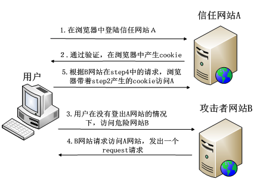
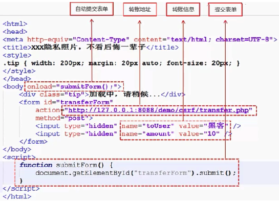

# CSRF(跨站请求伪造)

`CSRF(Cross Site Request Forgery)`: 是一种常见的Web攻击，它利用用户已登录的身份，在用户毫不知情的情况下，以用户的名义完成非法操作
## 原理

### 完成 CSRF 攻击必须要有三个条件：
1. 用户已经登录了站点 A，并在本地记录了 `cookie`
2. 在用户没有登出站点 A 的情况下（也就是 `cookie` 生效的情况下），访问了恶意攻击者提供的引诱危险站点 B (B 站点要求访问站点A)。
3. 站点 A 没有做任何 CSRF 防御

例子： 当我们登入转账页面后，突然眼前一亮**惊现"XXX隐私照片，不看后悔一辈子"的链接**，耐不住内心躁动，立马点击了该危险的网站（页面代码如下图所示），但当这页面一加载，便会执行 `submitForm` 这个方法来提交转账请求，从而将10块转给黑客。

!

## 防御方法

### 1. 验证码
验证码强制用户必须与应用进行交互，才能完成最终请求。因此在通常情况下，验证码能够很好地遏制`CSRF`攻击。但是验证码并非万能。很多时候，出于用户体验考虑，网站不能给所有的操作都加上验证码。因此，验证码只能作为防御CSRF的一种辅助手段，而不能作为最主要的解决方案。

### 2. Referer Check

Referer Check在互联网中最常见的应用就是“防止图片盗链”。同理，`Referer Check`也可以被用于检查请求是否来自合法的“源”。

> Referer Check的缺陷在于，服务器并非什么时候都能取到Referer。很多用户出于隐私保护的考虑，限制了Referer的发送。在某些情况下，浏览器也不会发送Referer，比如从HTTPS跳转到HTTP，出于安全的考虑，浏览器也不会发送Ref-erer。

### 3. Anti CSRF Token

现在业界针对CSRF的防御，一致的做法是使用一个Token。

