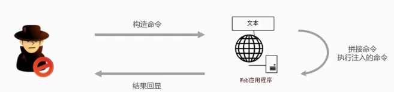

# OS命令注入攻击
OS命令注入和SQL注入差不多，只不过SQL注入是针对数据库的，而OS命令注入是针对操作系统的。OS命令注入攻击指通过Web应用，执行非法的操作系统命令达到攻击的目的。只要在能调用Shell函数的地方就有存在被攻击的风险。倘若调用Shell时存在疏漏，就可以执行插入的非法命令。

命令注入攻击可以向 `Shell` 发送命令，让 `Windows或Linux` 操作系统的命令行启动程序。也就是说， `通过命令注入攻击可执行操作系统上安装着的各种程序` 。

## 原理


黑客构造命令提交给web应用程序，web应用程序提取黑客构造的命令，拼接到被执行的命令中，因黑客注入的命令打破了原有命令结构，导致web应用执行了额外的命令，最后web应用程序将执行的结果输出到响应页面中。

我们通过一个例子来说明其原理，假如需要实现一个需求：用户提交一些内容到服务器，然后在服务器执行一些系统命令去返回一个结果给用户

``` js
// 以 Node.js 为例，假如在接口中需要从 github 下载用户指定的 repo
const exec = require('mz/child_process').exec;
let params = {
    /* 用户输入的参数 */ };
exec( `git clone ${params.repo} /some/path` );
```

如果 `params.repo` 传入的是 `https://github.com/admin/admin.github.io.git` 确实能从指定的 git repo 上下载到想要的代码。
但是如果 `params.repo` 传入的是 `https://github.com/xx/xx.git && rm -rf /* &&` 恰好你的服务是用 root 权限起的就糟糕了。

##  如何防御

1. 后端对前端提交内容进行规则限制（比如正则表达式）。
1. 在调用系统命令前对所有传入参数进行命令行参数转义过滤。
1. 不要直接拼接命令语句，借助一些工具做拼接、转义预处理，例如 Node.js 的 `shell-escape npm` 包

