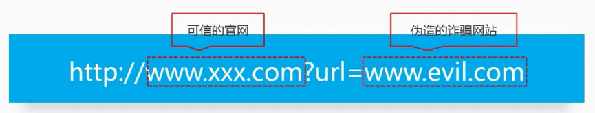

<div class="title">URL跳转漏洞</div>

定义：借助未验证的URL跳转，将应用程序引导到不安全的第三方区域，从而导致的安全问题。

## 1. URL跳转漏洞原理

黑客利用URL跳转漏洞来诱导安全意识低的用户点击，导致用户信息泄露或者资金的流失。其原理是黑客构建恶意链接(链接需要进行伪装, 尽可能迷惑), 发在QQ群或者是浏览量多的贴吧/论坛中。
安全意识低的用户点击后, 经过服务器或者浏览器解析后，跳到恶意的网站中。


恶意链接需要进行伪装, 经常的做法是熟悉的链接后面加上一个恶意的网址，这样才迷惑用户。



诸如伪装成像如下的网址，你是否能够识别出来是恶意网址呢？

```
http://gate.baidu.com/index?act=go&url=http://t.cn/RVTatrd
http://qt.qq.com/safecheck.html?flag=1&url=http://t.cn/RVTatrd
http://tieba.baidu.com/f/user/passport?jumpUrl=http://t.cn/RVTatrd
```

## 2. 实现方式：

* Header头跳转
* Javascript跳转
* META标签跳转

这里我们举个Header头跳转实现方式：

```
<?php
$url=$_GET['jumpto'];
header("Location: $url");
?>
```

```
http://www.wooyun.org/login.php?jumpto=http://www.evil.com
```

这里用户会认为 `www.wooyun.org` 都是可信的，但是点击上述链接将导致用户最终访问 `www.evil.com` 这个恶意网址。

## 3. 如何防御

### 3.1. referer的限制
如果确定传递URL参数进入的来源，我们可以通过该方式实现安全限制，保证该URL的有效性，避免恶意用户自己生成跳转链接

### 3.2. 加入有效性验证Token

我们保证所有生成的链接都是来自于我们可信域的，通过在生成的链接里加入用户不可控的Token对生成的链接进行校验，可以避免用户生成自己的恶意链接从而被利用，但是如果功能本身要求比较开放，可能导致有一定的限制。

