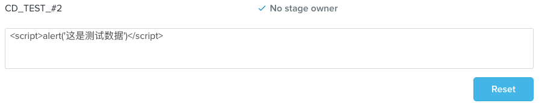

# XSS
`XSS` ：跨站脚本攻击是指通过存在安全漏洞的Web网站注册用户的浏览器内运行非法的 `HTML` 标签或 `JavaScript` 进行的一种攻击。

## 原理

是恶意攻击者往 `Web` 页面里插入恶意可执行网页脚本代码，当用户浏览该页之时，嵌入其中 `Web` 里面的脚本代码会被执行，从而可以达到攻击者盗取用户信息或其他侵犯用户安全隐私的目的

## 影响

1. 利用虚假输入表单骗取用户个人信息。
2. 利用脚本窃取用户的`Cookie`值，被害者在不知情的情况下，帮助攻击者发送恶意请求。
3. 显示伪造的文章或图片。

## 分类

大致分为两类

### 1. 非持久型 `XSS`（反射型 `XSS` ）

非持久型 XSS 漏洞，一般是通过给别人发送**带有恶意脚本代码参数的 URL**，当 URL 地址被打开时，特有的恶意代码参数被 HTML 解析、执行。
例子，比如页面中包含有以下代码

``` html
<select>
    <script>
        document.write('' +
            '<option value=1>' +
            location.href.substring(location.href.indexOf('default=') + 8) +
            '</option>'
        );
        document.write('<option value=2>English</option>');
    </script>
</select>
```

攻击者可以直接通过 URL (类似： `https://xxx.com/xxx?default=<script>alert(document.cookie)</script>` ) 注入可执行的脚本代码。不过一些浏览器如Chrome其内置了一些XSS过滤器，可以防止大部分反射型XSS攻击。

#### 非持久型 XSS 漏洞攻击有以下几点特征：

* 即时性，不经过服务器存储，直接通过 HTTP 的 GET 和 POST 请求就能完成一次攻击，拿到用户隐私数据。
* 攻击者需要诱骗点击, 必须要通过用户点击链接才能发起
* 反馈率低，所以较难发现和响应修复
* 盗取用户敏感保密信息

#### 为了防止出现非持久型 XSS 漏洞，需要确保这么几件事情：

* Web 页面渲染的所有内容或者渲染的数据都必须来自于服务端。
* 尽量不要从 `URL` ， `document.referrer` ， `document.forms` 等这种 DOM API 中获取数据直接渲染。
* 尽量不要使用 `eval` , `new Function()` ， `document.write()` ， `document.writeln()` ， `window.setInterval()` ， `window.setTimeout()` ， `innerHTML` ， `document.createElement()` 等可执行字符串的方法。
* 如果做不到以上几点，也必须对涉及 DOM 渲染的方法传入的字符串参数做 escape 转义。
* 前端渲染的时候对任何的字段都需要做 escape 转义编码。

### 2. 持久型 `XSS`（存储型 `XSS`）

持久型 XSS 漏洞，一般存在于 Form 表单提交等交互功能，如文章留言，提交文本信息等，黑客利用的 XSS 漏洞，将内容经正常功能提交进入数据库持久保存，当前端页面获得后端从数据库中读出的注入代码时，恰好将其渲染执行。
例如有个表单


主要注入页面方式和非持久型 XSS 漏洞类似，只不过持久型的不是来源于 URL，referer，forms 等，而是来源于`后端从数据库中读出来的数据`**` 。持久型 XSS 攻击不需要诱骗点击，黑客只需要在提交表单的地方完成注入即可，但是这种 XSS 攻击的成本相对还是很高。

### 攻击成功需要同时满足以下几个条件：

1. POST 请求提交表单后端没做转义直接入库。
2. 后端从数据库中取出数据没做转义直接输出给前端。
3. 前端拿到后端数据没做转义直接渲染成 DOM。

### 持久型 XSS 有以下几个特点：

1. 持久性，植入在数据库中
2. 盗取用户敏感私密信息
4. 危害面广

## 防御(主要5种方法)

#### (1). HttpOnly
游览器将禁止页面的`javascript`访问带有`HttpOnly`属性的`cookie`

> `HttpOnly`并非为了对抗XSS——HttpOnly解决的是XSS后的`Cookie`劫持攻击。

如果该Cookie设置了HttpOnly，则这种攻击会失败，因为JavaScript读取不到Cookie的值。
一个Cookie的使用过程如下。

* Step1：浏览器向服务器发起请求，这时候没有Cookie。
* Step2：服务器返回时发送Set-Cookie头，向客户端浏览器写入Cookie。
* Step3：在该Cookie到期前，浏览器访问该域下的所有页面，都将发送该Cookie。

#### (2). 输入检查(`XSS Filter`)
常见的Web漏洞如`XSS、SQL Injection`等，都要求攻击者构造一些特殊字符，这些特殊字符可能是正常用户不会用到的，所以输入检查就有存在的必要了。
在XSS的防御上，输入检查一般是检查用户输入的数据中是否包含一些特殊字符，如 `<` 、 `>` 、 `'` 、 `"` 等。如果发现存在特殊字符，则将这些字符`过滤`或者`编码`。比较智能的“输入检查”，可能还会匹配XSS的特征。比如查找用户数据中是否包含了 `<script>` 、 `javascript` 等敏感字符。这种输入检查的方式，可以称为 `XSS Filter` 。互联网上有很多开源的 `XSS Filter` 的实现。

#### (3). 输出检查
一般来说，除了富文本的输出外，在变量输出到HTML页面时，可以使用编码或转义的方式来防御XSS攻击。

#### (4). 安全的编码函数
编码分为很多种:
1. HTML代码的编码方式是 `HtmlEncode` 。对抗XSS，在HtmlEncode中要求至少转换以下字符：

``` javascript
& -- > & amp; <
-- > & lt; >
-- > & gt;
" --> &quot;
' --> &#x27; /
-- > & #x2F;
```

> * 包含反斜线是因为它可能会闭合一些 `HTML entity`
> * 所有在标签中输出的变量，如果未做任何处理，都能导致直接产生XSS

2. `JavaScript`的编码方式可以使用`JavascriptEncode`。

方法使用“\”对特殊字符进行转义。在对抗XSS时，还要求输出的变量必须在引号内部，

> * `<script>`标签中输出在`<script>`标签中输出时
> * 在事件中输出

```html
<a href="#" onclick="funcA('$var')">test</a>
```

3. 在CSS中输出在CSS和`style、style attribute`中形成XSS 使用 `encodeForCSS()` 。

> * 尽可能禁止用户可控制的变量在`<style>`标签、“HTML标签的style属性” “CSS文件” 输出
> * 将除了字母、数字外的所有字符都编码成十六进制形式”\uHH“。

4. 在地址中输出： 在URL的path（路径）或者`search`（参数）中输出，使用 `URLEncode` 。

方法使用“\”对特殊字符进行转义。在对抗XSS时，还要求输出的变量必须在引号内部，

> * URLEncode会将字符转换为“%HH”形式，比如空格就是“%20”，“<”符号是“%3c”

```html
<a href="http://www.evil.com/?test=" onclick=alert(1)"">test</a>
```

#### (5).处理富文本
如何区分安全的“富文本”和有攻击性的XSS呢？在处理富文本时，还是要回到“输入检查”的思路上来。“输入检查”的主要问题是，在检查时还不知道变量的输出语境。但用户提交的“富文本”数据，其语义是完整的HTML代码，在输出时也不会拼凑到某个标签的属性中。因此可以特殊情况特殊处理。

列出了所有在HTML中可能执行脚本的地方。而一个优秀的“XSS Filter”，也应该能够找出HTML代码中所有可能执行脚本的地方。

HTML是一种结构化的语言，比较好分析。通过htmlparser可以解析出HTML代码的标签、标签属性和事件。

在过滤富文本时，“事件”应该被严格禁止，因为“富文本”的展示需求里不应该包括“事件”这种动态效果。而一些危险的标签，比如<iframe>、<script>、<base>、<form>等，也是应该严格禁止的。

在标签的选择上，应该使用白名单，避免使用黑名单。比如，只允许<a>、、<div>等比较“安全”的标签存在。“白名单原则”不仅仅用于标签的选择，同样应该用于属性与事件的选择。

如果一定要允许用户自定义样式，则只能像过滤“富文本”一样过滤“CSS”。这需要一个CSSParser对样式进行智能分析，检查其中是否包含危险代码。有一些比较成熟的开源项目，实现了对富文本的XSS检查。

#### (6). CSP
CSP 本质上就是建立白名单，开发者明确告诉浏览器哪些外部资源可以加载和执行。我们只需要配置规则，如何拦截是由浏览器自己实现的。我们可以通过这种方式来尽量减少 XSS 攻击。

通常可以通过两种方式来开启 CSP：

设置 HTTP Header 中的 `Content-Security-Policy`
设置 meta 标签的方式 `<meta http-equiv="Content-Security-Policy">`
这里以设置 HTTP Header 来举例

只允许加载本站资源
```
Content-Security-Policy: default-src ‘self’
```
只允许加载 HTTPS 协议图片
```
Content-Security-Policy: img-src https://*
```
允许加载任何来源框架
```
Content-Security-Policy: child-src 'none'
``
当然可以设置的属性远不止这些，你可以通过查阅 文档 的方式来学习，这里就不过多赘述其他的属性了。

对于这种方式来说，只要开发者配置了正确的规则，那么即使网站存在漏洞，攻击者也不能执行它的攻击代码，并且 CSP 的兼容性也不错。