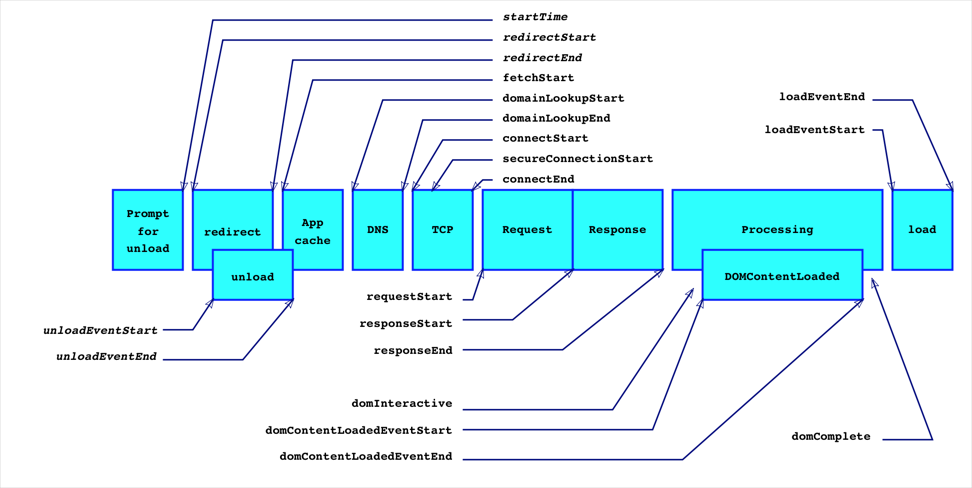

# 浏览器性能监控
使用 performance.timing 这个api就可以获取到绝大部分性能相关的数据
!
## 有前一个网页的情况下

1. `navigationStart`：在同一个浏览器上下文中，前一个网页（与当前页面不一定同域）unload 的时间戳，如果无前一个网页 unload ，则与 fetchStart 值相等
1. `unloadEventStart`：前一个网页（与当前页面同域）unload 的时间戳，如果无前一个网页 unload 或者前一个网页与当前页面不同域，则值为 0
1. `redirectStart`：第一个 HTTP 重定向发生时的时间。有跳转且是同域名内的重定向才算，否则值为 0
1. `redirectEnd`：最后一个 HTTP 重定向完成时的时间。有跳转且是同域名内的重定向才算，否则值为 0

## 开始加载当前页面

1. `fetchStart`：浏览器准备好使用 HTTP 请求抓取文档的时间，这发生在检查本地缓存之前

网络传输阶段 DNS TCP

1. `domainLookupStart`：DNS 域名查询开始的时间，如果使用了本地缓存（即无 DNS 查询）或持久连接，则与 fetchStart 值相等
1. `domainLookupEnd`：DNS 域名查询完成的时间，如果使用了本地缓存（即无 DNS 查询）或持久连接，则与 fetchStart 值相等
1. `connectStart`:HTTP（TCP） 开始建立连接的时间，如果是持久连接，则与 fetchStart 值相等,如果在传输层发生了错误且重新建立连接，则这里显示的是新建立的连接开始的时间
1. `secureConnectionStart`:HTTPS 连接开始的时间，如果不是安全连接，则值为 0
1. `connectEnd`:HTTP（TCP） 完成建立连接的时间（完成握手），如果是持久连接，则与 fetchStart 值相等,如果在传输层发生了错误且重新建立连接，则这里显示的是新建立的连接完成的时间

## 读取文档阶段

1. `requestStart`:HTTP 请求读取真实文档开始的时间（完成建立连接），包括从本地读取缓存,连接错误重连时，这里显示的也是新建立连接的时间
1. `responseStart`:HTTP 开始接收响应的时间（获取到第一个字节），包括从本地读取缓存
1. `responseEnd`:HTTP 响应全部接收完成的时间（获取到最后一个字节），包括从本地读取缓存

## 解析文档阶段

1. `domLoading`:开始解析渲染 DOM 树的时间，此时 Document.readyState 变为 loading，并将抛出 readystatechange 相关事件
1. `domInteractive`:完成解析 DOM 树的时间，Document.readyState 变为 interactive，并将抛出 readystatechange 相关事件
1. `domContentLoadedEventStart`:DOM 解析完成后，网页内资源加载开始的时间,代表DOMContentLoaded事件触发的时间节点
1. `domContentLoadedEventEnd`:DOM 解析完成后，网页内资源加载完成的时间（如 JS 脚本加载执行完毕），文档的DOMContentLoaded 事件的结束时间，也就是jQuery中的domready时间；
1. `domComplete`:DOM 树解析完成，且资源也准备就绪的时间，Document.readyState 变为 complete，并将抛出 readystatechange 相关事件
1. `loadEventStart`:load 事件发送给文档，也即 load 回调函数开始执行的时间,如果没有绑定 load 事件，值为 0
1. `loadEventEnd`:load 事件的回调函数执行完毕的时间,如果没有绑定 load 事件，值为 0

## 各个阶段时间段查询
1. DNS查询耗时` = domainLookupEnd - domainLookupStart
1. TCP链接耗时` = connectEnd - connectStart
1. request请求耗时` = responseEnd - responseStart
1. 解析dom树耗时` = domComplete - domInteractive
1. 白屏时间` = domloadng - fetchStart
1. domready时间` = domContentLoadedEventEnd - fetchStart
1. onload时间` = loadEventEnd - fetchStart
