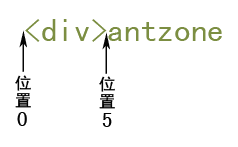
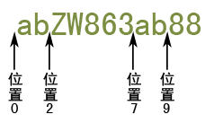

<!--
Created: Thu Apr 09 2020 16:22:51 GMT+0800 (China Standard Time)
Modified: Thu Apr 09 2020 16:22:51 GMT+0800 (China Standard Time)
-->

# 零宽断言

在使用正则表达式时，有时我们需要捕获的内容前后必须是特定内容，但又不捕获这些特定内容的时候，零宽断言就起到作用了。

## 一. 基本概念:

零宽断言正如它的名字一样，是一种零宽度的匹配，它匹配到的内容不会保存到匹配结果中去，最终匹配结果只是一个位置而已。
作用是给指定位置添加一个限定条件，用来规定此位置之前或者之后的字符必须满足限定条件才能使正则中的字表达式匹配成功。
注意: 这里所说的子表达式并非只有用小括号括起来的表达式，而是正则表达式中的任意匹配单元。
javascript只支持零宽先行断言，而零宽先行断言又可以分为正向零宽先行断言，和负向零宽先行断言。

代码实例如下:

``` js
var str = "abZW863";
var reg = /ab(?=[A-Z])/;
console.log(str.match(reg));
```

在以上代码中，正则表达式的语义是: 匹配后面跟随任意一个大写字母的字符串"ab"。最终匹配结果是"ab"，因为零宽断言" `(?=[A-Z])` "并不匹配任何字符，只是用来规定当前位置的后面必须是一个大写字母。

``` js
var str = "abZW863";
var reg = /ab(?![A-Z])/;
console.log(str.match(reg));
```

> 以上代码中，正则表达式的语义是: 匹配后面不跟随任意一个大写字母的字符串"ab"。正则表达式没能匹配任何字符，因为在字符串中，ab的后面跟随有大写字母。

## 二. 匹配原理:

### 1. 正向零宽断言:

``` js
var str = "<div>antzone";
var reg = /^(?=<)<[^>]+>\w+/;
console.log(str.match(reg));
```



> 匹配过程如下:
> * 1. 首先由正则表达式中的"^"获取控制权，首先由位置0开始进行匹配，它匹配开始位置0，匹配成功
> * 2. 然后控制权转交给" `(?=<)` "，由于"^"是零宽的，所以"(?=<)"也是从位置0处开始匹配，它要求所在的位置右侧必须是字符"<"，位置0的右侧恰好是字符"<"，匹配成功，然
> * 3. 后控制权转交个"<", 由于"(?=<)"也是零宽的，所以它也是从位置0处开始匹配，于是匹配成功，后面的匹配过程就不介绍了。

### 2. 负向零宽断言:

```
var str="abZW863ab88";
var reg=/ab(?![A-Z])/g;
console.log(str.match(reg));
```



> 匹配过程如下:
> * 1. 首先由正则表达式的字符"a"获取控制权，从位置0处开始匹配，匹配字符"a"成功，然后控制权转交给"b"，从位置1处开始匹配，配字符"b"成功，
> * 2. 然后控制权转交给" `(?![A-Z])` "，它从位置2处开始匹配，它要求所在位置的右边不能够是任意一个大写字母，而位置的右边是大写字母"Z", 匹配失败，
> 3. 然后控制权又重新交给字符"a"，并从位置1处开始尝试，匹配失败，
> 4. 然后控制权再次交给字符"a"，从位置2处开始尝试匹配，依然失败，
> 5. 如此往复尝试，直到从位置7处开始尝试匹配成功，然后将控制权转交给"b", 然后从位置8处开始尝试匹配，匹配成功，然后再将控制权转交给" `(?![A-Z])` "，它从位置9处开始尝试匹配，它规定它所在的位置右边不能够是大写字母，匹配成功，但是它并不会真正匹配字符，所以最终匹配结果是"ab"。

##### 说明

> 零宽断言是正则表达式中的一种方法，正则表达式在计算机科学中，是指一个用来描述或者匹配一系列符合某个句法规则的字符串的单个字符串。

### 定义解释

零宽断言是正则表达式中的一种方法正则表达式在计算机科学中，是指一个用来描述或者匹配一系列符合某个句法规则的字符串的单个字符串。在很多文本编辑器或其他工具里，正则表达式通常被用来检索和/或替换那些符合某个模式的文本内容。许多程序设计语言都支持利用正则表达式进行字符串操作

#### 零宽断言

用于查找在某些内容(但并不包括这些内容)之前或之后的东西，也就是说它们像`\b,^,<!--
Created: Thu Apr 09 2020 16:22:51 GMT+0800 (China Standard Time)
Modified: Thu Apr 09 2020 16:22:51 GMT+0800 (China Standard Time)
-->

# 零宽断言

在使用正则表达式时，有时我们需要捕获的内容前后必须是特定内容，但又不捕获这些特定内容的时候，零宽断言就起到作用了。

## 一. 基本概念:

零宽断言正如它的名字一样，是一种零宽度的匹配，它匹配到的内容不会保存到匹配结果中去，最终匹配结果只是一个位置而已。
作用是给指定位置添加一个限定条件，用来规定此位置之前或者之后的字符必须满足限定条件才能使正则中的字表达式匹配成功。
注意: 这里所说的子表达式并非只有用小括号括起来的表达式，而是正则表达式中的任意匹配单元。
javascript只支持零宽先行断言，而零宽先行断言又可以分为正向零宽先行断言，和负向零宽先行断言。

代码实例如下:

``` js
var str = "abZW863";
var reg = /ab(?=[A-Z])/;
console.log(str.match(reg));
```

在以上代码中，正则表达式的语义是: 匹配后面跟随任意一个大写字母的字符串"ab"。最终匹配结果是"ab"，因为零宽断言" `(?=[A-Z])` "并不匹配任何字符，只是用来规定当前位置的后面必须是一个大写字母。

``` js
var str = "abZW863";
var reg = /ab(?![A-Z])/;
console.log(str.match(reg));
```

> 以上代码中，正则表达式的语义是: 匹配后面不跟随任意一个大写字母的字符串"ab"。正则表达式没能匹配任何字符，因为在字符串中，ab的后面跟随有大写字母。

## 二. 匹配原理:

### 1. 正向零宽断言:

``` js
var str = "<div>antzone";
var reg = /^(?=<)<[^>]+>\w+/;
console.log(str.match(reg));
```


> 匹配过程如下:
> * 1. 首先由正则表达式中的"^"获取控制权，首先由位置0开始进行匹配，它匹配开始位置0，匹配成功
> * 2. 然后控制权转交给" `(?=<)` "，由于"^"是零宽的，所以"(?=<)"也是从位置0处开始匹配，它要求所在的位置右侧必须是字符"<"，位置0的右侧恰好是字符"<"，匹配成功，然
> * 3. 后控制权转交个"<", 由于"(?=<)"也是零宽的，所以它也是从位置0处开始匹配，于是匹配成功，后面的匹配过程就不介绍了。

### 2. 负向零宽断言:

```
var str="abZW863ab88";
var reg=/ab(?![A-Z])/g;
console.log(str.match(reg));
```


> 匹配过程如下:
> * 1. 首先由正则表达式的字符"a"获取控制权，从位置0处开始匹配，匹配字符"a"成功，然后控制权转交给"b"，从位置1处开始匹配，配字符"b"成功，
> * 2. 然后控制权转交给" `(?![A-Z])` "，它从位置2处开始匹配，它要求所在位置的右边不能够是任意一个大写字母，而位置的右边是大写字母"Z", 匹配失败，
> 3. 然后控制权又重新交给字符"a"，并从位置1处开始尝试，匹配失败，
> 4. 然后控制权再次交给字符"a"，从位置2处开始尝试匹配，依然失败，
> 5. 如此往复尝试，直到从位置7处开始尝试匹配成功，然后将控制权转交给"b", 然后从位置8处开始尝试匹配，匹配成功，然后再将控制权转交给" `(?![A-Z])` "，它从位置9处开始尝试匹配，它规定它所在的位置右边不能够是大写字母，匹配成功，但是它并不会真正匹配字符，所以最终匹配结果是"ab"。

##### 说明

> 零宽断言是正则表达式中的一种方法，正则表达式在计算机科学中，是指一个用来描述或者匹配一系列符合某个句法规则的字符串的单个字符串。

### 定义解释

零宽断言是正则表达式中的一种方法正则表达式在计算机科学中，是指一个用来描述或者匹配一系列符合某个句法规则的字符串的单个字符串。在很多文本编辑器或其他工具里，正则表达式通常被用来检索和/或替换那些符合某个模式的文本内容。许多程序设计语言都支持利用正则表达式进行字符串操作

#### 零宽断言

用于查找在某些内容(但并不包括这些内容)之前或之后的东西，也就是说它们像那样用于指定一个位置，这个位置应该满足一定的条件(即**断言**)，因此它们也被称为 **`零宽断言`**。 断言用来声明一个应该为真的事实。正则表达式中只有当断言为真时才会继续进行匹配。

(?=exp)也叫**`零宽度正预测先行断言`**，它断言自身出现的位置的后面能匹配表达式exp。比如\b(?=re)\w+\b，匹配以re开头的单词的后面部分(除了re以外的部分)，如查找reading a book. 时，它会匹配ading。

```
var reg = new Regex(@"\w+(?=ing)");
var str = "muing";
Console.WriteLine(reg.Match(str).Value);//返回mu
```

`(?<=exp)` 也叫**`零宽度正回顾后发断言`**，它断言自身出现的位置的前面能匹配表达式exp。比如 `\b\w+(?<=ing\b)` 会匹配以ing结尾的单词的前半部分(除了ing以外的部分)，例如在查找I am reading. 时，它匹配read。

假如你想要给一个很长的数字中每三位间加一个逗号(当然是从右边加起了)，你可以这样查找需要在前面和里面添加逗号的部分： `((?=\d)\d{3})+\b` ，用它对1234567890进行查找时结果是234567890。
下面这个例子同时使用了这两种断言： `(?<=\s)\d+(?=\s)` 匹配以空白符间隔的数字(再次强调，不包括这些空白符)。

### 负向零宽断言

前面我们提到过怎么查找不是某个字符或不在某个字符类里的字符的方法(反义)。但是如果我们只是想要确保某个字符没有出现，但并不想去匹配它时怎么办？例如，如果我们想查找这样的单词--它里面出现了字母q, 但是q后面跟的不是字母u, 我们可以尝试这样：

`\b\w*q[^u]\w*\b` 匹配包含后面不是字母u的字母q的单词。但是如果多做测试(或者你思维足够敏锐，直接就观察出来了)，你会发现，如果q出现在单词的结尾的话，像Iraq, Benq，这个表达式就会出错。这是因为[^u]总要匹配一个字符，所以如果q是单词的最后一个字符的话，后面的[^u]将会匹配q后面的单词分隔符(可能是空格，或者是句号或其它的什么)，后面的\w*\b将会匹配下一个单词，于是 `\b\w*q[^u]\w*\b` 就能匹配整个Iraq fighting。负向零宽断言能解决这样的问题，因为它只匹配一个位置，并不消费任何字符。现在，我们可以这样来解决这个问题： `\b\w*q(?!u)\w*\b` 。

零宽度负预测先行断言(?!exp)，断言此位置的后面不能匹配表达式exp。例如：\d{3}(?!\d)匹配三位数字，而且这三位数字的后面不能是数字；\b((?!abc)\w)+\b匹配不包含连续字符串abc的单词。
同理，我们可以用(?<!exp), 零宽度负回顾后发断言来断言此位置的前面不能匹配表达式exp：(?<![a-z])\d{7}匹配前面不是小写字母的七位数字。

一个更复杂的例子： `(?<=<(\w+)>).*(?=<\/\1>)` 匹配不包含属性的简单HTML标签内里的内容。 `(<?=(\w+)>)` 指定了这样的前缀：被尖括号括起来的单词(比如可能是<b>)，然后是.*(任意的字符串), 最后是一个后缀 `(?=<\/\1>)` 。注意后缀里的\/，它用到了前面提过的字符转义；\1则是一个反向引用，引用的正是捕获的第一组，前面的(\w+)匹配的内容，这样如果前缀实际上是<b>的话，后缀就是</b>了。整个表达式匹配的是<b>和</b>之间的内容(再次提醒，不包括前缀和后缀本身)。

上面的看了有点伤脑筋啊。下面来点

#### 补充一

断言用来声明一个应该为真的事实。正则表达式中只有当断言为真时才会继续进行匹配。
接下来的四个用于查找在某些内容(但并不包括这些内容)之前或之后的东西，也就是说它们像\b, ^, $那样用于指定一个位置，这个位置应该满足一定的条件(即断言)，因此它们也被称为零宽断言。最好还是拿例子来说明吧：

(?=exp)也叫零宽度正预测先行断言，它断言自身出现的位置的后面能匹配表达式exp。比如\b\w+(?=ing\b)，匹配以ing结尾的单词的前面部分(除了ing以外的部分)，如查找I'm singing while you're dancing. 时，它会匹配sing和danc。
(?<=exp)也叫零宽度正回顾后发断言，它断言自身出现的位置的前面能匹配表达式exp。比如(?<=\bre)\w+\b会匹配以re开头的单词的后半部分(除了re以外的部分)，例如在查找reading a book时，它匹配ading。

假如你想要给一个很长的数字中每三位间加一个逗号(当然是从右边加起了)，你可以这样查找需要在前面和里面添加逗号的部分：((?<=\d)\d{3})*\b，用它对1234567890进行查找时结果是234567890。
下面这个例子同时使用了这两种断言：(?<=\s)\d+(?=\s)匹配以空白符间隔的数字(再次强调，不包括这些空白符)。

#### 补充二：

零宽度正预测先行断言是什么呢，看msdn上的官方解释定义

(?= 子表达式)

（零宽度正预测先行断言。）仅当子表达式在此位置的右侧匹配时才继续匹配。例如，\w+(?=\d) 与后跟数字的单词匹配，而不与该数字匹配。

      经典的例子：某单词以ing结尾，要获取ing前面的内容

```
var reg = /\w+(?=ing)/;
var str = "muing";
Console.log(str.match(reg));//返回mu
```

以上是网上到处可见的例子，到这里或许你明白了，原来就是返回了exp表达式前面的内容。

```
var reg = new Regex(@"a(?=b)c");
var str = "abc";
Console.WriteLine(reg.IsMatch(str));//返回false
```

为什么会返回false？

     其实msdn官方定义已经说了，只是它说得很官方而已。这里需要我们注意一个关键点：此位置。没错，是位置而不是字符。那么结合官方定义和第一个例子来理解第二个例子：

     因为a后面是b，则此时返回了匹配内容a（由第一个例子知道，只返回a不返回exp匹配的内容），此时a(?=b)c中的a(?=b)部分已经解决了，接下来要解决c的匹配问题了，此时匹配c要从字符串abc哪里开始呢，结合官方定义，就知道是从子表达的位置向右开始的，那么就是从b的位置开始，但b又不匹配a(?=b)c剩余部分的c，所以abc就不匹配a(?=b)c了。

 那么如果要上面的进行匹配，正则应该如何写呢？

答案是：a(?=b)bc　　

当然，有人会说直接abc就匹配上了，还要这么折腾吗？当然不用这么折腾，只是为了说明零宽度正预测先行断言到底是怎么一回事？关于其它的零宽断言也是同一原理！

### 补充三

(?=exp): 零宽度正预测先行断言，它断言自身出现的位置的后面能匹配表达式exp。

#匹配后面为_path，结果为product
  'product_path'.scan /(product)(?=_path)/

(?<=exp): 零宽度正回顾后发断言，它断言自身出现的位置的前面能匹配表达式exp

#匹配前面为name:，结果为wangfei
'name:wangfei'.scan /(?<=name:)(wangfei)/ #wangfei

(?!exp): 零宽度负预测先行断言，断言此位置的后面不能匹配表达式exp。

#匹配后面不是_path
'product_path'.scan /(product)(?!_path)/  #nil
#匹配后面不是_url
'product_path'.scan /(product)(?!_url)/  #product

(?<!exp): 零宽度负回顾后发断言来断言此位置的前面不能匹配表达式exp

#匹配前面不是name:
'name:angelica'.scan /(?<!name:)(angelica)/  #nil
#匹配前面不是nick_name:
'name:angelica'.scan /(?<!nick_name:)(angelica)/#angelica

　　

'123456789'.match(/(?=(\d{3})+$)/)

(?=(\d{3})+$) 单位匹配，每次都需要匹配到结尾，才算成功

所谓g，就是从0的位置，开始遍历整个字符串

@123 456 789 ok  3个3位结尾
1@234 567 89
12@345 679 9
123@456 789 ok  2个3位结尾

1234@567 89

12345@678 9

123456@789 ok 1个3位结尾

/\B(?=(\d{3})+$)/g

\B的意思是，匹配前，检测当前位置左右是否同类型字符，如果不是，则停止匹配，继续下一次循环，

对于 123456789 而言：

第一次，0位置匹配时，左边是空格，右边是数字，因此是单词边界，失败， 也就是从1开始匹配。

‘123456789’.replace(/\B(?=(\d{3})+$)/g, ', '); // 123, 456, 789

> http://www.cnblogs.com/onepixel/articles/7717789.html

