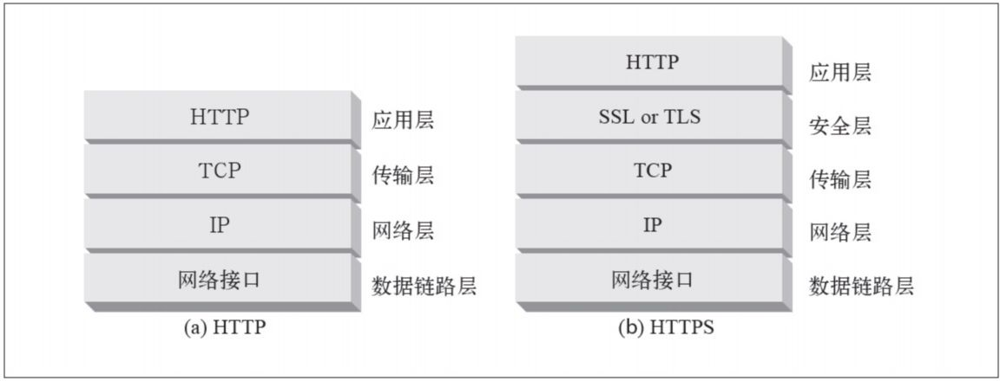
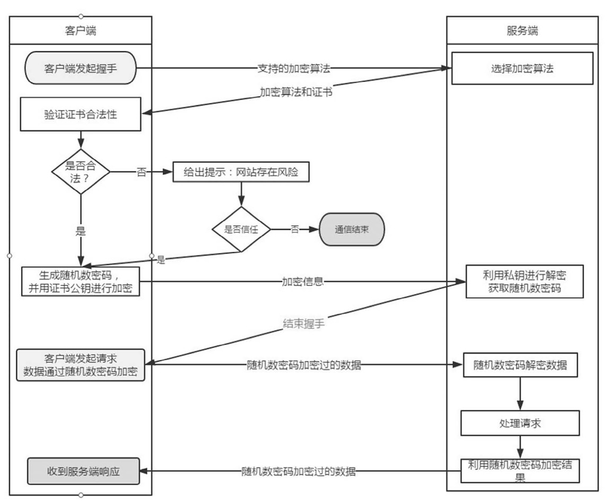

# https

## http 简述
### http 安全技术需要提供的功能
服务器认证（客户端知道它们是在与真正的而不是伪造的服务器通话）。
1. 客户端认证（服务器知道它们是在与真正的而不是伪造的客户端通话）。
1. 完整性（客户端和服务器的数据不会被修改）。
1. 加密（客户端和服务器的对话是私密的，无需担心被窃听）。
1. 效率（一个运行的足够快的算法，以便低端的客户端和服务器使用）
1. 普适性（基本上所有的客户端和服务器都支持这些协议）。
1. 管理的可扩展性（在任何地方的任何人都可以立即进行安全通信）。
1. 适应性（能够支持当前最知名的安全方法）。
1. 在社会上的可行性（满足社会的政治文化需要）。

### HTTPS 基础知识
使用HTTPS时，所有的HTTP请求和响应数据在发送到网络之前，都要进行加密。HTTPS在HTTP下面提供了一个`传输级的密码安全层`——可以使用`SSL\TLS`. 由于SSL和TLS非常类似. 在大多数情况下，只需要用SSL的输入/输出调用取代TCP的调用，再增加其他几个调用来配置和管理安全信息就行了。HTTP协议采用明文传输信息，存在信息窃听、信息篡改和信息劫持的风险，而协议TLS/SSL具有身份验证、信息加密和完整性校验的功能，可以避免此类问题发生。

` TLS/SSL`全称安全传输层协议Transport Layer Security, 是介于TCP和HTTP之间的一层安全协议，不影响原有的TCP协议和HTTP协议，所以使用HTTPS基本上不需要对HTTP页面进行改造

### 数字加密
* **密码:** 对文本进行编码，使偷窥者无法识别的算法。
* **密钥:** 改变密码行为的数字化参数。
* **对称密钥加密系统:** 编/解码使用相同密钥的算法。
* **不对称密钥加密系统:** 编/解码使用不同密钥的算法。
* **公开密钥加密系统:** 一种能够使数百万计算机便捷地发送机密报文的系统。
* **数字签名:** 用来验证报文未被伪造或篡改的校验和。
* **数字证书:** 由一个可信的组织验证和签发的识别信息。

端口、安全原理、中间人攻击

将HTTP协议的通信接口部分用 `SSL` （Secure Socket Layer，安全套接字层，保障数据传输过程中不被截取和窃听的一种协议）或 `TLS` （Transport Layer Security，安全传输层协议，用来确保通信双方传递数据的保密性和完整性）

> HTTP+加密+认证+完整性保护=HTTPS

### 一、什么是HTTPS
HTTPS是在HTTP上建立SSL加密层，并对传输数据进行加密，是HTTP协议的安全版。HTTPS主要作用是：
（1）对数据进行加密，并建立一个信息安全通道，来保证传输过程中的数据安全;
（2）对网站服务器进行真实身份认证。

### 二、HTTPS和HTTP的区别是什么

1. HTTPS是加密传输协议，HTTP是名文传输协议;
2. HTTPS需要用到SSL证书，而HTTP不用;
3. HTTPS比HTTP更加安全，对搜索引擎更友好，利于SEO 1）为保护用户隐私安全,谷歌优先索引HTTPS网页、（2）百度开放收录https站点，https全网化势不可挡;
4. HTTPS标准端口`443`，HTTP标准端口`80`;
5. HTTPS基于传输层，HTTP基于应用层;
6. HTTPS在浏览器显示绿色安全锁，HTTP没有显示;
总的来说HTTPS比HTTP更加安全，能够有效的保护网站用户的隐私信息安全，这也是为什么现在的HTTPS网站越来越多。如果不想你的网站因为数据泄露上头条的话，就赶快去申请一张SSL证书为自己的网站实现HTTPS加密吧!

### 三、HTTPS通信流程

1. 浏览器需要先与服务端进行握手，将自己支持的加密算法发送给服务端。
2. 服务端从中选出一组加密算法，并将自己的SSL证书和公钥发回给浏览器。
3. 浏览器获得证书之后开始验证证书的合法性（颁发证书的机构是否合法、证书中包含的网站地址是否与正在访问的地址一致等），如果证书受信任，则浏览器栏里面会显示一个小锁头，否则会给出证书不受信任的提示。
4. 如果证书受信任，或者用户接受了不受信任的证书，浏览器会生成一串随机数的密码，并用证书中提供的公钥加密。
5. 浏览器生成随机数密码，并使用证书公钥加密发送给服务端。
6. 网站接收浏览器发来的数据之后使用自己的私钥将信息解密取出密码，使用密码解密浏览器发来的握手消息，使用密码加密一段握手消息，发送给浏览器，告诉浏览器握手过程结束。
7. 之后所有的通信数据将用之前浏览器生成的随机密码并利用对称加密算法进行加解密

HTTPS的整体过程分为证书验证和数据传输阶段，具体的交互过程如下：

> HTTPS 在内容传输的加密上使用的是对称加密，非对称加密只作用在证书验证阶段。

① 证书验证阶段：

1）浏览器发起 HTTPS 请求；

2）服务端返回 HTTPS 证书；

3）客户端验证证书是否合法，如果不合法则提示告警。

② 数据传输阶段：

1）当证书验证合法后，在本地生成随机数；

2）通过公钥加密随机数，并把加密后的随机数传输到服务端；

3）服务端通过私钥对随机数进行解密；

4）服务端通过客户端传入的随机数构造对称加密算法，对返回结果内容进行加密后传输。

## HTTPS是对称加密还是非对称加密
HTTPS 在内容传输的加密上使用的是对称加密，非对称加密只作用在证书验证阶段

### 为什么数据传输是用对称加密
非对称加密的加解密效率是非常低的，而 http 的应用场景中通常端与端之间存在大量的交互，非对称加密的效率是无法接受的。
另外：在 HTTPS 的场景中只有服务端保存了私钥，一对公私钥只能实现单向的加解密，所以 HTTPS 中内容传输加密采取的是对称加密，而不是非对称加密。

### 为什么需要 CA 认证机构颁发证书
HTTP 协议被认为不安全是因为传输过程容易被监听者勾线监听、伪造服务器，而 HTTPS 协议主要解决的便是网络传输的安全性问题。
首先我们假设不存在认证机构，任何人都可以制作证书，这带来的安全风险便是经典的“中间人攻击”问题。
1. 本地请求被劫持（如DNS劫持等），所有请求均发送到中间人的服务器；
2. 中间人服务器返回中间人自己的证书；
3. 客户端创建随机数，通过中间人证书的公钥对随机数加密后传送给中间人，然后凭随机数构造对称加密对传输内容进行加密传输；
4. 中间人因为拥有客户端的随机数，可以通过对称加密算法进行内容解密；
5. 中间人以客户端的请求内容再向正规网站发起请求；
6. 因为中间人与服务器的通信过程是合法的，正规网站通过建立的安全通道返回加密后的数据；
7. 中间人凭借与正规网站建立的对称加密算法对内容进行解密；
8. 中间人通过与客户端建立的对称加密算法对正规内容返回的数据进行加密传输；
9. 客户端通过与中间人建立的对称加密算法对返回结果数据进行解密。

参考资料： https://www.cnblogs.com/imstudy/p/12015889.html

### 浏览器是如何确保 CA 证书的合法性
#### 证书包含什么信息
1）颁发机构信息；
2）公钥；
3）公司信息；
4）域名；
5）有效期；
6）指纹；
7）......
#### 证书的合法性依据是什么
1.首先：权威机构是要有认证的，不是随便一个机构都有资格颁发证书，不然也不叫做权威机构；
2.另外：证书的可信性基于信任制，权威机构需要对其颁发的证书进行信用背书，只要是权威机构生成的证书，我们就认为是合法的。
所以权威机构会对申请者的信息进行审核，不同等级的权威机构对审核的要求也不一样，于是证书也分为免费的、便宜的和贵的

### 浏览器如何验证证书的合法性
浏览器发起 HTTPS 请求时，服务器会返回网站的 SSL 证书，浏览器需要对证书做以下验证：
1. 验证域名、有效期等信息是否正确：证书上都有包含这些信息，比较容易完成验证；

2. 判断证书来源是否合法：每份签发证书都可以根据验证链查找到对应的根证书，操作系统、浏览器会在本地存储权威机构的根证书，利用本地根证书可以对对应机构签发证书完成来源验证
3. 判断证书是否被篡改：需要与 CA 服务器进行校验；
4. 判断证书是否已吊销：通过CRL（Certificate Revocation List 证书注销列表）和 OCSP（Online Certificate Status Protocol 在线证书状态协议）实现，其中 OCSP 可用于第3步中以减少与 CA 服务器的交互，提高验证效率。
以上任意一步都满足的情况下浏览器才认为证书是合法的。
> 既然证书是公开的，如果要发起中间人攻击，我在官网上下载一份证书作为我的服务器证书，那客户端肯定会认同这个证书是合法的，如何避免这种证书冒用的情况？
> 其实这就是非加密对称中公私钥的用处，虽然中间人可以得到证书，但私钥是无法获取的，一份公钥是不可能推算出其对应的私钥，中间人即使拿到证书也无法伪装成合法服务端，因为无法对客户端传入的加密数据进行解密。：

### 本地随机数被窃取怎么办
证书验证是采用非对称加密实现，但是传输过程是采用对称加密，而其中对称加密算法中重要的随机数是由本地生成并且存储于本地的，HTTPS 如何保证随机数不会被窃取？

其实 HTTPS 并不包含对随机数的安全保证，HTTPS 保证的只是传输过程安全，而随机数存储于本地，本地的安全属于另一安全范畴，应对的措施有安装杀毒软件、反木马、浏览器升级修复漏洞等。

### 用了 HTTPS 会被抓包吗
TTPS 的数据是加密的，常规下抓包工具代理请求后抓到的包内容是加密状态，无法直接查看。

但是，正如前文所说，浏览器只会提示安全风险，如果用户授权仍然可以继续访问网站，完成请求。因此，只要客户端是我们自己的终端，我们授权的情况下，便可以组建中间人网络，而抓包工具便是作为中间人的代理。通常 HTTPS 抓包工具的使用方法是会生成一个证书，用户需要手动把证书安装到客户端中，然后终端发起的所有请求通过该证书完成与抓包工具的交互，然后抓包工具再转发请求到服务器，最后把服务器返回的结果在控制台输出后再返回给终端，从而完成整个请求的闭环。
> 既然 HTTPS 不能防抓包，那 HTTPS 有什么意义？
>HTTPS 可以防止用户在不知情的情况下通信链路被监听，对于主动授信的抓包操作是不提供防护的，因为这个场景用户是已经对风险知情。要防止被抓包，需要采用应用级的安全防护，例如采用私有的对称加密，同时做好移动端的防反编译加固，防止本地算法被破解。

## HTTPS性能与优化

### 1.HTTPS性能损耗
前文讨论了HTTPS原理与优势：身份验证、信息加密与完整性校验等，且未对TCP和HTTP协议做任何修改。但通过增加新协议以实现更安全的通信必然需要付出代价，HTTPS协议的性能损耗主要体现如下：
1. 增加延时
分析前面的握手过程，一次完整的握手至少需要两端依次来回两次通信，至少增加延时2* RTT，利用会话缓存从而复用连接，延时也至少1* RTT*。
2. 消耗较多的CPU资源
除数据传输之外，HTTPS通信主要包括对对称加解密、非对称加解密(服务器主要采用私钥解密数据); 压测 TS8 机型的单核 CPU：对称加密算法AES-CBC-256 吞吐量 600Mbps，非对称 RSA 私钥解密200次/s。不考虑其它软件层面的开销，10G 网卡为对称加密需要消耗 CPU 约17核，24核CPU最多接入 HTTPS 连接 4800;
静态节点当前10G 网卡的 TS8 机型的 HTTP 单机接入能力约为10w/s，如果将所有的HTTP连接变为HTTPS连接，则明显RSA的解密最先成为瓶颈。因此，RSA的解密能力是当前困扰HTTPS接入的主要难题。

### 2. HTTPS接入优化
1. CDN接入
HTTPS 增加的延时主要是传输延时 RTT，RTT 的特点是节点越近延时越小，CDN 天然离用户最近，因此选择使用 CDN 作为 HTTPS 接入的入口，将能够极大减少接入延时。CDN 节点通过和业务服务器维持长连接、会话复用和链路质量优化等可控方法，极大减少 HTTPS 带来的延时。

2. 会话缓存
虽然前文提到 HTTPS 即使采用会话缓存也要至少1*RTT的延时，但是至少延时已经减少为原来的一半，明显的延时优化;同时，基于会话缓存建立的 HTTPS 连接不需要服务器使用RSA私钥解密获取 Pre-master 信息，可以省去CPU 的消耗。如果业务访问连接集中，缓存命中率高，则HTTPS的接入能力讲明显提升。当前TRP平台的缓存命中率高峰时期大于30%，10k/s的接入资源实际可以承载13k/的接入，收效非常可观。

3. 硬件加速
为接入服务器安装专用的SSL硬件加速卡，作用类似 GPU，释放 CPU，能够具有更高的 HTTPS 接入能力且不影响业务程序的。测试某硬件加速卡单卡可以提供35k的解密能力，相当于175核 CPU，至少相当于7台24核的服务器，考虑到接入服务器其它程序的开销，一张硬件卡可以实现接近10台服务器的接入能力。

4. 远程解密
本地接入消耗过多的 CPU 资源，浪费了网卡和硬盘等资源，考虑将最消耗 CPU 资源的RSA解密计算任务转移到其它服务器，如此则可以充分发挥服务器的接入能力，充分利用带宽与网卡资源。远程解密服务器可以选择 CPU 负载较低的机器充当，实现机器资源复用，也可以是专门优化的高计算性能的服务器。当前也是 CDN 用于大规模HTTPS接入的解决方案之一。

5. SPDY/HTTP2
前面的方法分别从减少传输延时和单机负载的方法提高 HTTPS 接入性能，但是方法都基于不改变 HTTP 协议的基础上提出的优化方法，SPDY/HTTP2 利用 TLS/SSL 带来的优势，通过修改协议的方法来提升 HTTPS 的性能，提高下载速度等。

## TLS/SSL工作原理
`HTTPS`协议的主要功能基本都依赖于`TLS/SSL`协议
`TLS/SSL`的功能实现主要依赖于三类基本算法：`散列函数 Hash`、`对称加密`和`非对称加密`，其利用`非对称加密`实现**身份认证**和**密钥协商**，`对称加密算法采用协商的密钥`对**数据加密**，基于`散列函数`**验证信息的完整性**。  

1. **散列函数Hash**
常见的有 `MD5`、`SHA1`、`SHA256`，该类函数特点是函数单向不可逆、对输入非常敏感、输出长度固定，针对数据的任何修改都会改变散列函数的结果，用于防止信息篡改并验证数据的完整性;
在信息传输过程中，散列函数不能单独实现信息防篡改，因为明文传输，中间人可以修改信息之后重新计算信息摘要，因此需要对传输的信息以及信息摘要进行加密;

2. **对称加密**
常见的有 `AES-CBC`、`DES`、`3DES`、`AES-GCM`等，相同的密钥可以用于信息的加密和解密，掌握密钥才能获取信息，能够防止信息窃听，通信方式是1对1;
对称加密的优势是`信息传输1对1`，需要共享相同的密码，密码的安全是保证信息安全的基础，服务器和 N 个客户端通信，需要维持 N 个密码记录，且缺少修改密码的机制;

3. **非对称加密**
即常见的 `RSA` 算法，还包括 `ECC`、`DH` 等算法，算法特点是，密钥成对出现，一般称为公钥(公开)和私钥(保密)，公钥加密的信息只能私钥解开，私钥加密的信息只能公钥解开。因此掌握公钥的不同客户端之间不能互相解密信息，只能和掌握私钥的服务器进行加密通信，服务器可以实现1对多的通信，客户端也可以用来验证掌握私钥的服务器身份。

非对称加密的特点是`信息传输1对多`，服务器只需要维持一个私钥就能够和多个客户端进行加密通信，但服务器发出的信息能够被所有的客户端解密，且该算法的**计算复杂，加密速度慢**。

结合三类算法的特点，TLS的基本工作方式是，客户端使用`非对称加密与服务器进行通信`，`实现身份验证并协商对称加密使用的密钥`，然后`对称加密算法采用协商密钥对信息以及信息摘要进行加密通信`，不同的节点之间采用的对称密钥不同，从而可以保证信息只能通信双方获取。

## TLS/SSL握手过程
https://blog.csdn.net/hherima/article/details/52469674