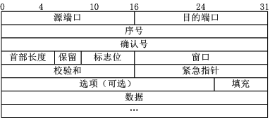
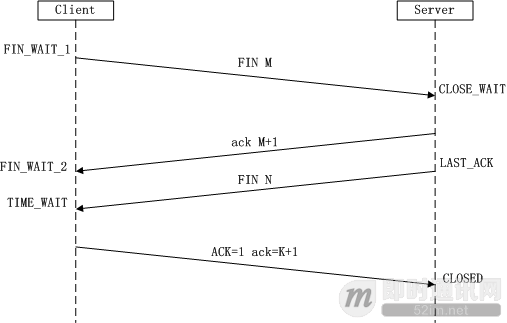

# TCP
## TCP报文格式

1. 序号：Seq序号，占32位，用来标识从TCP源端向目的端发送的字节流，发起方发送数据时对此进行标记。
2. 确认序号：Ack序号，占32位，只有ACK标志位为1时，确认序号字段才有效，Ack=Seq+1。
3. 标志位：共6个，即URG、ACK、PSH、RST、SYN、FIN等，具体含义如下：
  * URG：紧急指针（urgent pointer）有效。
  * ACK：确认序号有效。
  * PSH：接收方应该尽快将这个报文交给应用层。
  * RST：重置连接。
  * SYN：发起一个新连接。
  * FIN：释放一个连接。
需要注意的是：
（A）不要将确认序号Ack与标志位中的ACK搞混了。
（B）确认方Ack=发起方Req+1，两端配对。

## TCP三次握手和四次挥手的过程

### TCP三次握手

第一次握手：建立连接时，客户端发送 `syn包(syn=j)` 到服务器，并进入 `SYN_SEND` 状态，等待服务器确认；
第二次握手：服务器收到syn包，必须确认客户的 `syn（ack=j+1）` ，同时自己也发送一个 `SYN包（syn=k）` ，即 `SYN+ACK` 包，此时服务器进入 `SYN_RECV` 状态；
第三次握手：客户端收到服务器的 `SYN+ACK` 包，向服务器发送确认包 `ACK(ack=k+1)` ，此包发送完毕，客户端和服务器进入 `established` 状态，完成三次握手。

### TCP四次挥手

由于TCP连接是全双工的，因此每个方向都必须单独进行关闭。这原则是当一方完成它的数据发送任务后就能发送一个FIN来终止这个方向的连接。收到一个 FIN只意味着这一方向上没有数据流动，一个TCP连接在收到一个FIN后仍能发送数据。首先进行关闭的一方将执行主动关闭，而另一方执行被动关闭。

1. 第一次挥手： Client发送一个FIN，用来关闭Client到Server的数据传送，Client进入FIN_WAIT_1状态。
1. 第二次挥手： Server收到FIN后，发送一个ACK给Client，确认序号为收到序号+1（与SYN相同，一个FIN占用一个序号），Server进入CLOSE_WAIT状态。
1. 第三次挥手： Server发送一个FIN，用来关闭Server到Client的数据传送，Server进入LAST_ACK状态。
1. 第四次挥手： Client收到FIN后，Client进入TIME_WAIT状态，接着发送一个ACK给Server，确认序号为收到序号+1，Server进入CLOSED状态，完成四次挥手。

### 为什么建立连接是三次握手，而关闭连接却是四次挥手呢
这是因为服务端在`LISTEN`状态下，收到建立连接请求的`SYN`报文后，把`ACK`和`SYN`放在一个报文里发送给客户端。而关闭连接时，当收到对方的`FIN`报文时，仅仅表示对方不再发送数据了但是还能接收数据，己方也未必全部数据都发送给对方了，所以己方可以立即`close`，也可以发送一些数据给对方后，再发送`FIN`报文给对方来表示同意现在关闭连接，因此，己方`ACK`和`FIN`一般都会分开发送

## TCP和UDP的差异
TCP：是面向连接的、可靠的、有序的传输层协议，而 UDP 是面向数据报的、不可靠的、无序的传输协议，所以 UDP 压根不会建立什么连接。
UDP： 就好比发短信一样，UDP 只需要知道对方的 ip 地址，将数据报一份一份的发送过去就可以了，其他的作为发送方，都不需要关心。

### TCP、UDP 之间数据发送的差异，可以体现二者最大的不同之处
TCP： 由于 TCP 是建立在两端连接之上的协议，所以理论上发送的数据流不存在大小的限制。但是由于缓冲区有大小限制，所以你如果用 TCP 发送一段很大的数据，可能会截断成好几段，接收方依次的接收。
UDP： 由于 UDP 本身发送的就是一份一份的数据报，所以自然而然的就有一个上限的大小。
#### 每次 UDP 发送的数据报大小由哪些因素共同决定呢？
UDP协议本身，UDP协议中有16位的UDP报文长度，那么UDP报文长度不能超过2^16=65536；
以太网(Ethernet)数据帧的长度，数据链路层的MTU(最大传输单元)；
socket的UDP发送缓存区大小

### 数据有序性的差异
其实大家都知道 TCP 本身是可靠的协议，而 UDP 是不可靠的协议。
* TCP: 内部的很多算法机制让他保持连接的过程中是很可靠的。比如：TCP 的超时重传、错误重传、TCP 的流量控制、阻塞控制、慢热启动算法、拥塞避免算法、快速恢复算法 等等。所以 TCP 是一个内部原理复杂，但是使用起来比较简单的这么一个协议。
* UDP: UDP 是一个面向非连接的协议，UDP 发送的每个数据报带有自己的 IP 地址和接收方的 IP 地址，它本身对这个数据报是否出错，是否到达不关心，只要发出去了就好了。
#### 所以来研究下，什么情况会导致 UDP 丢包：
数据报分片重组丢失：在文章之前我们就说过，UDP 的每个数据报大小多少最合适，事实上 UDP 协议本身规定的大小是 64kb，但是在数据链路层有 MTU 的限制，大小大概在 5kb，所以当你发送一个很大的 UDP 包的时候，这个包会在 IP 层进行分片，然后重组。这个过程就有可能导致分片的包丢失。UDP 本身有 CRC 检测机制，会抛弃掉丢失的 UDP 包；
UDP 缓冲区填满：当 UDP 的缓冲区已经被填满的时候，接收方还没有处理这部分的 UDP 数据报，这个时候再过来的数据报就没有地方可以存了，自然就都被丢弃了。

### 使用场景总结
 事实上经过这么多年的发展 TCP 已经拥有足够多的算法和优化，在网络状态不错的情况下，TCP 的整体性能是优于 UDP 的。
#### 那在什么时候我们非用 UDP 不可呢？
1. 对实时性要求高：比如实时会议，实时视频这种情况下，如果使用 TCP，当网络不好发生重传时，画面肯定会有延时，甚至越堆越多。如果使用 UDP 的话，即使偶尔丢了几个包，但是也不会影响什么，这种情况下使用 UDP 比较好；
2. 多点通信：TCP 需要保持一个长连接，那么在涉及多点通讯的时候，肯定需要和多个通信节点建立其双向连接，然后有时在NAT环境下，两个通信节点建立其直接的 TCP 连接不是一个容易的事情，而 UDP 可以无需保持连接，直接发就可以了，所以成本会很低，而且穿透性好。这种情况下使用 UDP 也是没错的。

参考： http://www.52im.net/thread-258-1-1.html
参考： http://www.52im.net/thread-1160-1-1.html

### http 与 tcp 的关系
### tcp 可以建立多个连接吗